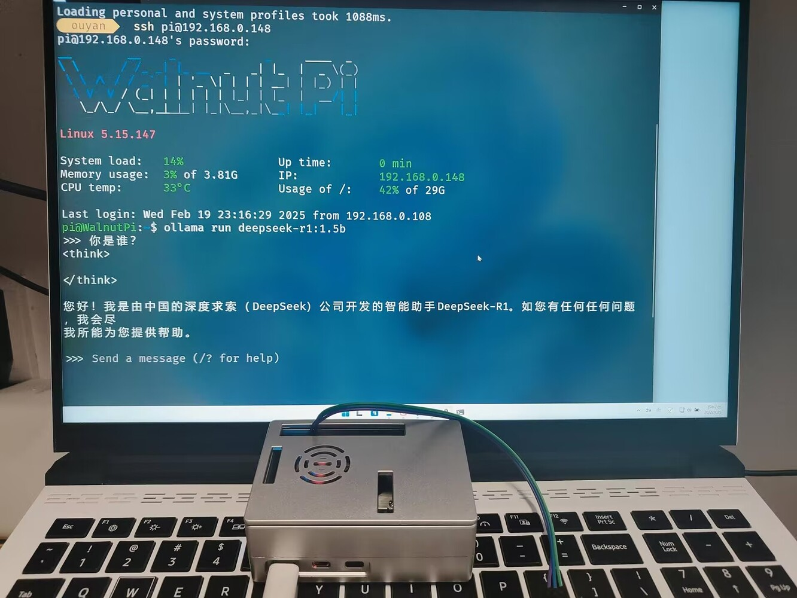

# 社区用户开源项目分享

感谢以下用户为核桃派开源生态贡献项目，如果你也有基于核桃派相关开源项目可以QQ群或者邮件（walnutpi@qq.com）联系我们，我们将不定期为贡献项目用户赠送核桃派相关产品。

## 核桃派2B部署deepseek-r1 1.5B大模型

- `用户`：ouyanglingle

[核桃派2B运行deepseek-r1大模型，并将用户文本转化为AT指令输出给单片机](https://forum.walnutpi.com/t/topic/298)

## 核桃派1.54寸LCD扩展板

- `用户`：windskys

[核桃派2B的功能小板（LCD） PCB开源](https://oshwhub.com/windskys/walnut-pi-2b)

