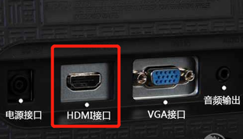
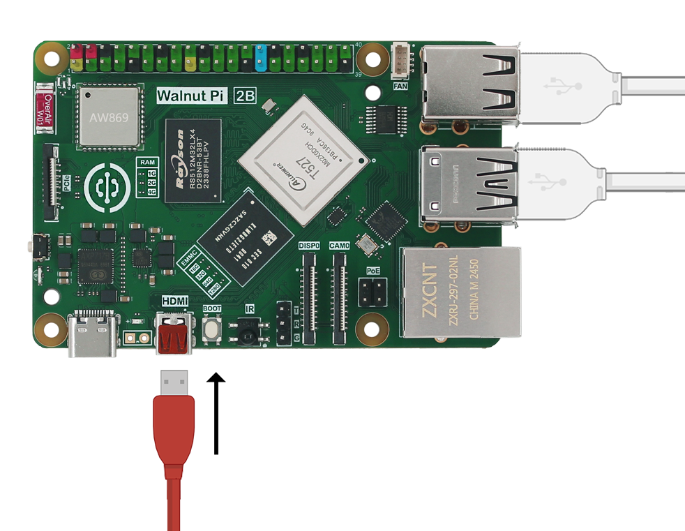
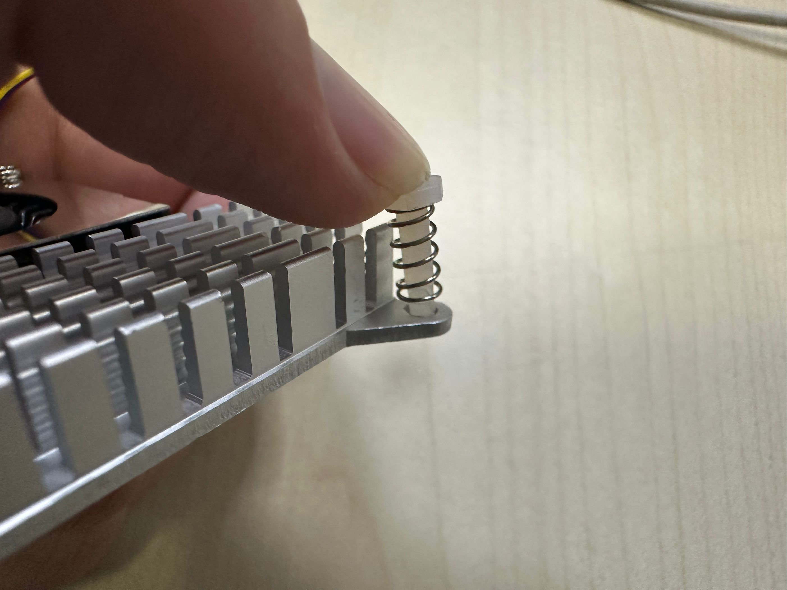
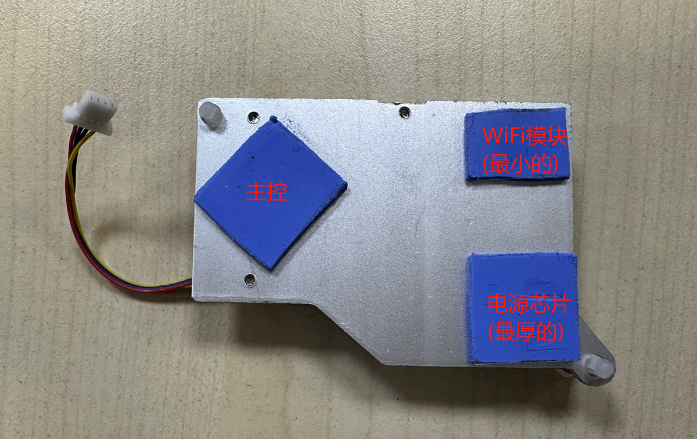
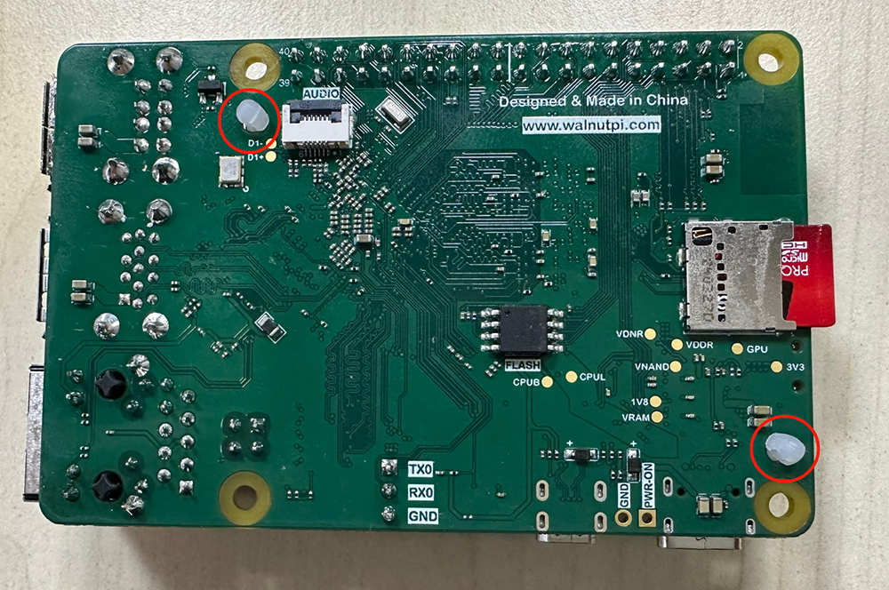
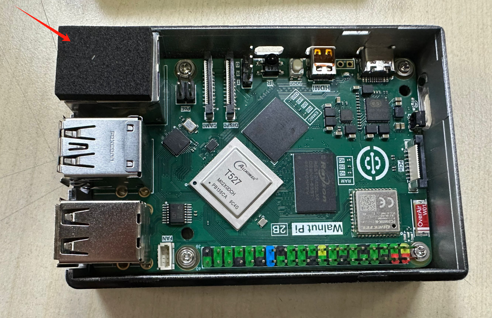
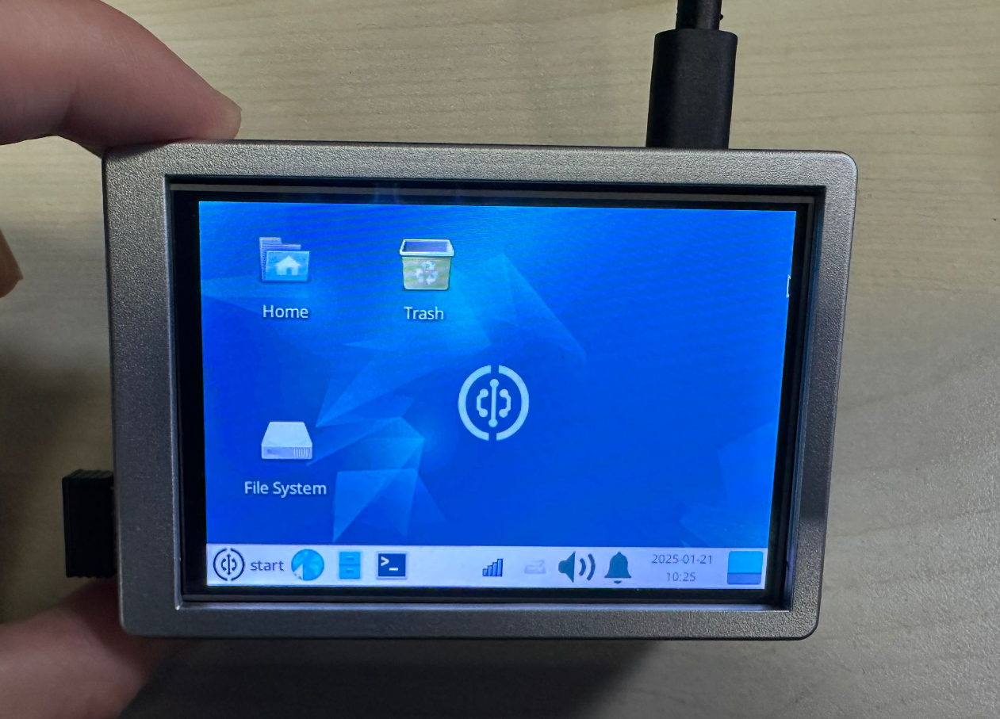
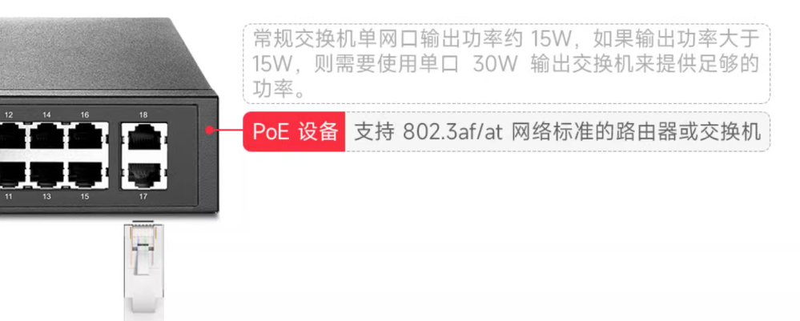
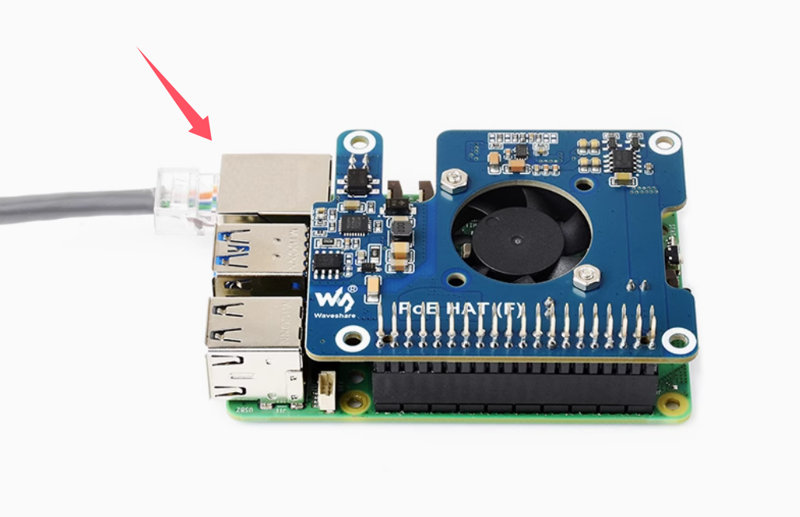

# 核桃派2B配件组装

在上一节了解过核桃派的硬件后，我们对核桃派有了一定的认识。但单独一个核桃派板子是无法工作的，它要求有一些必须的外设，如电源、键盘鼠标、显示器等。这节我们就来做详细的介绍核桃派2B配件组装.

## MicroSD卡

MicroSD卡需要预先拷贝操作系统的，那会在下一节系统和软件展开讲解，这里只介绍安装方法。推荐使用16G以上的MicroSD卡。

将MicroSD卡按下图所示方向轻轻插入到底。

如果你需要去除 SD 卡，直接拔出即可。
:::danger 注意

请勿在通电情况下拔插 SD 卡。

:::

## 键盘和鼠标

核桃派支持有线键鼠和无线键鼠。

**有线键鼠**

**无线键鼠**

将键盘和鼠标连接到USB口。有线和无线 USB 键鼠安装方法一样。正常情况下USB的拔插不需要太用力，否则可能是插反了。检查USB方向是否正确。

## 显示器

一般的电脑显示屏或电视机都带有HDMI接口。

使用microHDMI转HDMI数据线可以直接将核桃派视频信号显示出来。

将microHDMI线较小的一端连接到核桃派（靠近Type-C电源口的那个端口），另一端连接到显示器，如果你的显示器有多个输入端口，可能还需要进
行一个输入端口切换的操作，具体视你显示器情况而定。

## 网线（可选）

要把核桃派和网络连接起来， 可以通过以太网或者 WiFi 无线连接。通常用WiFi，核桃派的 WiFi 支持 5G 信号连接，这里主要说一下网线的连接方法。把它
插进以太网口，塑料夹子朝下，直到你听到咔哒声。 网线的另一端通常以相同的方式连接到路由器、 网络集线器或交换机上的任意空闲端口。如果您需要移除网线，只需将塑料夹向内挤压到插头处，然后轻轻将电缆滑出即可。

## 音频（可选）

核桃派2B背面预留一个音频FPC座，可以通过转接板转成3.5mm音频座，也就是常见的耳机插孔。可以用于连接耳机或扬声器得到更强大的声音。

:::tip 提示
核桃派也可以通过HDMI音频输出。
:::

## 主动散热扇

主动散热扇能帮助核桃派板卡有效散热，特别在高温的环境下实现稳定工作。**核桃派2B会根据主控温度变化自动对散热扇进行调速。**

安装方法如下：

将2个固定弹簧引脚按下图所示插入到散热扇孔：

将配套的3片导热贴按先撕掉一面胶纸，下面位置贴好。位置大概即可，有点误差没关系。

- 最厚的贴右下角（用于PMC电源芯片散热）
- 最小的贴右上角（用于WiFi模块散热）
- 剩下的贴左边（用于主控T527散热）

撕掉导热贴胶纸，然后对着核桃派2个散热孔插入。

卡扣会自动锁紧。

最厚将4P接口插入核桃派2B散热器接口即可。

:::tip 提示
如需拆卸可使用镊子或者小夹子。注意不要损伤弹簧固定柱周围的元件。
:::

## 外壳

除了亚克力底板，可以直接装配核桃派2B外壳。（市面上兼容树莓派5的外壳一般也能直接使用。）

这里使用核桃派官方推荐的外壳:

支持多种使用方式：

将外壳从中间拆开：

将核桃派2B装进外壳，4个定位孔用配套的螺丝拧紧固定。

支持外接3007风扇，按下图插入顶盖定位柱即可。

底部可贴上配套的防滑垫：

LED导光柱和按键在下面这个位置。测试一下按键是否正常。

可以将顶盖和面板打开，在以太网口位置放上配套的黑色垫子。

插入核桃派3.5寸显示屏。然后装上外壳使用。

## 亚克力底板

除了外壳，也可以只装亚克力的底板，亚克力底板的作用是避免PCB底部跟其它金属物体接触短路，避免刮花桌面，同时底部产生了空间也提升了散热效果。

核桃派亚克力底板安装方法非常简单，撕掉亚克力保护膜，中间嵌套铜柱，上下两端分别用M2.5螺丝拧紧即可。

## 电源连接

核桃派对电源的要求是：5V 3A以上的Type-C接口电源。

连接电源通常是最后的操作，接通电源后意味着我们准备开始使用。将电源的Type-C端连接到核桃派。如果线材上有开关，记得将开关打开。

## PoE以太网供电

除了使用type-c电源外，核桃派2B还支持PoE方式供电。只需要一根网线便可以实现上网和供电。**需要具备PoE协议的交换机和PoE模块。**

1、PoE供电交换机：[推荐购买链接](https://item.jd.com/100050331026.html#crumb-wrap)

单个核桃派2B大概10-15W, 如果只给1台核桃派2B供电，那么只需要购买总功率大于15W即可。多台核桃派2B设备总功率需求如此类推。

2、PoE扩展板：[推荐购买链接](https://item.taobao.com/item.htm?&id=759353203698)

市面上支持树莓派5代的都可以在核桃派2B上使用。

