# 核桃派CM2配件组装

## 散热

核桃派CM2基于全志T527 八核高性能处理器，模块体积小，接HDMI显示下温度可达70℃以上，引出建议增加散热措施。

- 单底板导热贴：降10-15℃；
- 单散热片：降10-15℃；
- 底板导热贴 + 散热片 ：降20℃；
- 主动散热器：：降20+℃；（推荐。随着温度升高，散热扇风速增强，获得更好的散热效果）

## 底板导热贴

购买IO底板会赠送底板撒热贴，可以将热量传递到底板。

将导热贴表面胶纸撕开

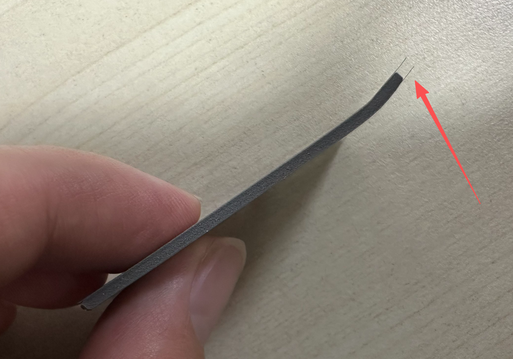

粘贴到CM2模块底部，然后组装到CM2 IO底板即可。

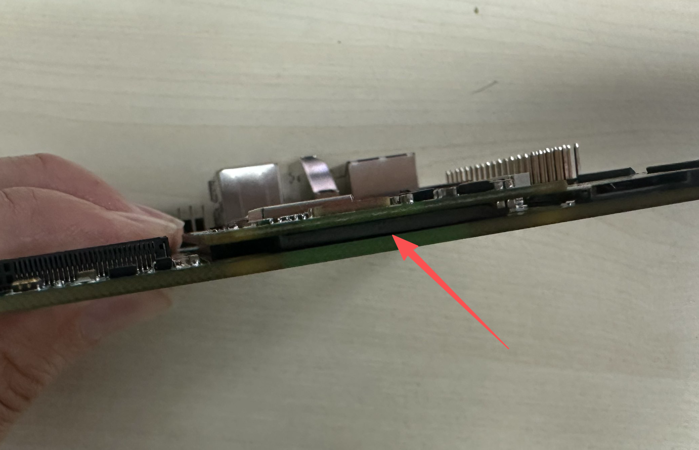

## 散热片 （降10-15℃）

散热片会配套工具包。

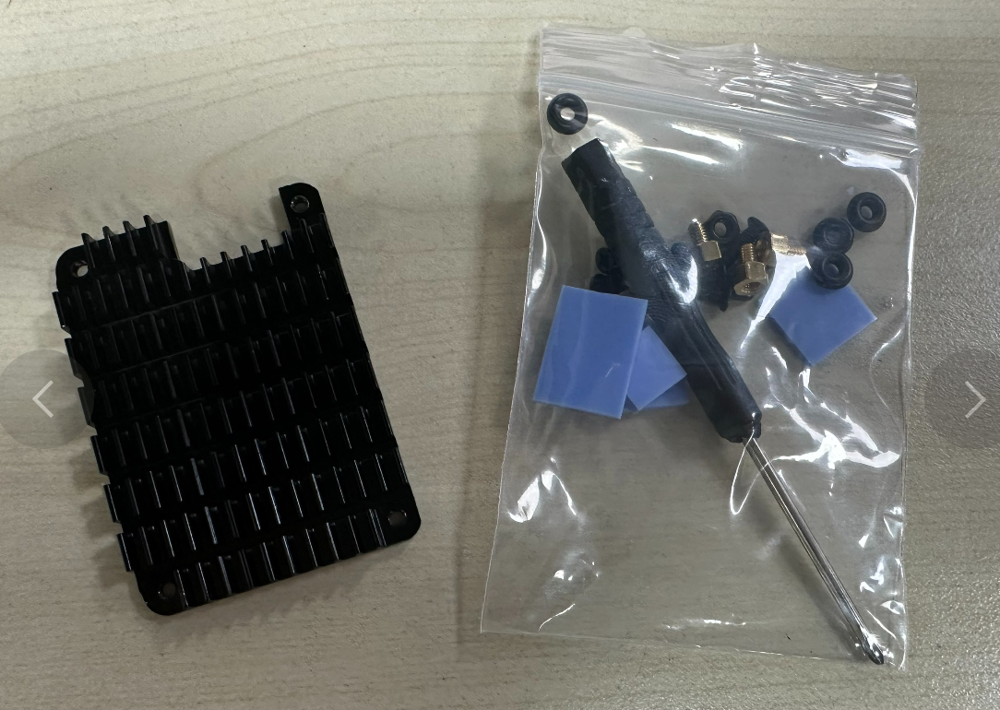

工具包兼容树莓派的，核桃派只需要用到其中2个散热贴。`正方形薄的`和`最小的`。

正方形最下的贴T527主控，最小的贴电源芯片位置。（发热量最大的两个地方）

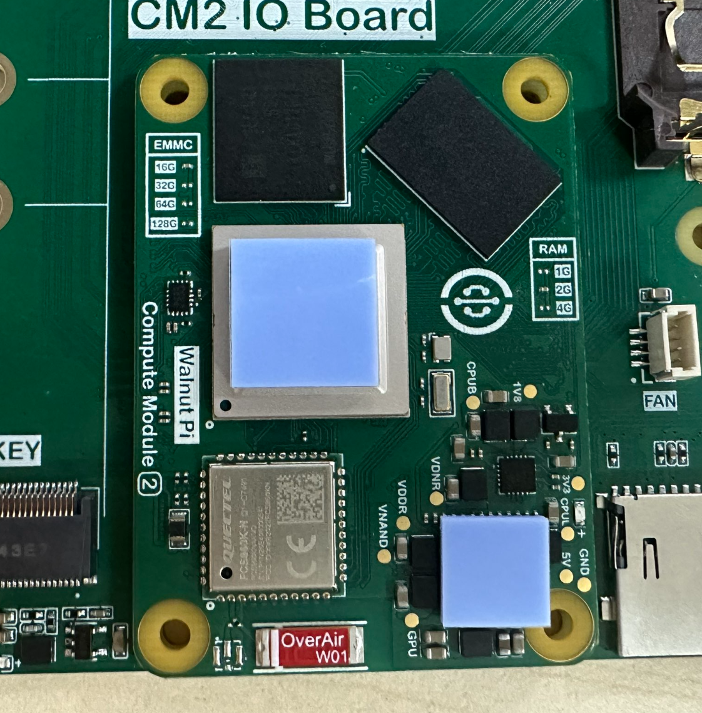

将单通铜柱拧到散热片上。

### 不固定底板安装

不固定底板安装方式简单，方便拆卸。将装好铜柱的散热片按下图天线在缺口位置放置。然后使用小螺丝拧紧即可。

然后直接装到IO底板即可。方便拔插。

### 固定底板安装

固定底板方式将CM2模块和底板固定在一起，适合需要长途运输或工作中有振动的场景。

需要使用配套的脚垫和长螺丝。

先将4个脚垫和长螺丝按下图方式固定在IO底板。

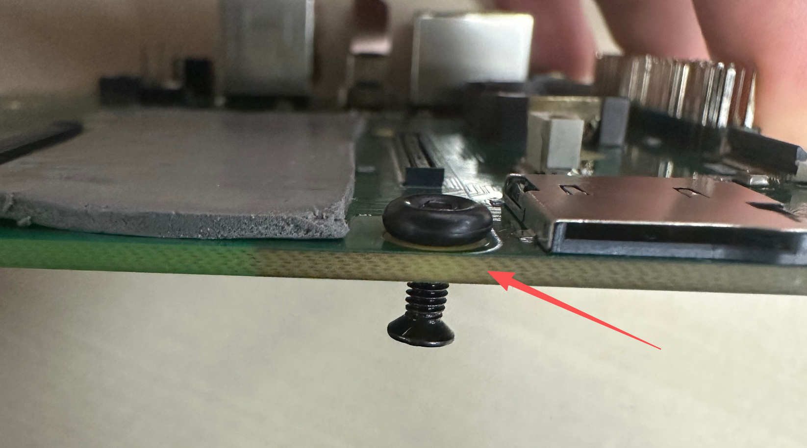

将CM2模块安装到底板。

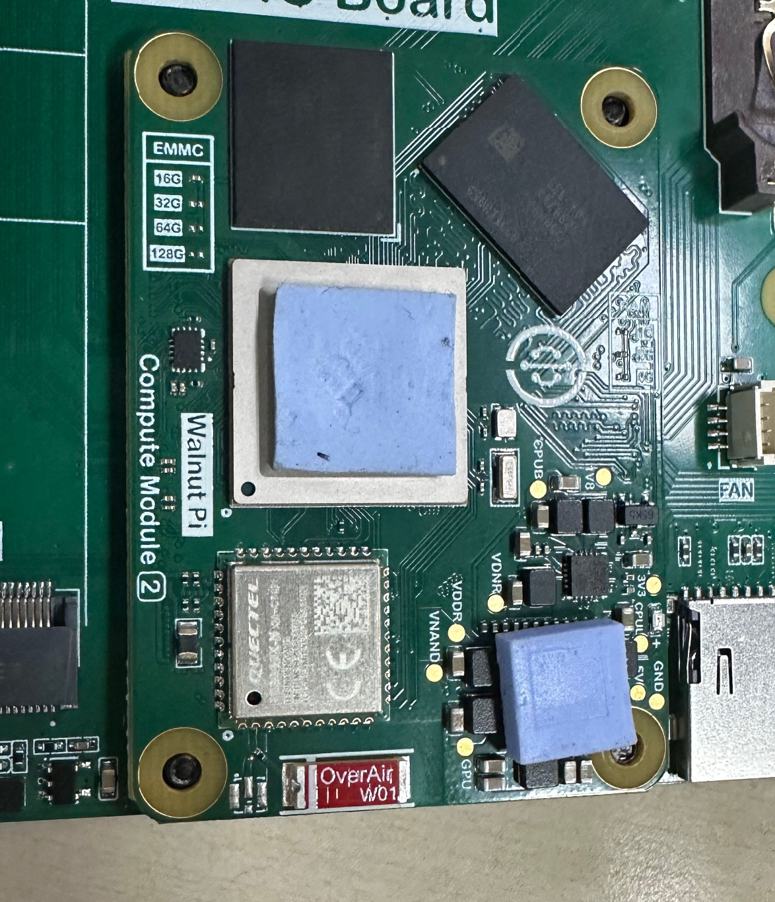

盖上散热器，拧紧螺丝即可。

## 主动散热器（推荐, 降20+℃）

主动散热器安装方式和上方散热片完全一致，安装后将散热器接口插到IO底板即可。当CPU温度大于50℃会启动，随着温度继续上升，风速增大。

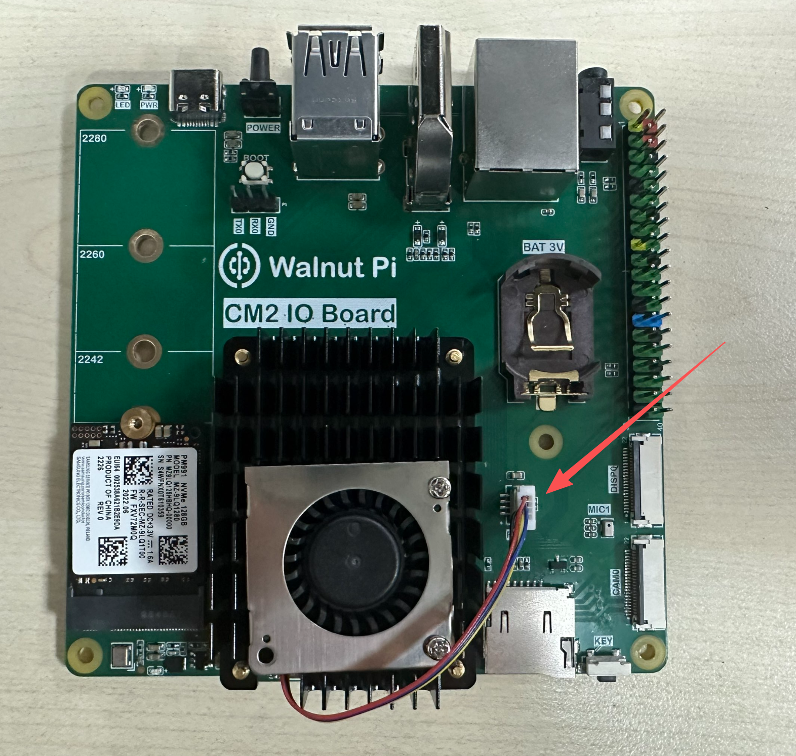

## RTC电池

CM2 IO底板带RTC锂电池座，适用于3V的2032尺寸电池。可配置充电功能，适合可充电的3V锂电池。

## NVMe固态硬盘

CM2 IO底板支持 2230/2242/2260/2280 4种尺寸的固态硬盘，使用底板配套的铜柱螺丝安装即可。[NVMe固态硬盘使用教程>>](../os_software/nvme.md)

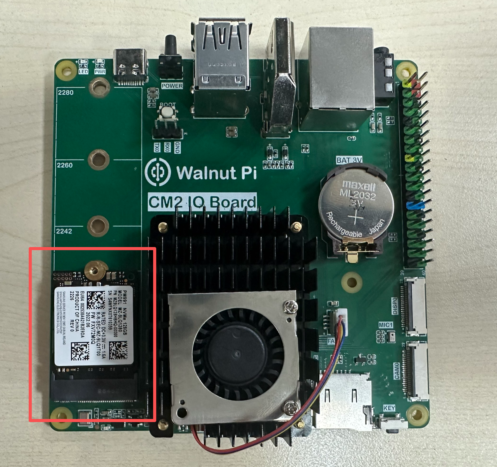

## 外壳

检查外壳配件清单，包含外壳、亚克力顶盖和底盖亚克力板，铜柱螺丝。

将4组铜柱按下面方式装在底板4个角落。

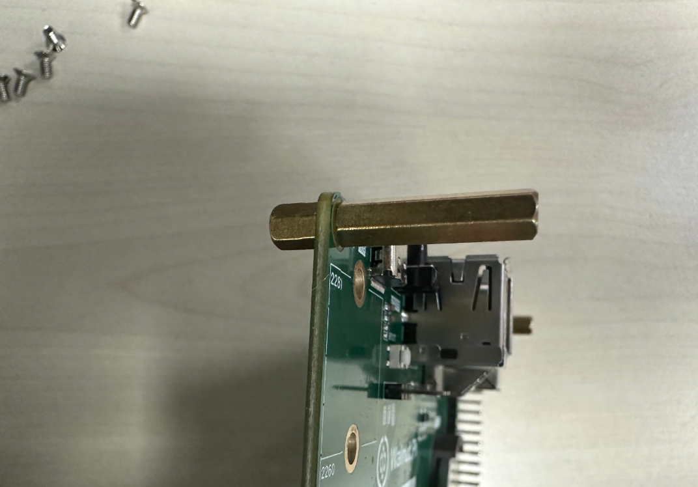

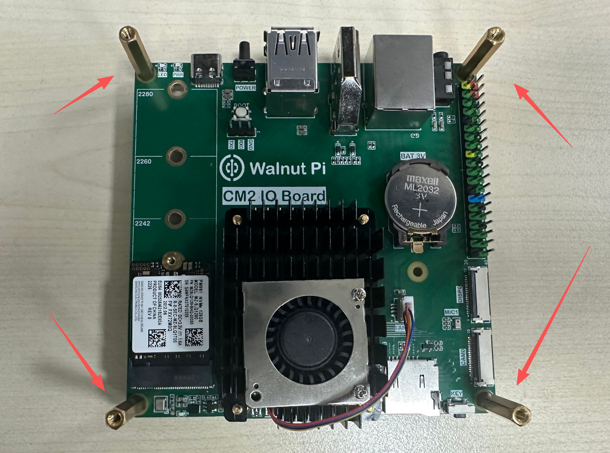

如下图所示，将板卡斜着插入外壳，接口对准后箭头所示位置稍微用点力就能推进去。**如果不行的话就先将板卡装进外壳，再拧铜柱。**

推进后放平如下图：

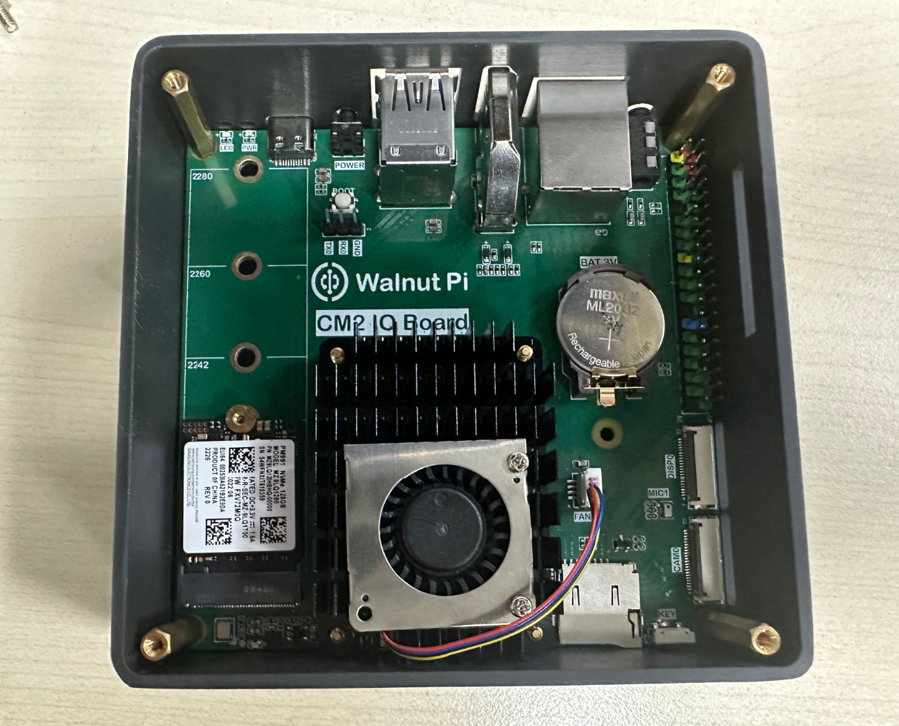

将2片亚克力的保护膜撕开

使用螺丝将底盖亚克力拧好，底盖带壁挂孔。

用同样方式安装顶盖，注意风扇孔位于散热扇上方。

至此，安装完成。

