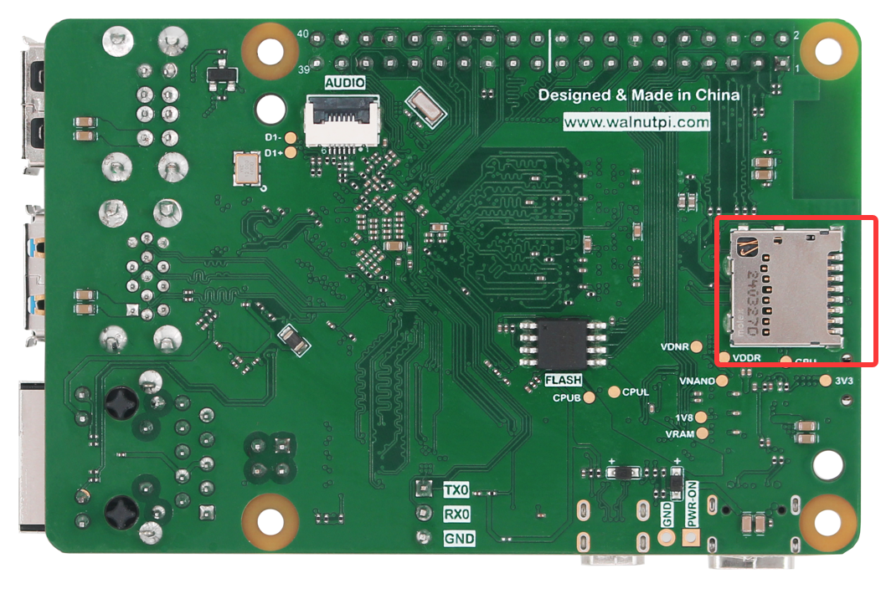
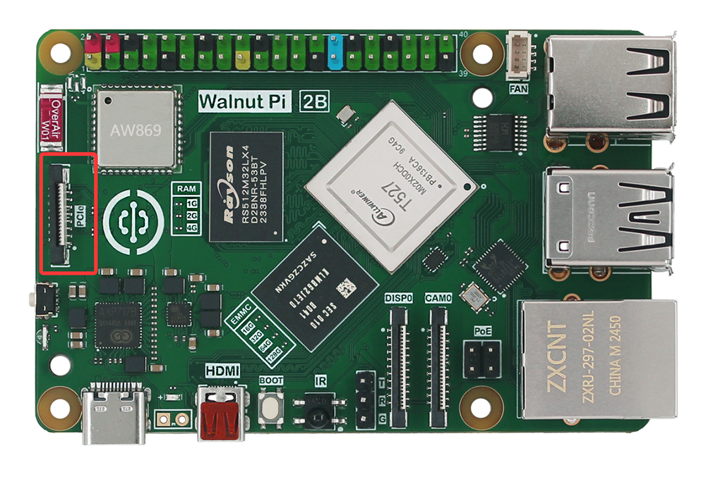
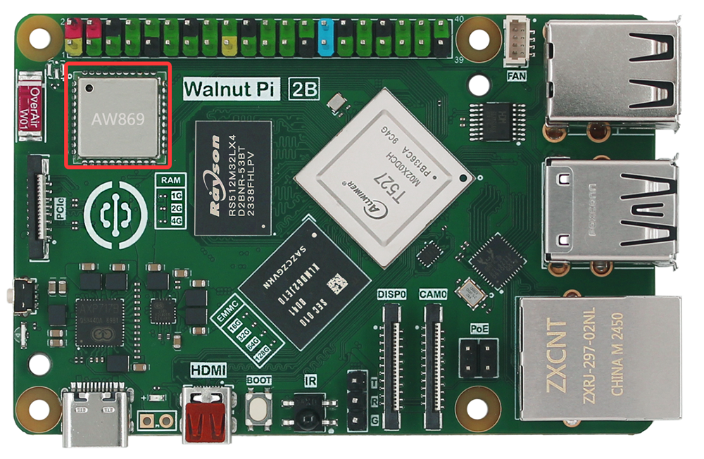
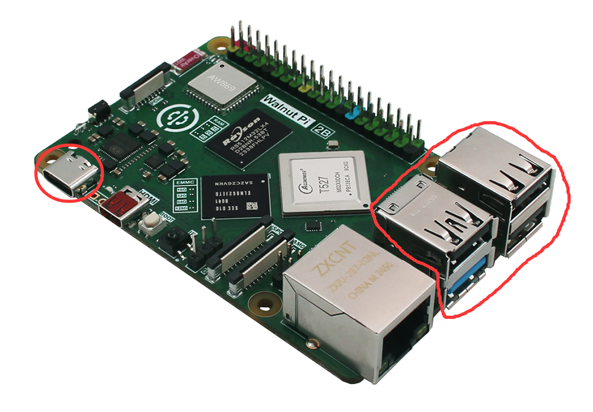
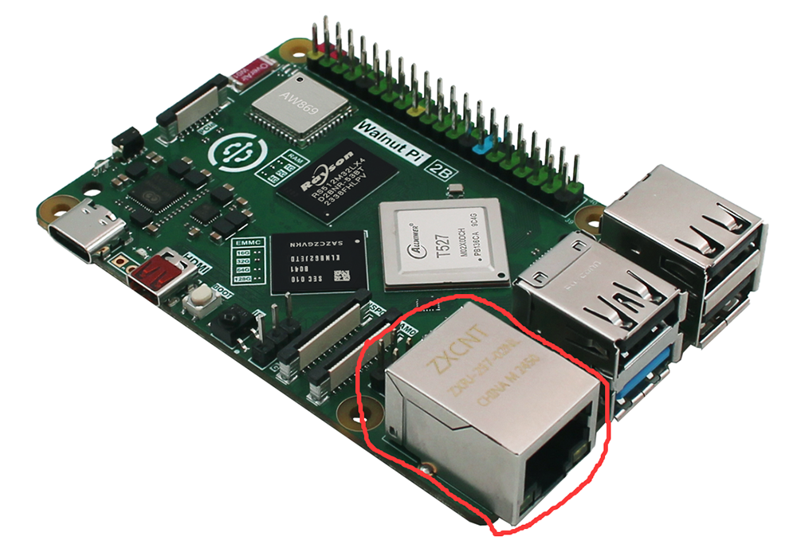
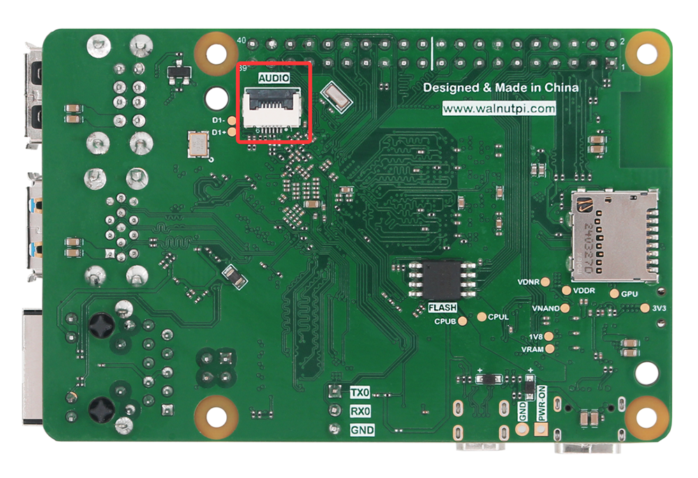
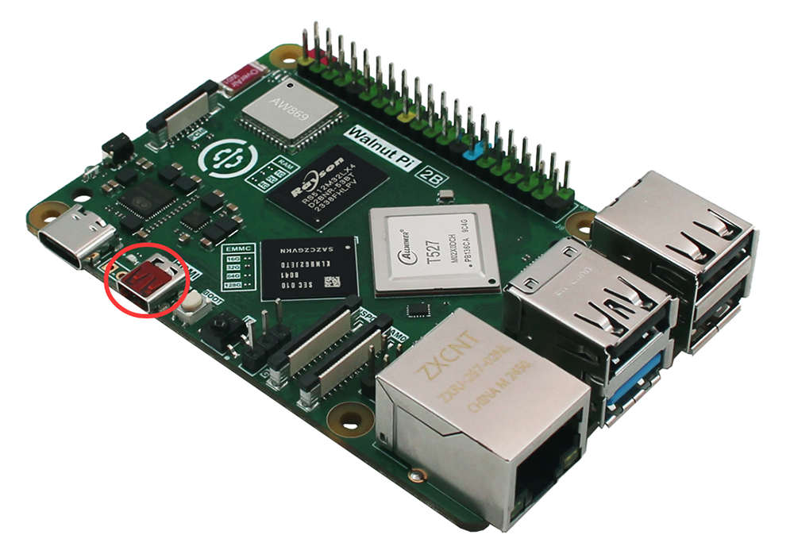
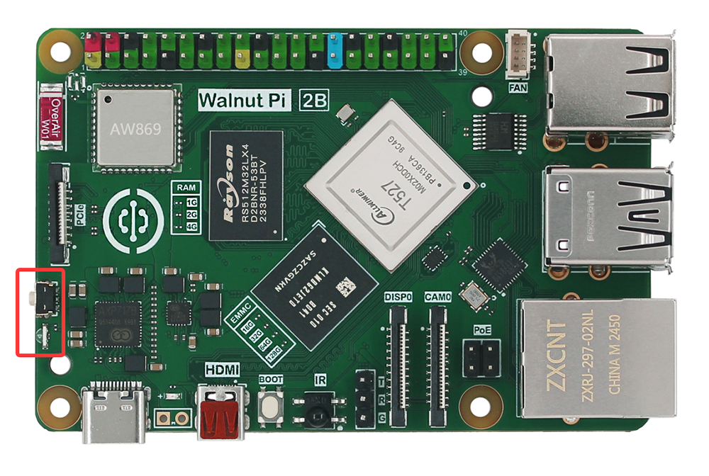
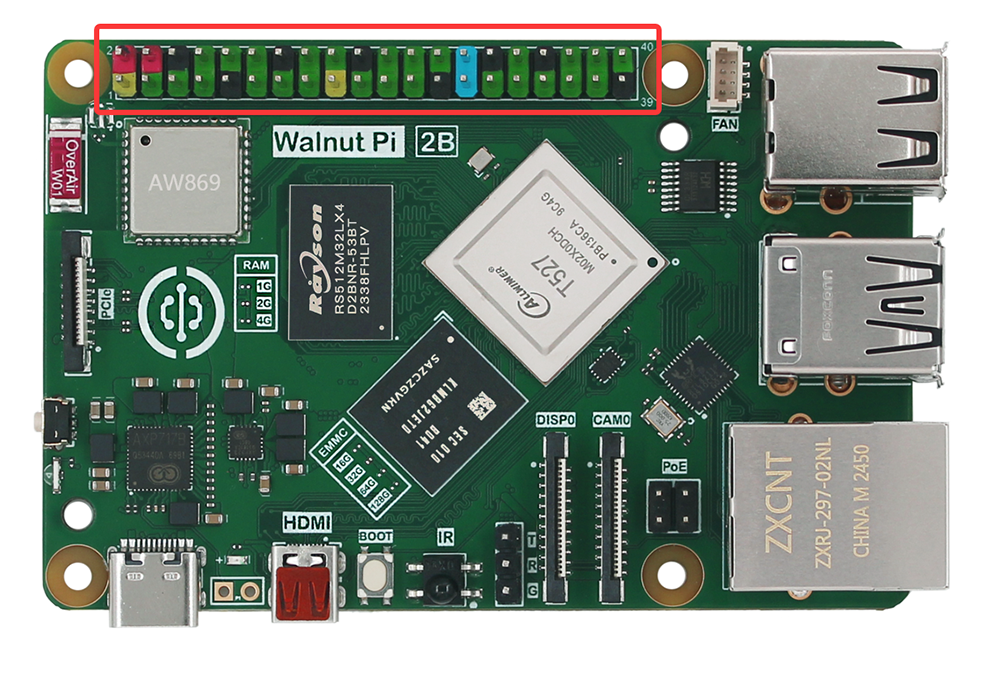

# 硬件详解

对核桃派2B各部分硬件详细讲解。

## CPU

跟普通电脑一样，核桃派硬件是由众多组件组成，每个组件都为其整体运行扮演重要角色，首先来看看CPU。核桃派2B使用全志T527 八核高性能Cortex-A55处理器，主频可达1.8GHz。

:::tip 提示：
T527有2个版本，分别是`M02X0DCH`和`M00X0DCH`，其中`M02X0DCH`表示带2TOPs算力版本。核桃派2B使用的为`M02X0DCH`，即带2TOPs算力。
:::

## RAM（内存）

在 CPU 旁边有1个黑色矩形芯片（下图所示）。这就是核桃派的随机存储器（RAM），也就是我们常说的内存。

当你使用核桃派时，RAM在保持你的使用和运行，只有当你保存相关文件时才会保存到 microSD 卡或者EMMC储存介质。这些组件在一起形成核桃派的易失性和非易失性记忆：RAM 是掉电不保存，而 microSD卡和EMMC是掉电保存的。

**核桃派2B提供1/2/4GB内存选择。（T527最大支持4G内存）**

## EMMC（闪存）

EMMC闪存可以简单理解成电脑的“硬盘”，可以存放操作系统或者文件。掉电是保存的。功能和MicroSD卡一样，速度比MicroSD卡快。

**核桃派2B的EMMC是选配，默认32GB容量**

## MicroSD卡槽

microSD卡连接器在核桃派2B的背部。这是核桃派的存储：插入这里的 microSD卡包含核桃派所有保存的文件、所有安装的软件和运行的操作系统。

**microSD卡最大支持容量为512GB**

## PCIe

核桃派2B提供PCIe 2.1接口，可通过扩展板外接固态硬盘等兼容PCIe标准的设备。

## WiFi和蓝牙

在核桃派的左上角，你会发现一个金属屏蔽罩。这是无线模块，实际由两部分组成，分别是 WiFi 和蓝牙。WiFi用于连接到无线网络；而蓝牙则可以用于连接外设比如蓝牙键盘鼠标，也可以向附近的传感器或智能手机等设备发送数据。

**核桃派2B无线模块支持双频WiFi(2.4G和5G)以及蓝牙5.0。板载双频陶瓷天线，无需外接天线。同时预留ipex4天线座，有需要用户可以焊接0R电阻切换。**

## USB

核桃派有4个标准 USB 2.0和1个USB3.0接口。其中3个以USB-A母座接口引出（如下图），还有1个位于供电接口的type-c(可以通过type-c拓展坞拓展引出)，这些可以连接各种USB外围设备，包括键盘、鼠标、USB摄像头、U盘等。

**USB母座黑色是USB2.0，蓝色是USB3.0。**

## 以太网

核桃派2B板载千兆以太网口（10M/100M/1000M自适应），你可以用一根网线将核桃派连接到有线计算机网络（路由器 LAN 网口）。如果仔细观察以太网端口，您会在底部看到两个发光二极管（LED）,这些是状态 LED，让您知道该网络连接正在工作。

:::tip 提示
连接百兆以太网线指示灯状态：绿灯常亮，黄灯闪烁；  
连接千兆以太网线指示灯状态：绿灯闪烁，黄灯常亮。
:::

**预留PoE接口，可以通过搭配PoE电源模块供电，需要路由器具备PoE功能。**

## 音频接口

核桃派2B背面预留一个音频FPC座，可以通过转接板转成3.5mm音频座，也就是常见的耳机插孔。可以用于连接耳机或扬声器得到更强大的声音。

## HDMI

核桃派2B拥有1个高清多媒体接口(HDMI 2.0)端口，支持4K@60fps。板载microHDMI接口，通常情况下你需要使用microHDMI转标准HDMI线缆连接到显示器。

## MIPI CSI

核桃派2B拥有1 MIPI CSI接口（1x4 lane CSI，兼容2 lane）。可外接CSI摄像头设备。

## MIPI DSI

核桃派2B拥有1 MIPI DSI接口（1x4 lane CSI，兼容2 lane）。可外接MIPI显示屏，支持1080P@60fps。

## 红外接收器

核桃派2B板载红外接收头1个。

## 按键和LED

核桃派2B板载可编程按键和LED各1个。

## GPIO

核桃派上方有个40P金属引脚（排针），分成两行，每行20个排针。这是GPIO(通用输入/输出)排针，这些引脚用于连接LED、按钮到传感器、操纵杆和脉搏率监控器等其他硬件进行通信。也就是我们常说的单片机IO口。

核桃派使用彩色40P排针，方便接线，避免误接短路。

## 串口调试口

核桃派引出了串口调试口，可以通过USB转TTL串口工具连接，使用putty等工具查看调试信息或登录系统控制台。

## 电源管理

在核桃派方的Type-C 母座上方看到一个小芯片， 这是电源处理芯片（PMC），可以处理将Type-C端口输入的电源转换为核桃派工作需要的电源。核桃派2B要求电源输入5V，电流3A以上。

