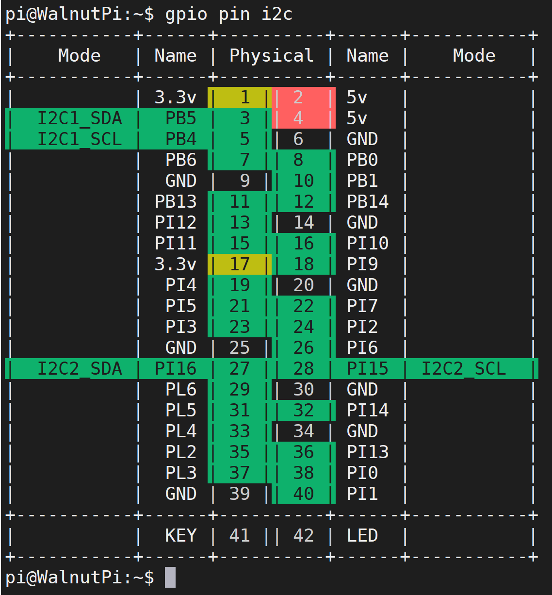

# GPIO介绍

我们详细介绍一下核桃派的GPIO，也就是核桃派的40Pin GPIO（和树莓派类似），核桃派已经是一个很棒的卡片电脑，但 GPIO 的设计让用户使用核桃派进行各类 DIY 电子设计变得更容易，让你拥使用一个强大的单片机开发板一样的体验。


下面是核桃派GPIO的引脚图：

- 核桃派2B


从上面表格和图例可以看到，GPIO和传统的单片机开发相似，除了普通IO口外，也有I2C、串口（UART）、SPI等总线接口，以及电源输出供电引脚（3.3V和5V）。可以外接各类传感器和模块，在后面的嵌入式编程章节都会涉及。

## 电源引脚

核桃派GPIO中有两路5V和两路3.3V输出引脚，以及8个GND引脚，可对外供电。

## 普通IO

除了电源引脚外，所有IO口都可以配置为输入/输出引脚使用。IO电平为3.3V。

## 其它功能

部分引脚有其它功能，具体如下：

### PWM (脉宽调制)

PB4, PB6, PI10, PI11, PI12, PI2, PI3, PI4, PI5, PI6, PI7, PI15, PI16, PI13, PI14, PI0, PI1, PL2, PL3, PL4, PL5, PL6 提供硬件PWM功能。

查询指令：

```bash
gpio pin pwm
```


### UART 

- TX2(PB0), RX2(PB1)
- TX3(PI11), RX3(PI12)
- TX4(PI0), RX4(PI1)
- TX5(PI2), RX5(PI3)
- TX6(PI6), RX6(PI7)
- TX7(PB13), RX7(PB14)
- TX8(PL2), RX8(PBL3)

查询指令：
```bash
gpio pin uart
```


### I2C 

- SDA1(PB5), SCL1(PB4)
- SDA2(PI16), SCL2(PI15)

查询指令：
```bash
gpio pin i2c
```


### SPI 

- SPI1: MOSI (PI4); MISO (PI5); SCLK (PI3); CS0 (PI2), CS1 (PI6)

查询指令：
```bash
gpio pin spi
```
