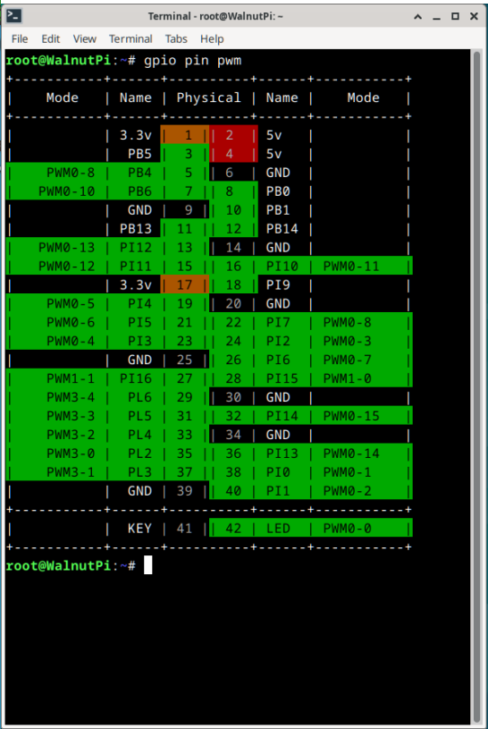
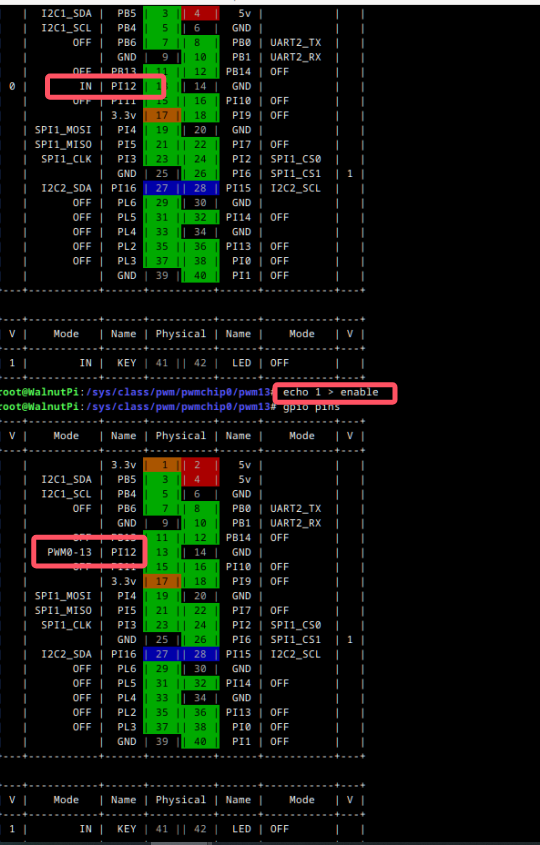
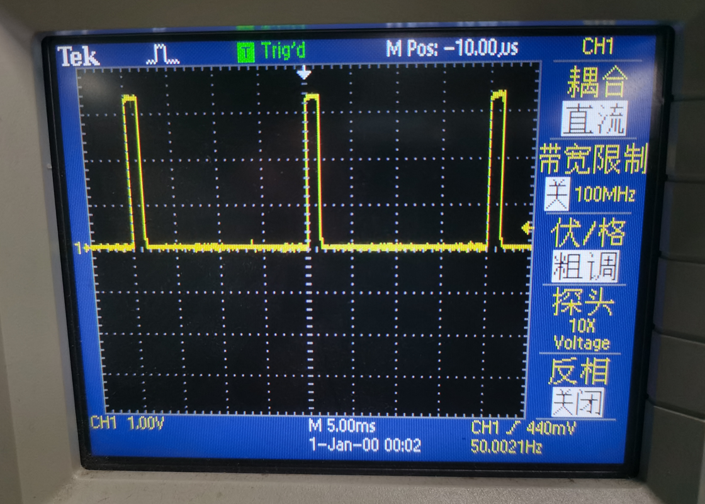
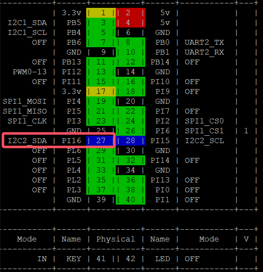
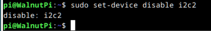
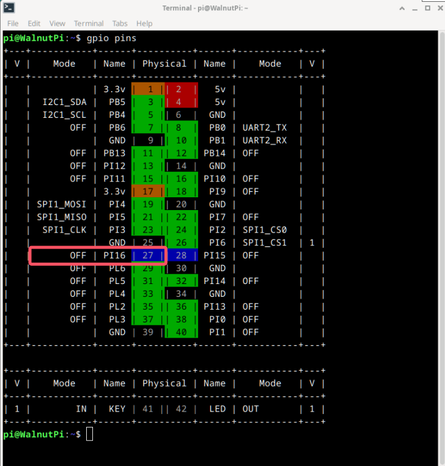
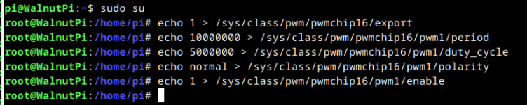

# PWM

本篇主要介绍如何使用板上的硬件PWM功能，基于linux下对pwm的通用操作方式

需要管理员才能操作硬件pwm，这里先从用户pi切换到root用户
```
su root
```


## 查看pwm引脚分布
运行命令`gpio pin pwm`来查看有哪些引脚带硬件pwm功能
```
gpio pin pwm
```



## 切换引脚到pwm功能
跟uart spi i2c那些功能不同，如果你想使用引脚的pwm功能，使用`set-device指令`关掉该引脚上的其他功能即可。（set-device更改完需要重启才能生效）

例如核桃派2b的引脚24（PI2）可作为pwm3、uart5_tx、spi1_cs0这3种功能，只要本次开机时没有启用uart5 和 spi1 ，那这个引脚24（PI2）就可以被设置为硬件pwm输出

## PWM控制方式

### 1. 导出pwm的控制文件
在路径 **/sys/class/pwm/** 下有着4个文件夹，与芯片本身的4个硬件pwm控制器相对应。将通道号写入到内部的**export**文件，即可生成对应pwm通道的控制文件。后面我们通过生成的这些文件来控制pwm的周期占空比等参数。


- 例如引脚19是PWM0-5，pwm控制器0的通道5，归 **pwmchip0** 
- 例如引脚27是PWM1-1，pwm控制器1的通道1，归 **pwmchip16**
- 例如引脚29是PWM3-4，pwm控制器3的通道4，归 **pwmchip22**

这里我要控制的是PWM0-13，pwm控制器3的通道4，进pwmchip0文件夹，写入13到文件 **export**
```
cd /sys/class/pwm/pwmchip0
echo 13 > export
```


进入这个 **pwm13** 文件夹，这些文件就可以用来设置pwm了


### 2. 设置周期

**period** 这个文件用于设置pwm的周期，单位是纳秒（ns）

例如我想输出一个周期为20ms的pwm，则敲入如下命令即可
```
echo 20000000 > period #周期设置为20ms
```


### 3. 设置占空比
**duty_cycle** 这个文件用来设置一个周期内高电平的时长，单位是纳秒（ns）（可通过另一个文件设置，让duty_cycle代表低电平所占时长）

例如我想让这个pwm的高电平时长为1.5ms，则敲入如下命令即可
```
echo 1500000 > duty_cycle #高电平时长为1.5ms
```


### 4. 设置占空比的极性
**polarity** 这个文件用来设置duty_cycle文件参数所代表的是哪段电平的长度
- 设置为 normal,则**duty_cycle**文件的值会做为一个周期内 高电平 所占的时长
- 设置为 inversed,则**duty_cycle**文件的值会做为一个周期内 低电平 所占的时长

我想让上面写的1.5ms代表高电平的时长，只要往这个文件内写入normal即可
```
echo normal > polarity
```


### 5. 启动/关闭 输出
**enable** 这个文件用于使能pwm输出，
- 写入1，使能pwm输出
- 写入0，关闭pwm输出

```
echo 1 > enable #使能pwm输出
echo 0 > enable #关闭pwm输出
```




## 示例：控制PWM1-1输出

首先运行`gpio pins`命令查看引脚是否已设置为其他功能。



由上图可知，该引脚已经被启用为i2c2,那么我们需要使用命令`set-device`来关掉i2c2,然后运行命令`sudo reboot`重启后生效



重启后看到该引脚的mode现在已经变成了off，就可以输出pwm了


让pwm1-1输出一个频率100HZ（周期10ms），占空比百分之50（高电平长5ms）的波形。完整流程如下
```
sudo su #切换到root用户
echo 1 > /sys/class/pwm/pwmchip16/export
echo 10000000 > /sys/class/pwm/pwmchip16/pwm1/period #周期设置为10ms
echo 5000000 > /sys/class/pwm/pwmchip16/pwm1/duty_cycle #高电平时长为5ms
echo normal > /sys/class/pwm/pwmchip16/pwm1/polarity #duty_cycle代表高电平时长
echo 1 > /sys/class/pwm/pwmchip16/pwm1/enable #使能pwm输出
```
```
echo 0 >/sys/class/pwm/pwmchip16/pwm1/enable #关闭pwm输出
```


