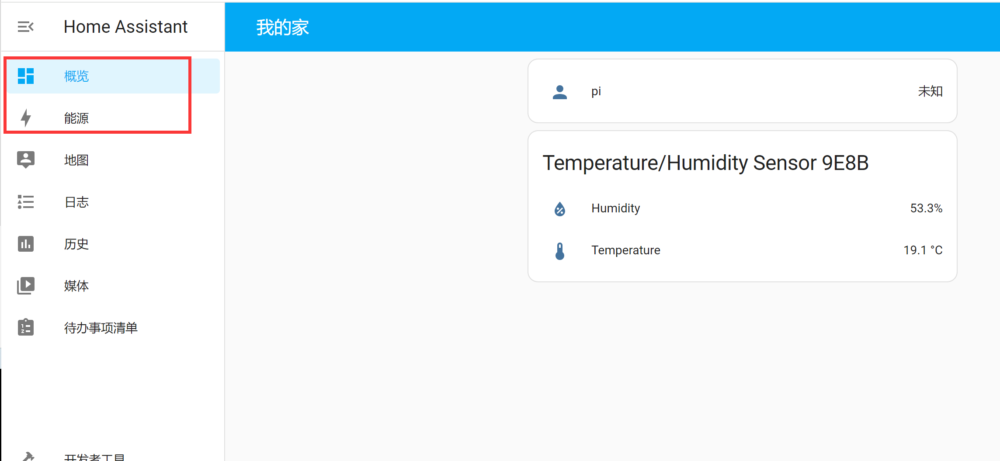
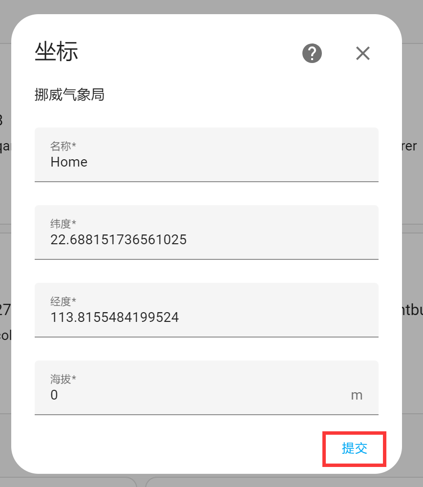
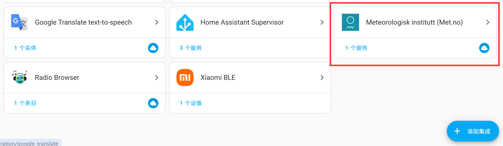
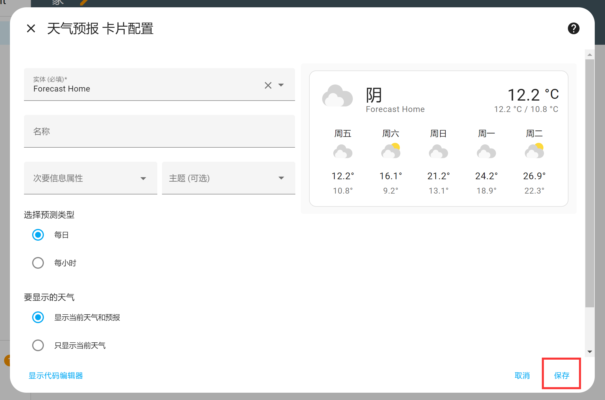

# 仪表盘

仪表盘是登录Home Assistant后的首页。用于显示各类信息，用户可以自定义页面。默认情况下有**概览**和**能源**界面，最主要使用的是**概览**页面，首次登录可以看到页面几乎是空的。

接下来我们讲解一下怎么在仪表盘中添加新的卡片。点击右上角**铅笔**按钮，在弹出的对话框点击右上角按钮，选择**自行编辑**：

弹出新窗口，如果你想从空白仪表盘开始编辑，选中左下角选项即可（不用担心丢失设备，后面都可以重新添加回来），然后点击**自行编辑**：

然后出现下面界面，今后再点右上角**铅笔**按钮都是出现这个界面了。点击右下角**添加卡片**按钮：

我们以添加一个**天气预报**卡片为例，看看是如何在仪表盘添加卡片的。可以看到有很多卡片，往下拉动到天气预报，看到下图只有卡片介绍，说明这个卡片还没绑定服务：

我们回到首页，先通过地图修改自己所在位置：

在配置--设备与服务里面添加集成：

在弹出的窗口搜索“**meteoro**”关键词，选择Meteorologisk institutt服务（一个气象站服务）：

然后是设置名称和经纬度坐标，之前在地图设置过位置这里就不用重复设置了，点击**提交**按钮，完成配置：

可以看到集成里面已经成功添加该服务：

这时候返回概览首页，点击右上角**铅笔**按钮，然后点击**添加卡片**，找到天气预报，可以发现已经有天气数据：

点击选择它，然后在弹出的窗口配相关信息，这里演示使用默认信息，点保存。

仪表盘就出现了天气的卡片：

当仪表盘有多个卡片时可以通过修改下方编号实现改变卡片位置：

