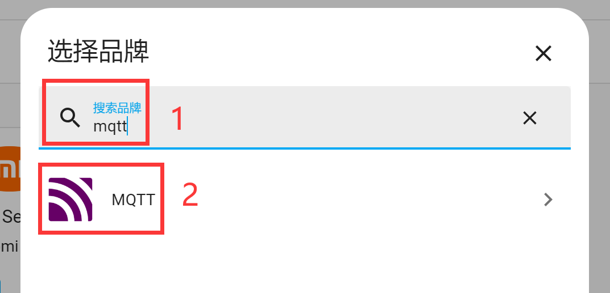
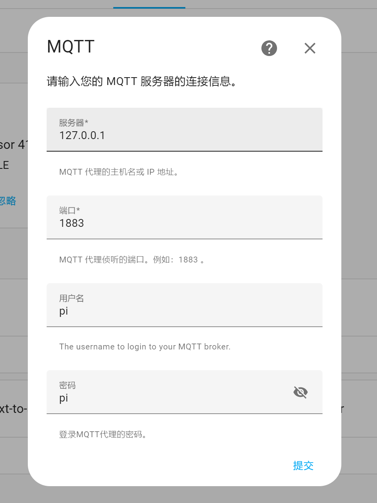

# 添加MQTT集成

在上一节搭建好MQTT服务器后，本节来讲解如何在Home Assistant里面添加MQTT集成。添加成功后我们就可以根据协议加入各类自定义的设备了。

点击**配置**，然后点击右下角**添加集成**：

在弹出窗口搜索“mqtt” ,  选择MQTT进入：

再选择下图所示进入：

依次填写MQTT服务器信息：
- `服务器`：MQTT服务器的域名或IP地址，由于这里使用的MQTT服务器也是安装在核桃派上，因此可以写：127.0.0.1 表示本机的意思；
- `端口`：没修改过的话就是1883；
- `用户名`和`密码`：上一节教程设置的均为pi。

点击提交，成功连接的话会弹出提成，没成功的话请参考上一节教程检查MQTT服务器是否安装成功。

安装成功后可以看到基础里面多了MQTT了。

点击进入，可以看到MQTT集成信息，通过**选项**可以重新配置MQTT集成服务器等信息配置：

添加集成后接下来就可以添加各类MQTT设备了。

