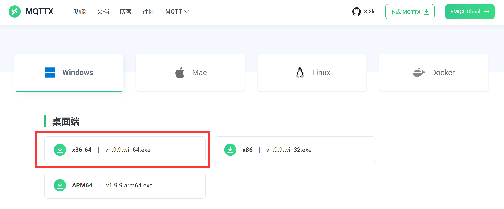

# MQTT服务器安装

MQTT（又名 MQ 遥测传输）是一种基于 TCP/IP 的机器对机器或“物联网”连接协议。它允许极其轻量级的发布/订阅消息传输。MQTT是一个非常通用的协议，使用它可以让我们非常方便接入自己的设备。关于核桃派MQTT详细教程可以参考：[MQTT通讯](../../python/network/mqtt.md)


使用MQTT集成需要一个MQTT服务器。

:::tip 提示
如果你使用的是核桃派Home Assistant镜像，那么这个镜像出厂已经安装好了MQTT服务器，并开机自启动。
:::


如果你使用核桃派普通镜像安装的Home Assistant，那么就需要自己手动安装和配置MQTT服务器。安装教程如下：

## 安装

打开核桃派终端, 使用apt指令安装：

```bash
sudo apt install mosquitto
```

设置开机自启动：

```bash
sudo service mosquitto start
```

## 常规配置

这里可以配置mqtt服务器端口和绑定文件相关信息，在核桃派 **/etc/mosquitto/conf.d** 目录下用终端新建一个配置文件，名称随意，系统会自动检测，如default.conf :

```bash
sudo nano /etc/mosquitto/conf.d/default.conf
```

输入内容：
```
#修改端口
port 1883

# 不允许匿名访问，需要提供 用户名&密码 才能连接服务器
allow_anonymous false

# 指定要使用的 用户名&密码 文件，需手动创建该文件
password_file /etc/mosquitto/pwfile

# 指定权限控制文件存放路径，需手动创建该文件
acl_file /etc/mosquitto/aclfile
```

然后按ctrl+x保存退出。

## 新建账户

这个账号和密码用于登录MQTT服务器。核桃派 **/etc/mosquitto/** 目录使用下面指令新建一个文件，文件名称和前面配置的名称 **pwfile**要一致。

```bash
sudo touch /etc/mosquitto/pwfile
```

增加文件后需要使用mosquitto_passwd命令来创建账号密码：这里以新建一个账号：pi ，密码：pi 的账户来测试。

```bash
sudo mosquitto_passwd /etc/mosquitto/pwfile pi
```

然后后提示输入密码即可。

:::tip 提示
密码不会显示，注意区分大小写，需要需要2次。
:::


## 设定账号权限 

这个功能主要是让不同用户过滤掉MQTT服务器一些没用的信息。可选功能，如果不设置就表示接收全部主题信息。

在核桃派 **/etc/mosquitto/** 目录使用下面指令新建一个账号权限文件，文件名称和前面配置的名称 **aclfile**要一致。

```bash
sudo nano /etc/mosquitto/aclfile
```

文件内输入：

```
user pi
topic #
```

表示然后按ctrl+x保存退出。

上面内容表示pi用户接收所有MQTT topic信息，如： **topic walnutpi/#** 则表示只接受**walnutpi/**开头的topic相关信息。其它主题会屏蔽。

所有配置完成后通过下面指令重启MQTT服务以生效：


配置完成后重启MQTT服务器以便配置生效：

```bash
sudo service mosquitto restart
```

## 测试MQTT服务器

在核桃派上安装完MQTT服务器后可以使用MQTT助手测试，这里推荐一款功能比较齐全的测试助手，叫MQTTX，支持windows, mac, linux等平台，在今后MQTT实验里面会经常借助MQTT助手来调试。这里基于windows安装使用：

### 下载和安装MQTTX

下载地址：https://mqttx.app/zh/downloads

选择自己电脑合适版本下载，下图是Windows 64位系统：



下载完成后直接安装即可。

### 连接核桃派MQTT服务器并测试

打开安装好的MQTTX ，可以看到界面非常简洁：


点击连接旁边的 + 按钮，选 **新建连接** 新建一个链接：


输入核桃派MQTT服务器信息：
- `名称`：随意；
- `服务器地址`：填写核桃派的IP地址；
- `用户名和密码`：前面配置的用户名和密码，如果使用Home Assistant镜像，则默认用户名：pi；密码：pi。

其它信息默认即可。


然后点击**连接**，连接成功后会有提示：


连接成功后订阅一个测试的主题，点击**添加主题**：


在弹出窗口主题位置输入 ：walnutpi/1 ，这里的-`walnutpi/1`是主题名称，可以自己定义，点击确认。


然后回到主窗口，在右侧按下图选择数据类型和输入主题和信息，主题必须和订阅的一致，输入完成后按右下角发送按钮：


可以看到对话框出现了2条信息，右边为发送的内容，左边为接收内容。说明核桃派MQTT服务器收发正常。


