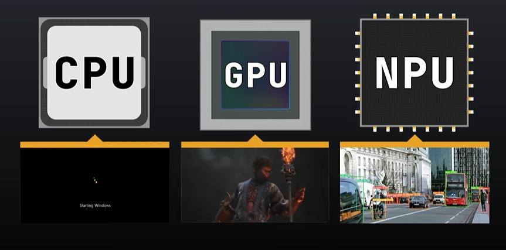

# NPU简介

NPU（Neural Processing Unit，神经网络处理器）    是专为人工智能领域的神经网络计算设计的硬件加速芯片 ，是人工智能时代的核心算力引擎。相较于传统的 CPU（中央处理器）和 GPU（图形处理器），NPU 通过深度优化架构，集成大量针对神经网络运算的专用单元，如乘累加器阵列、脉动阵列等，能够高效执行矩阵运算、激活函数计算等复杂操作。这使其在处理深度学习任务时，展现出惊人的速度和能效优势，大幅降低计算延迟与功耗，在图像识别、语音处理、自然语言处理等场景中实现实时推理与训练。从智能终端到数据中心，从边缘计算到云端服务，NPU 凭借其强大的并行处理能力和卓越的能效比，推动人工智能技术快速落地，成为驱动行业智能化变革的关键力量。

关于CPU、GPU、NPU区别可以查看B站这个up主的视频：https://www.bilibili.com/video/BV1wbcdeWENh/

核桃派2B（全志T527）内置2TOPS NPU, 支持INT 8/16/32b, Float 16/32b. 核桃派OS(Debian)已经移植好相关驱动。

