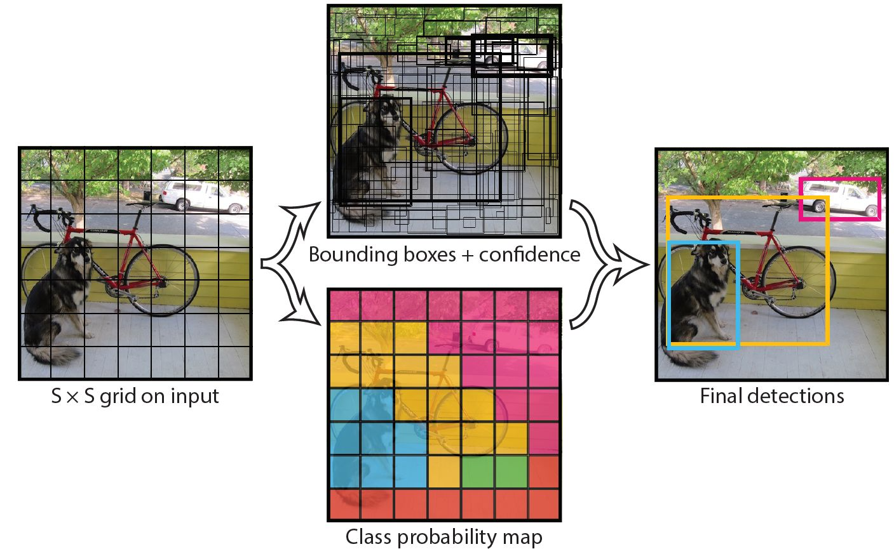
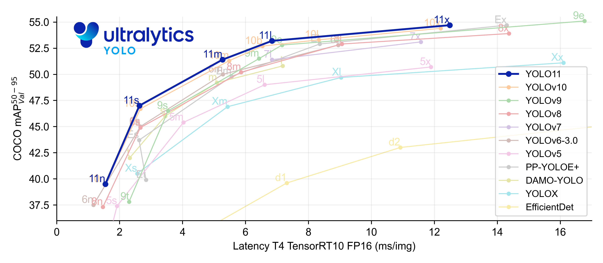
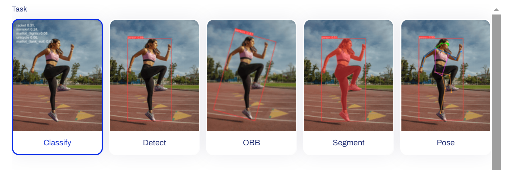
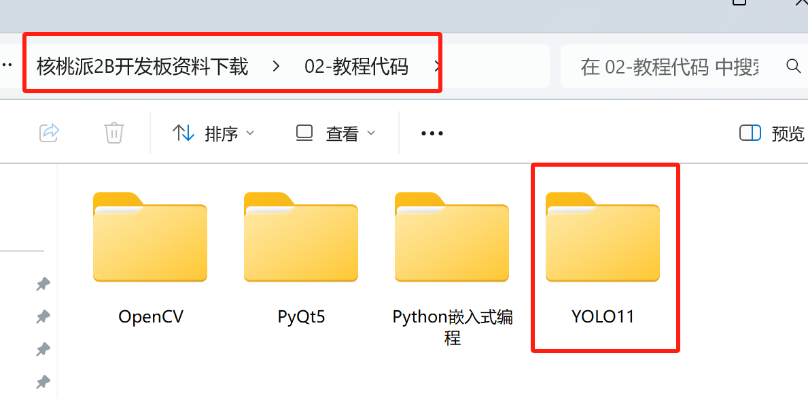

# YOLO简介

YOLO（You Only Look Once）是一种先进的实时目标检测算法，主要用于视觉识别，由 Joseph Redmon 等人于 2015 年提出，其核心思想是将目标检测任务视为一个单一的回归问题，通过一次网络前向传播直接预测出目标的边界框坐标和类别，显著提升检测速度与效率。

## 技术原理

YOLO 将输入图像划分为 S×S 的网格，每个网格负责预测落入该网格内的目标。每个网格会输出 B 个边界框及其置信度，同时预测 C 个类别概率。边界框包含位置信息（中心坐标、宽、高）和置信度得分（反映框内存在目标的概率及框定位的准确程度）。通过非极大值抑制（NMS）算法，过滤掉重叠度高的冗余框，保留最优检测结果。

## 发展历程

YOLO有很多版本，不同版本甚至由不同公司维护，其中比较受欢迎的是Ultralytics维护的YOLOv5、YOLOv8以及YOLO11。

YOLO11 是 UltralyticsYOLO 是实时物体检测器系列中的最新产品，以最先进的精度、速度和效率重新定义了可能实现的目标。在之前YOLO 版本令人印象深刻的进步基础上，YOLO11 在架构和训练方法上进行了重大改进，使其成为广泛的计算机视觉任务的多功能选择。

为了满足速度和精度不同需求，YOLO每个版本又分不同变体版本区分，如YOLO11包含YOLO11n、YOLO11s、YOLO11m、YOLO11l、YOLO11x 是 YOLOv11 版本。主要区别体现在模型大小、性能和精度上。以下是它们的核心差异：

- 模型规模与参数量
    - YOLO11n（Nano）：最小版本，参数量最少（通常 < 1M），模型体积小，适合边缘设备部署。
    - YOLO11s（Small）：参数量适中（约 2-5M），平衡速度和精度，适合轻量级应用。
    - YOLO11m（Medium）：中等规模（约 10-20M），精度显著提升，适合大多数常规场景。
    - YOLO11l（Large）：参数量较大（约 30-50M），精度更高，但推理速度较慢。
    - YOLO11x（Extra-Large）：最大版本（参数量 > 50M），提供最高精度，适合对准确率要求极高的场景。

- 应用场景
    - YOLO11n：无人机、移动设备、实时监控（低算力环境）。
    - YOLO11s/m：通用目标检测（如安防监控、自动驾驶辅助）。
    - YOLO11l/x：高精度场景（如工业质检、医学图像分析）。

核桃派YOLO教程将以YOLO11n为案例进行讲解。包含分类、检测、定向检测、姿态识别和图像分割5个应用例程。

核桃派系统内置一套封装好的YOLO11 Python库，使用Python编程轻松实现YOLO识别功能。代码资料位于开发板资料包-示例程序目录。

