# 在线训练模型

核桃派在线训练模型网站适用于用户需要自己训练视觉模型场景，无需代码，拖放图片构建数据集，简单几步，即可生成强大的YOLO11视觉模型。训练完成后自动生成模型文件和python脚本，可直接在开发板上运行。

在线训练网站链接：https://ai.01studio.cc 

目前支持平台：核桃派2B **(请使用v1.4以上Debian版本镜像）**

支持视觉识别类型：图像分类、图像检测

## 注册登录

打开 https://ai.01studio.cc ，点击右上角登录按钮

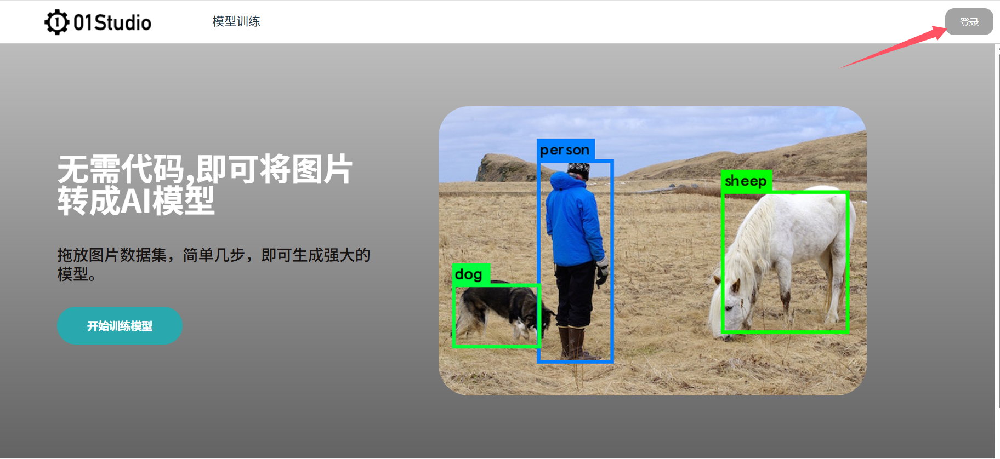

可以通过手动注册或微信、Github关联账号一键登录（当前关联登录仍然需要邮件或手机号码验证。）


登录后点击右上角 【头像--个人主页】 可查看或修改自己的个人信息


## 训练分类模型

视觉分类是对图片进行识别分类，输出这张图片大概率是什么物品。（无位置矩形框）

这里准备了一个简单的数据集给大家测试使用，点击下载： [示例数据集（分类）](https://01studio-1258570164.cos.ap-guangzhou.myqcloud.com/train/%E7%A4%BA%E4%BE%8B%E6%95%B0%E6%8D%AE%E9%9B%86%EF%BC%88%E5%88%86%E7%B1%BB%EF%BC%89.zip) ，里面包含了苹果和鼠标各数十张图片。


### 创建数据集

点击  模型训练--数据集--创建数据集 :


进入后输入数据集名称（自定义），然后选择分类，点击创建。


可以看到新建了一条数据集。


- `数据集ID`：所有数据集唯一编号；
- `数据集名称`：自己定义的数据集名称；
- `类型`：视觉识别类型，这里是分类；
- `创建时间`：数据集的创建时间；
- `最后更新时间`：数据集最后编辑时间；
- `操作`：包含编辑和删除按钮（删除目前不可恢复）。

点击右边操作的`编辑`按钮，首次进入会提示新建一个标签，这里我们训练苹果和鼠标分类识别，先创建苹果标签 apple **（标签尽量使用英文，避免某些开发板无中文库无法使用）**


创建后左边列表栏出现了apple标签，点击右边按钮可以编辑修改。


点击【上传图片到训练集】


点击【添加图片】

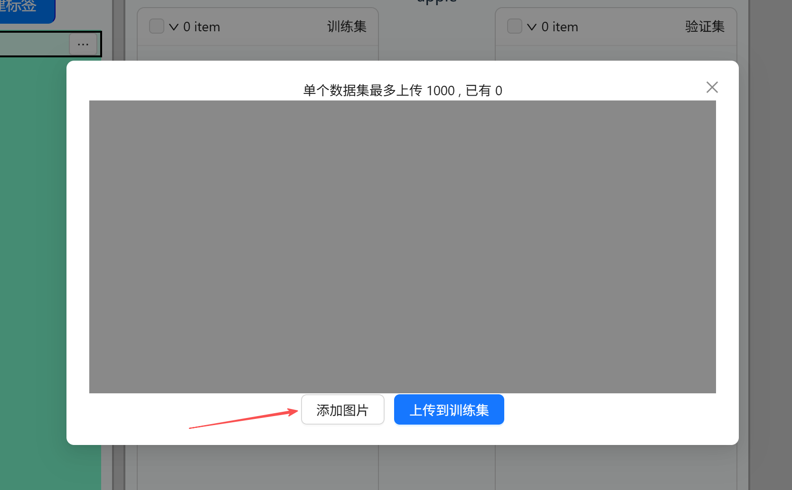

将前面下载的示例数据集中的apple图片的选中：

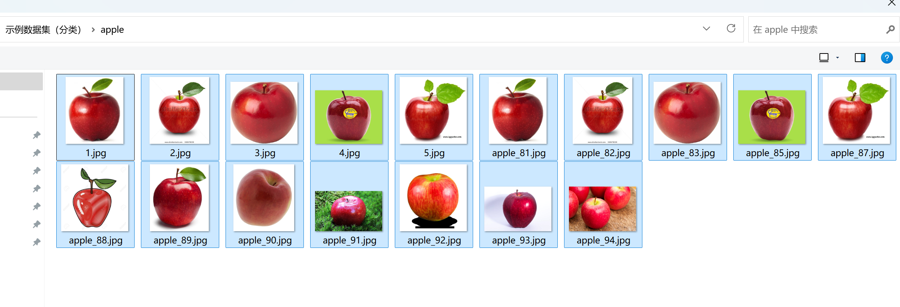

点击【上传到训练集】


同样方法再上传几张图片到验证集。训练集用于训练，验证集用于每轮训练考核。验证集数量一般为数据集数量的10%~30%即可。


点击【创建标签】，然后新建一个鼠标（mouse）标签。

选中mouse标签:

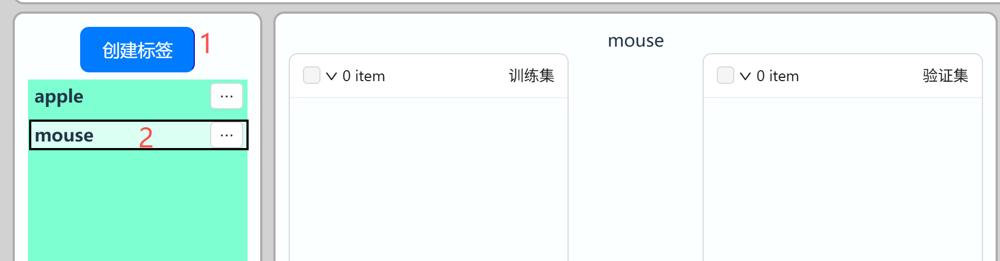

按前面的方法将示例数据集的鼠标图片上传到训练集和数据集。

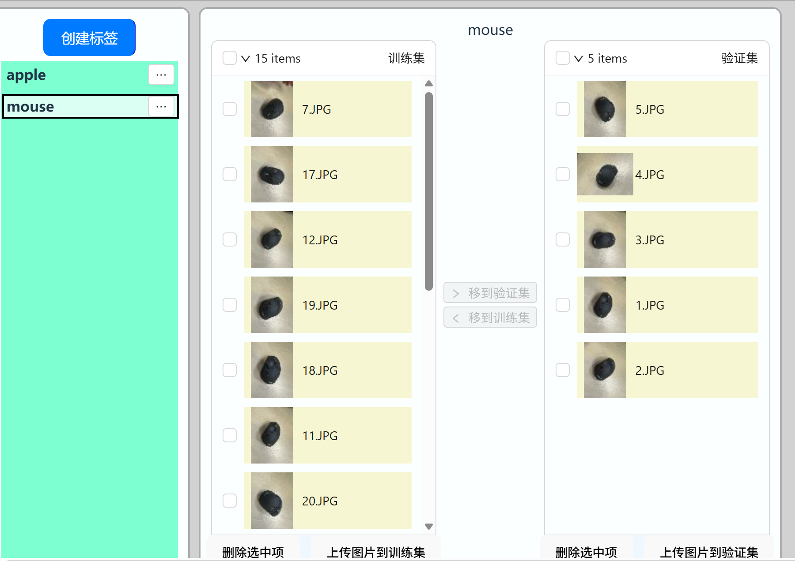

### 开始训练

点击数据集上方 【创建训练任务】：


配置训练参数：**参数一般情况下按默认配置即可。**

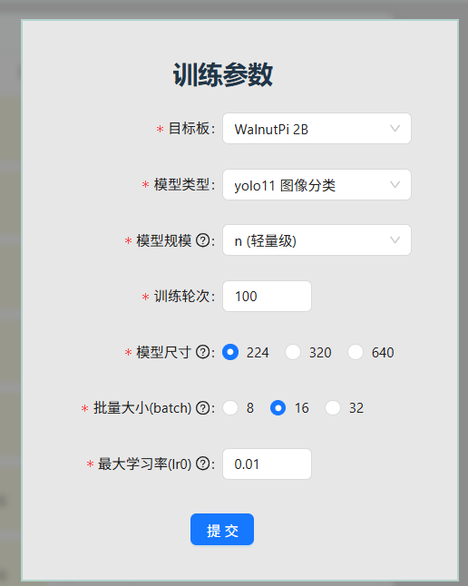

- `目标板`：这里选中WalnutPi 2B；
- `模型类型`：会根据数据集自动选择；
- `模型规模`：开发板一般选n或s，其它可能跑不起。

- `训练轮次`：当前平台最大允许500轮；
- `模型尺寸`：数值变大精度会提升，但运行时间长。一般推荐224或320。
- `批量大小（batch）`：默认16，如果图片数量较多（一千张）可以选中32以提升训练速度；
- `最大学习率（lr0）`：默认0.01，一般情况下无需调整；

点击【提交】后自动跳转到训练界面：

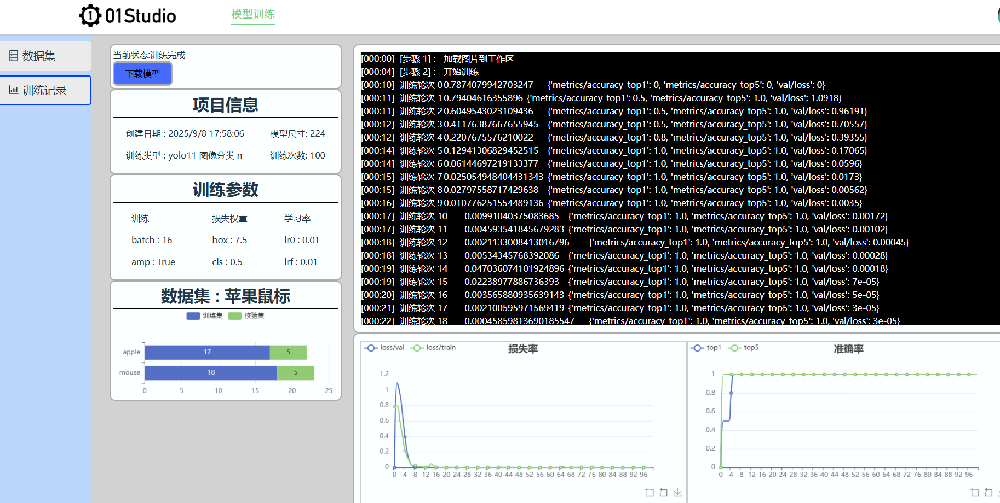

左边是项目信息，右上方是训练日志，右下方是训练结果图表。以下图为例，模型在第5次后识别准确率达100%，效果非常好。


点击左侧导航栏--训练记录 即可看到所有训练项目信息。点击右边【详情】按钮进入：


训练完成后可以点击【下载】按钮下载模型和代码文件。


### 部署运行

模型文件下载后通过U盘等方式拷贝到核桃派2B。推荐桌面版系统，方便观察摄像头或者图片识别结果。

也可以在桌面版核桃派系统网页打开 https://ai.01studio.cc , 同样账号登录。在训练记录中下载训练结果文件。


使用下面指令解压。

```bash
tar -xvf 3.tar
```


可以看到有4个文件:

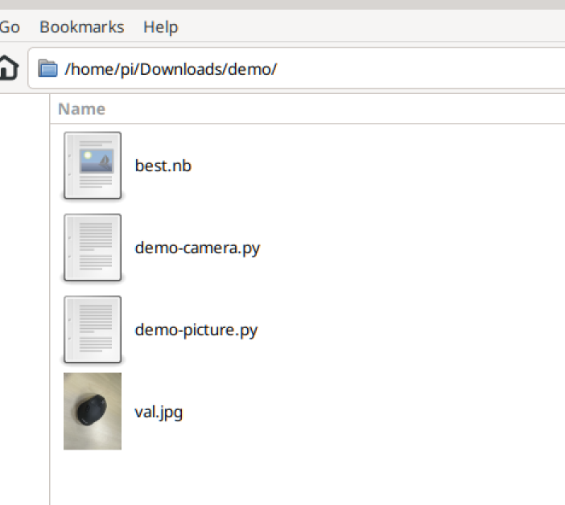

分别是：

- `best.nb` ：适用于核桃派2B（全志T527）的模型文件
- `val.jpg` ：用于测试图片demo的图片
- `demo-picture.py` ：识别图片demo，会用到val.jpg
- `demo-camera.py` : 使用USB摄像头识别 

#### 基于图片

在终端使用 **python demo-picture.py** 指令，或者使用thonny打开运行。
可以看到识别结果为mouse鼠标，置信率为0.97 （最大1），同时在当前路径下返回result.jpg，图片左上角有识别信息。


#### 基于摄像头

核桃派2B连接USB摄像头：


终端运行指令： **python demo-camera.py** , 出现一个摄像头图像显示框，可以实时识别分类物体。


## 训练检测模型

图像检测是将图片中训练时的物体类型识别出来，并使用方框进行标注。

这里准备了一个简单的数据集给大家测试使用，点击下载： [示例数据集（检测）](https://01studio-1258570164.cos.ap-guangzhou.myqcloud.com/train/%E7%A4%BA%E4%BE%8B%E6%95%B0%E6%8D%AE%E9%9B%86%EF%BC%88%E6%A3%80%E6%B5%8B%EF%BC%89.zip) ，里面包含了苹果和香蕉各数十张图片已经标注好的label.txt文件。

train里面的是训练集，val里面的是验证集。

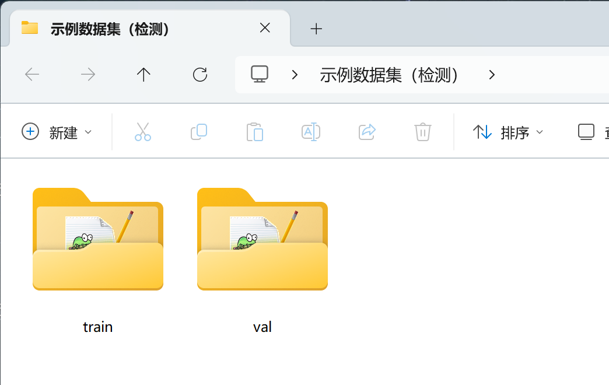

### 创建数据集

点击  模型训练--数据集--创建数据集 :


进入后输入数据集名称（自定义），然后选择检测，点击创建。


可以看到新建了一条数据集。

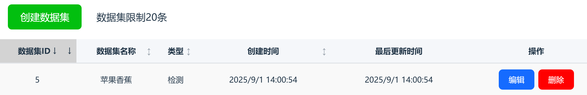

- `数据集ID`：所有数据集唯一编号；
- `数据集名称`：自己定义的数据集名称；
- `类型`：视觉识别类型，这里是分类；
- `创建时间`：数据集的创建时间；
- `最后更新时间`：数据集最后编辑时间；
- `操作`：包含编辑和删除按钮（删除目前不可恢复）。

点击【编辑】按钮进入编辑数据集，然后点击上传图片：


先上传到训练集：


将示例数据集train文件夹里全部图片添加上传。

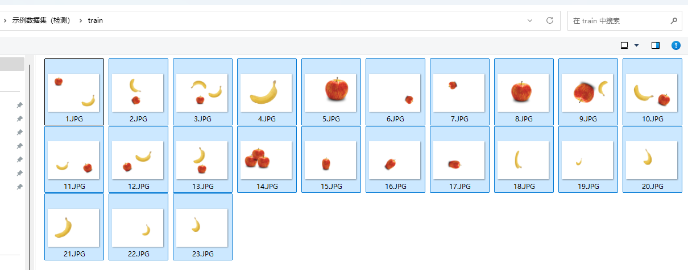

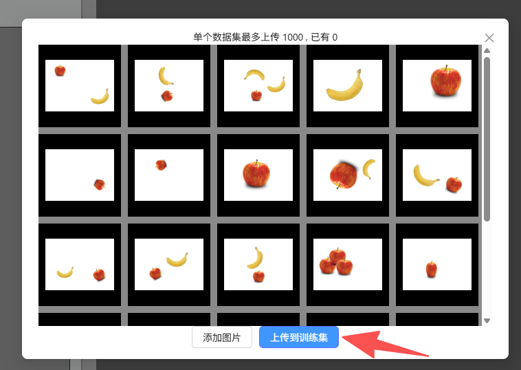

在右边创建一个标签，名称为apple，颜色自定义一下。


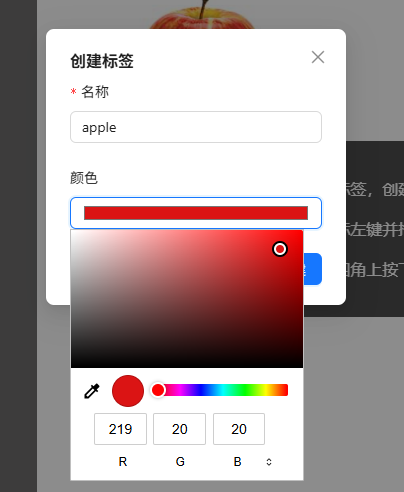

创建完成如下图：


然后再创建一个香蕉的标签 banana 。**（提示：创建完点击右边小按钮可以重新编辑）**


#### 图片标注

接下来我们就可以标注图片，从第一张图片开始：


先选中标签栏的苹果，然后使用鼠标框出苹果。完成后如下图，左边有个方框，里面有个数字1，右边下方为标注框信息。

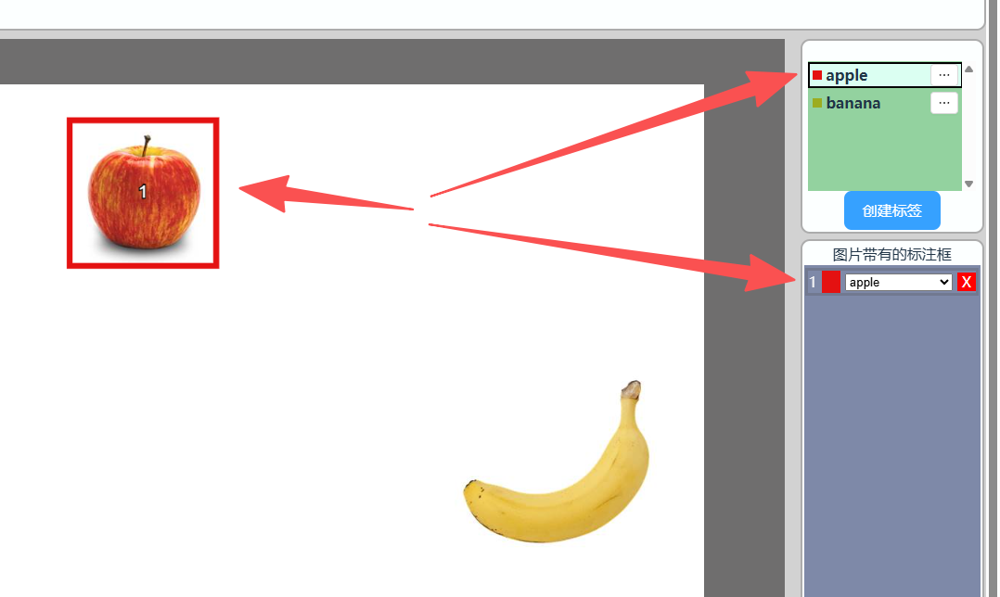

同样方法再标注香蕉。

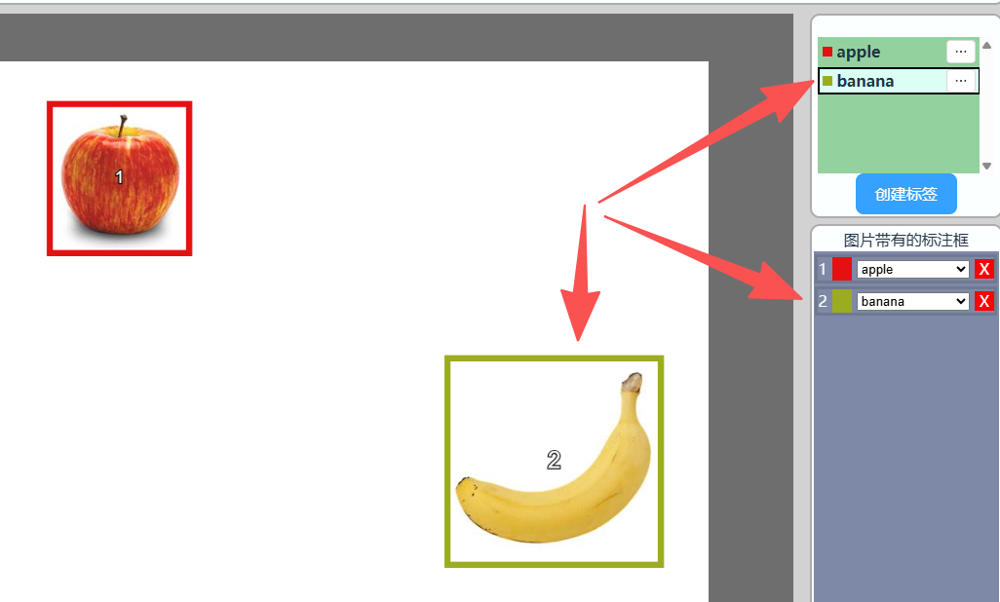

最后用同样的方法将所有图片的苹果和香蕉标注出来。


<br></br>

训练集标注完成后将val文件夹图片上传到验证集。**训练集用于训练，验证集用于每轮训练考核。验证集数量一般为数据集数量的10%~30%即可。**


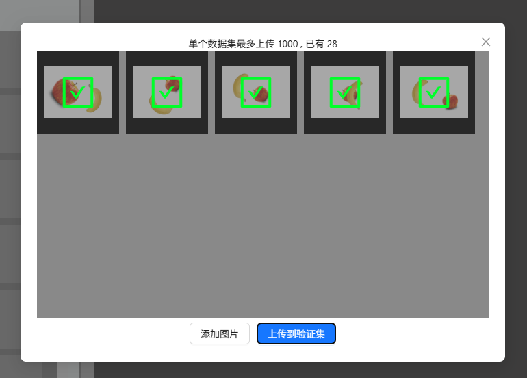

然后使用与前面训练集同样方法进行标注。


下面这个位置可以筛选训练集、验证集 以及是否已经标准的图片。


至此检测数据集标注完成。

:::tip 提示
平台目前支持上传和导出标注文件，当前仅支持YOLO TXT 格式，每个TXT文件对应一张图片的所有标注目标，每一行代表一个目标，每行格式为：
**<类别索引> <目标中心点x> <目标中心点y> <目标宽度w> <目标高度h>**
:::

示例检测数据集里面带一个和图片同名的txt文件是标注信息文件。可以直接上传导入。

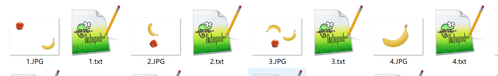

点击上传标注文件：


导入后如标签名称不一致手动修改即可。


### 开始训练

完成标注后点击数据集上方 【创建训练任务】：

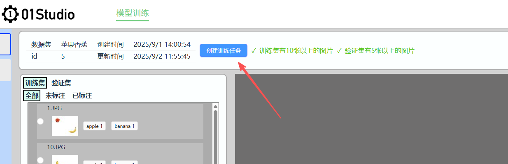

配置训练参数：**参数一般情况下按默认配置即可。**


- `目标板`：这里选中WalnutPi 2B；
- `模型类型`：会根据数据集自动选择；
- `模型规模`：开发板一般选n或s，其它可能跑不起。

- `训练轮次`：平台当前最大允许500轮；
- `模型尺寸`：数值变大精度会提升，但运行时间长。一般推荐224或320。
- `批量大小（batch）`：默认16，如果图片数量较多（一千张）可以选中32以提升训练速度；
- `最大学习率（lr0）`：默认0.01，一般情况下无需调整；

点击【提交】后自动跳转到训练界面：


左边是项目信息，右上方是训练日志，右下方是训练结果图表。以下图为例，模型在100轮训练后最终**mAP50**值为0.94（>0.8），**mAP50-mAP50-95**值为0.65(>0.5)，效果非常好。


点击左侧导航栏--训练记录 即可看到所有训练项目信息。点击右边【详情】按钮进入：


训练完成后可以点击【下载】按钮下载模型和代码文件。


### 部署运行

下载后通过U盘等方式拷贝到核桃派2B。推荐桌面版系统，方便观察摄像头或者图片识别结果。

也可以在桌面版核桃派系统网页打开 https://ai.01studio.cc , 同样账号登录。在训练记录中下载训练结果文件。

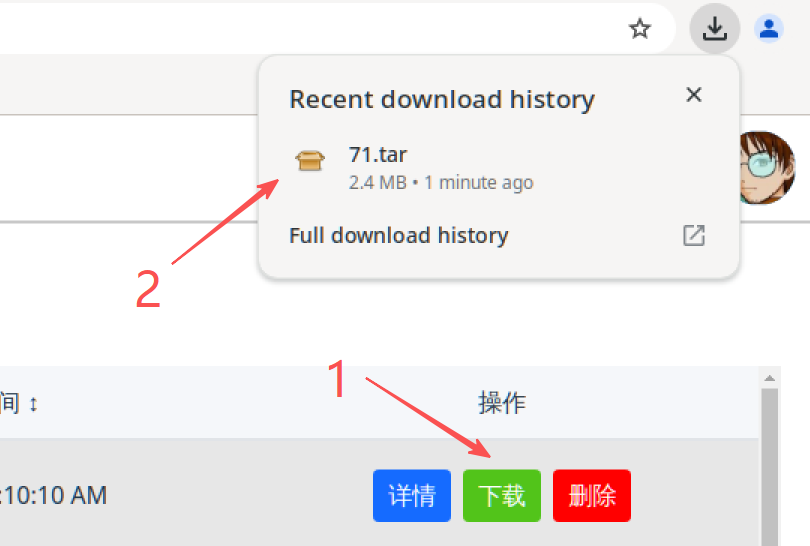

使用指令 tar -xvf 71.rar 解压（根据自己的文件名修改）。可以看到有4个文件


分别是：

- `best.nb` ：适用于核桃派2B（全志T527）的模型文件
- `val.jpg` ：用于测试图片demo的图片
- `demo-picture.py` ：识别图片demo，会用到val.jpg
- `demo-camera.py` : 使用USB摄像头识别 

#### 基于图片

在终端使用 **python demo-picture.py** 指令，或者使用thonny打开运行。

可以看到识别结果，将识别水果标注出来，**同时在当前路径下返回结果图片result.jpg**。


#### 基于摄像头

核桃派2B连接USB摄像头：


终端运行指令： **python demo-camera.py** , 出现一个摄像头图像显示框，可以实时识别检测物体并标注方框。

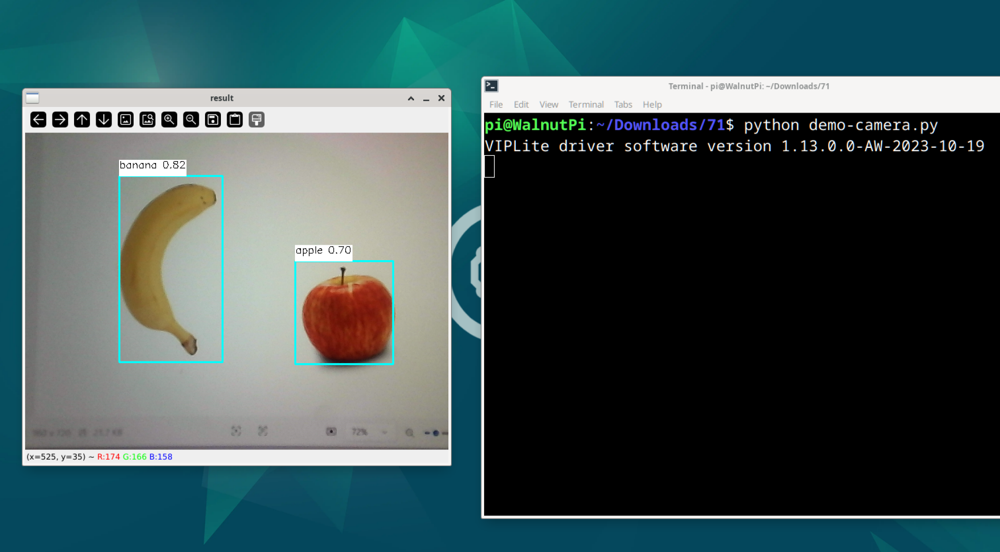


