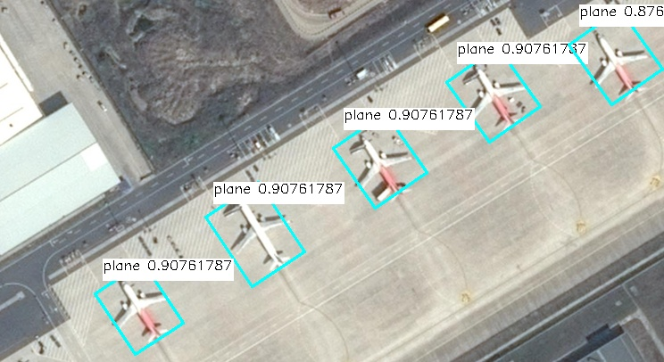
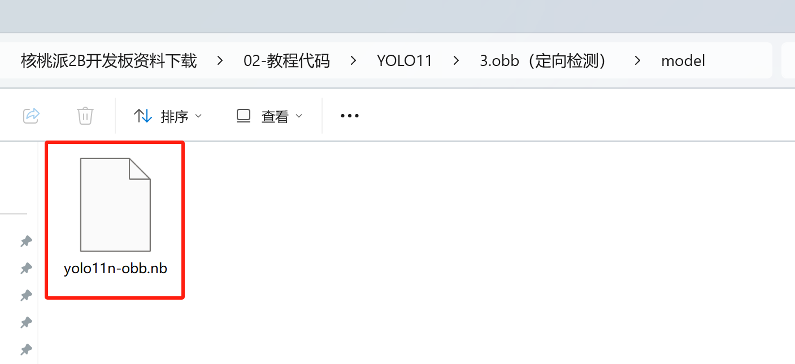
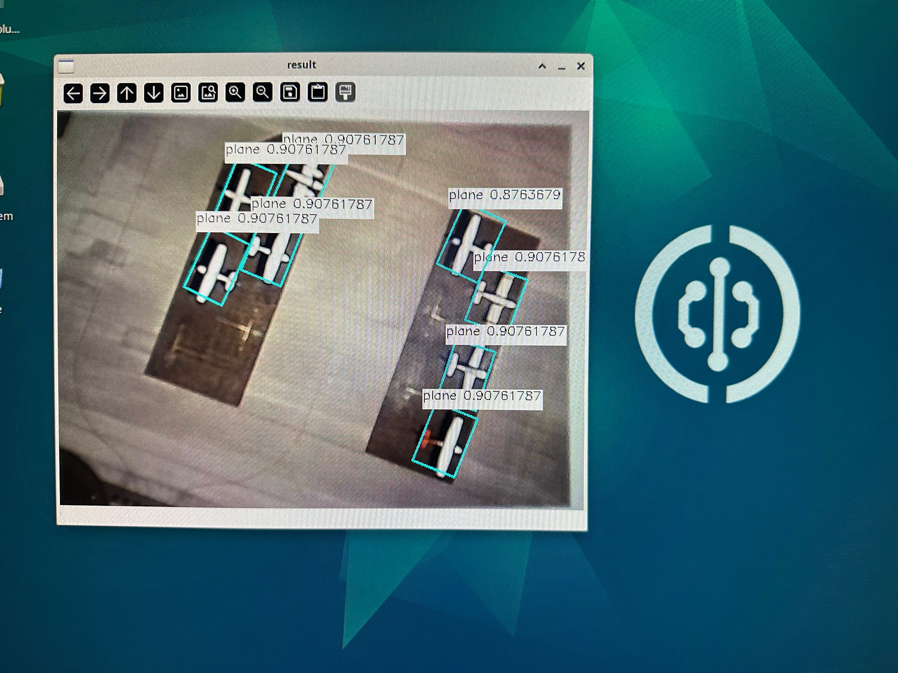

# YOLO11 定向检测

该模型的功能是找到图片中所有在训练时标注的物品类型。但在检测模型的基础上，增加了对于物体识别框旋转角度的检测。




## 准备模型文件

我们提供的程序包里会有一个名为`yolo11n-obb.nb`的文件，这就是在核桃派2B（T527） NPU上运行YOLO11定向检测的模型文件。



想尝试自行转换模型可以参考：[模型转换教程](./model_convert.md) 

## 安装OpenCV

本教程需要用到OpenCV库，安装方法参考：[OpenCV安装](../../opencv/install.md)

## Python运行模型

核桃派2B v1.3.0 版本以上系统提供一套封装好的YOLO11 Python库。

### 1. 实例化yolo11类
实例化`YOLO11_OBB`类，需要传入模型文件的路径

```python
from walnutpi import YOLO11

yolo = YOLO11.YOLO11_OBB("model/yolo11n-obb.nb")
```

### 2. 运行模型-阻塞式
使用`run`方法即可运行模型，并返回检测结果，需要传入3个参数
- 图片数据， 使用opencv的读取图片方法进行读取即可
- 置信度阈值， 只会返回置信度高于这个值的检测框
- 检测框重叠度阈值， 模型经常会在物体周围同时命中多个检测框，如果框之间的面积重合度高于这个值，则只保留置信度最高的框，删除其他重合框

```python
# 读取图片
import cv2
img = cv2.imread("image/plane.jpg")

# 检测
boxes = yolo.run(img, 0.5, 0.1)
```

### 3. 运行模型-非阻塞式
使用`run_async`方法会创建一个线程来运行模型,然后立刻返回。需要传入3个参数
- 图片数据， 使用opencv的读取图片方法进行读取即可
- 置信度阈值， 只会返回置信度高于这个值的检测框
- 检测框重叠度阈值， 模型经常会在物体周围同时命中多个检测框，如果框之间的面积重合度高于这个值，则只保留置信度最高的框，删除其他重合框

非阻塞式运行需要配合 `is_running` 属性使用，他的值是 true或false，表示后台是否跑着`run_async`启动的模型运行线程。如果后台已经跑着一个运行线程了，则运行`run_async`时不会再启动新的线程。也可以用此属性来判断模型运行线程跑完了没，是否可以获取结果了。

使用`get_result()`方法 会返回后台的识别结果，与阻塞式方法`run`得到的是相同的东西

```python
import cv2
img = cv2.imread("image/plane.jpg")

yolo.run_async(img, 0.5, 0.1)
while yolo.is_running:
    time.sleep(0.1)
boxes = yolo.get_result()
```

### 4. 检测结果
`run`方法和`get_result`方法返回的都是一个列表，如果图片中检测不到东西则返回一个空的列表。列表里每个值都代表一个命中了的检测框，每个检测框对象都包含以下属性

| 属性        | 说明                          |
| ----------- | ----------------------------- |
| x           | 检测框中心点的x坐标           |
| y           | 检测框中心点的y坐标           |
| w           | 检测框的宽度                  |
| h           | 检测框的高度                  |
| reliability | 表示检测框的置信度，例如:0.78 |
| label       | 检测框的标签                  |
| angle       | 检测框的旋转角度              |

注意label是一个数字，例如yolo官方模型训练时标注了15个类型，检测出来的label属性就会是0-14

每个检测框对象都包含以下方法，用于计算旋转后的检测框的四个点的坐标

| 方法             | 说明                   |
| ---------------- | ---------------------- |
| get_top_left     | 获取旋转后的左上角坐标 |
| get_bottom_left  | 获取旋转后的左下角坐标 |
| get_top_right    | 获取旋转后的右上角坐标 |
| get_bottom_right | 获取旋转后的右下角坐标 |


可以使用以下代码输出所有检测到的框的信息
```python
print(f"boxes: {boxes.__len__()}")
for box in boxes:
    print(
        "{:f} ({:4d},{:4d} r{:f} ) w{:4d} h{:4d} {:d}".format(
            box.reliability,
            box.x,
            box.y,
            box.angle,
            box.w,
            box.h,
            box.label,
        )
    )
```
## 示例程序

### 基于图片

读取图片做检测，并保存结果


```python
'''
实验名称：YOLO11定向检测
实验平台：核桃派2B
说明：基于图片
'''

from walnutpi import YOLO11
import dataset_dota
import cv2

#【可选代码】允许Thonny远程运行
import os
os.environ["DISPLAY"] = ":0.0"

model_path = "model/yolo11n-obb.nb"
picture_path = "image/plane.jpg"
output_path = "result.jpg"

# 检测图片
yolo = YOLO11.YOLO11_OBB(model_path)
boxes = yolo.run(picture_path, 0.6, 0.1)

# 输出检测结果
print(f"boxes: {boxes.__len__()}")
for box in boxes:
    print(
        "{:f} ({:4d},{:4d} r{:f} ) w{:4d} h{:4d} {:s}".format(
            box.reliability,
            box.x,
            box.y,
            box.angle,
            box.w,
            box.h,
            dataset_dota.label_names[box.label],
        )
    )

# 到图上画框
img = cv2.imread(picture_path)
for box in boxes:
    left_x = int(box.x - box.w / 2)
    left_y = int(box.y - box.h / 2)
    right_x = int(box.x + box.w / 2)
    right_y = int(box.y + box.h / 2)
    label = str(dataset_dota.label_names[box.label]) + " " + str(box.reliability)
    (label_width, label_height), bottom = cv2.getTextSize(
        label,
        cv2.FONT_HERSHEY_SIMPLEX,
        0.5,
        1,
    )

    cv2.line(img, box.get_top_left(), box.get_top_right(), (255, 255, 0), 2)
    cv2.line(img, box.get_top_left(), box.get_bottom_left(), (255, 255, 0), 2)
    cv2.line(img, box.get_bottom_right(), box.get_bottom_left(), (255, 255, 0), 2)
    cv2.line(img, box.get_bottom_right(), box.get_top_right(), (255, 255, 0), 2)
    cv2.rectangle(
        img,
        (left_x, left_y - label_height * 2),
        (left_x + label_width, left_y),
        (255, 255, 255),
        -1,
    )
    cv2.putText(
        img,
        label,
        (left_x, left_y - label_height),
        cv2.FONT_HERSHEY_SIMPLEX,
        0.5,
        (0, 0, 0),
        1,
    )

# 保存图片
cv2.imwrite(output_path, img)

#窗口显示图片
cv2.imshow('result',img)

cv2.waitKey() #等待键盘任意按键按下
cv2.destroyAllWindows() #关闭窗口

```

### 基于摄像头

可以先学习在OpenCV的 [USB摄像头使用教程](../../opencv/usb_cam.md)



```python
'''
实验名称：YOLO11定向检测
实验平台：核桃派2B
说明：基于摄像头
'''

from walnutpi import YOLO11
import dataset_dota
import cv2

#【可选代码】允许Thonny远程运行
import os
os.environ["DISPLAY"] = ":0.0"

#加载模型
path_model = "model/yolo11n-obb.nb"
yolo = YOLO11.YOLO11_OBB(path_model)

# 打开摄像头
cap = cv2.VideoCapture(0)
if not cap.isOpened():
    print("Cannot open camera")
    exit()

# 设置为1080p
# cap.set(cv2.CAP_PROP_FOURCC, cv2.VideoWriter_fourcc(*"MJPG"))
# cap.set(cv2.CAP_PROP_FRAME_WIDTH, 1920)  # 设置宽度
# cap.set(cv2.CAP_PROP_FRAME_HEIGHT, 1080)  # 设置长度

boxes = []

while True:
    
    # 摄像头读取一帧图像    
    ret, img = cap.read()
    
    if not ret:
        print("Can't receive frame (stream end?). Exiting ...")
        break
    
    #非阻塞式推理图片    
    if not yolo.is_running:
        # 执行目标检测，设置置信度阈值为 0.5，IoU 阈值为 0.45
        yolo.run_async(img, 0.6, 0.1)
        
    boxes = yolo.get_result()
    
    # 输出检测结果
    if boxes is not None:
            
        # 输出检测结果
        print(f"boxes: {boxes.__len__()}")
            
        for box in boxes:
            print(
                "{:f} ({:4d},{:4d} r{:f} ) w{:4d} h{:4d} {:s}".format(
                    box.reliability,
                    box.x,
                    box.y,
                    box.angle,
                    box.w,
                    box.h,
                    dataset_dota.label_names[box.label],
                )
            )

        for box in boxes:
            
            left_x = int(box.x - box.w / 2)
            left_y = int(box.y - box.h / 2)
            right_x = int(box.x + box.w / 2)
            right_y = int(box.y + box.h / 2)
            label = str(dataset_dota.label_names[box.label]) + " " + str(box.reliability)
            (label_width, label_height), bottom = cv2.getTextSize(
                label,
                cv2.FONT_HERSHEY_SIMPLEX,
                0.5,
                1,
            )

            cv2.line(img, box.get_top_left(), box.get_top_right(), (255, 255, 0), 2)
            cv2.line(img, box.get_top_left(), box.get_bottom_left(), (255, 255, 0), 2)
            cv2.line(img, box.get_bottom_right(), box.get_bottom_left(), (255, 255, 0), 2)
            cv2.line(img, box.get_bottom_right(), box.get_top_right(), (255, 255, 0), 2)
            cv2.rectangle(
                img,
                (left_x, left_y - label_height * 2),
                (left_x + label_width, left_y),
                (255, 255, 255),
                -1,
            )
            cv2.putText(
                img,
                label,
                (left_x, left_y - label_height),
                cv2.FONT_HERSHEY_SIMPLEX,
                0.5,
                (0, 0, 0),
                1,
            )
    cv2.imshow("result", img)#窗口显示图片
    
    key = cv2.waitKey(1) # 窗口的图像刷新时间为1毫秒，防止阻塞    
    if key == 32: # 如果按下空格键，打断退出
        break
    
cap .release() # 关闭摄像头
cv2.destroyAllWindows() # 销毁显示摄像头视频的窗口

```