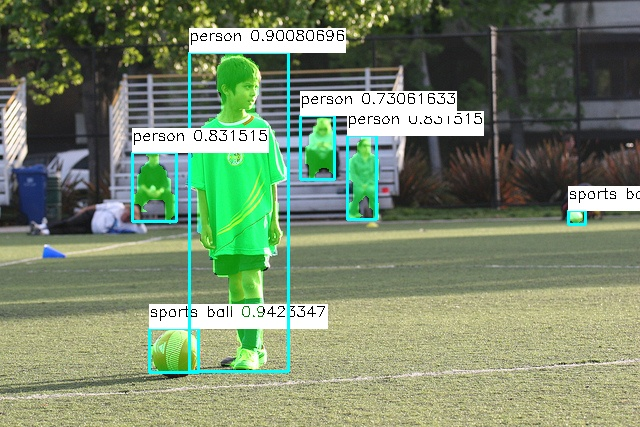
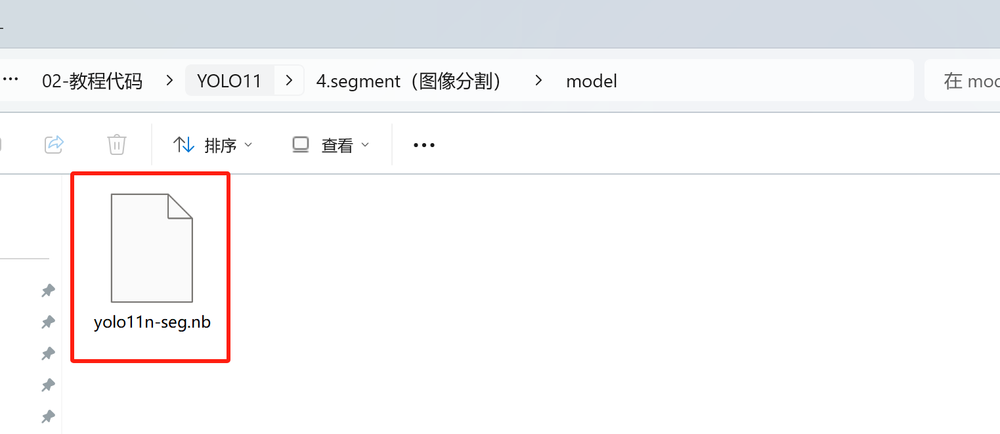
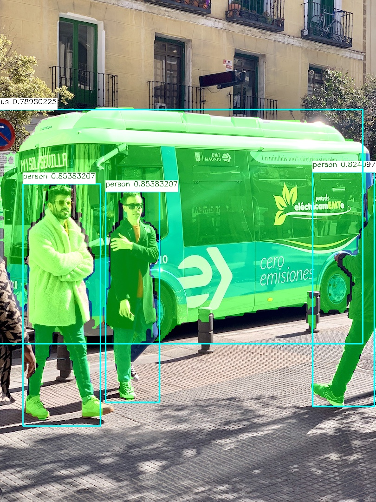
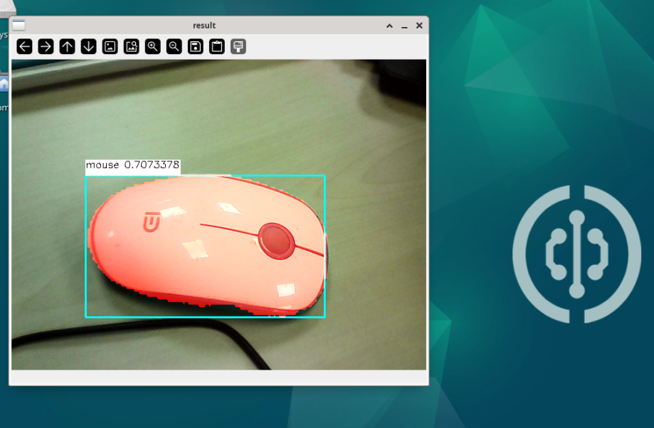

# YOLO11 图像分割

该模型在检测模型的基础上，增加了对于哪些像素点属于目标物体的判断




## 准备模型文件

我们提供的程序包里会有一个名为`yolo11n-seg.nb`的文件，这就是在核桃派2B（T527） NPU上运行YOLO11图像分割的模型文件。



想尝试自行转换模型可以参考：[模型转换教程](./model_convert.md) 

## 安装OpenCV

本教程需要用到OpenCV库，安装方法参考：[OpenCV安装](../../opencv/install.md)

## Python运行模型

核桃派2B v1.3.0 版本以上系统提供一套封装好的YOLO11 Python库。

### 1. 实例化yolo11类
实例化`YOLO11_SEG`类，需要传入模型文件的路径
```python
from walnutpi import YOLO11
yolo = YOLO11.YOLO11_SEG("model/yolo11n-seg.nb")
```
### 2. 运行模型-阻塞式
使用`run`方法即可运行模型，并返回检测结果，需要传入3个参数
- 图片数据， 使用opencv的读取图片方法进行读取即可
- 置信度阈值， 只会返回置信度高于这个值的检测框
- 检测框重叠度阈值， 模型经常会在物体周围同时命中多个检测框，如果框之间的面积重合度高于这个值，则只保留置信度最高的框，删除其他重合框

```python
# 读取图片
import cv2
img = cv2.imread("image/bus.jpg")

# 检测
boxes = yolo.run(img, 0.5, 0.5)
```

### 3. 运行模型-非阻塞式
使用`run_async`方法会创建一个线程来运行模型,然后立刻返回。需要传入3个参数
- 图片数据， 使用opencv的读取图片方法进行读取即可
- 置信度阈值， 只会返回置信度高于这个值的检测框
- 检测框重叠度阈值， 模型经常会在物体周围同时命中多个检测框，如果框之间的面积重合度高于这个值，则只保留置信度最高的框，删除其他重合框

非阻塞式运行需要配合 `is_running` 属性使用，他的值是 true或false，表示后台是否跑着`run_async`启动的模型运行线程。如果后台已经跑着一个运行线程了，则运行`run_async`时不会再启动新的线程。也可以用此属性来判断模型运行线程跑完了没，是否可以获取结果了。

使用`get_result()`方法 会返回后台的识别结果，与阻塞式方法`run`得到的是相同的东西

```python
import cv2
img = cv2.imread("image/bus.jpg")

yolo.run_async(img, 0.5, 0.5)
while yolo.is_running:
    time.sleep(0.1)
boxes = yolo.get_result()
```

### 4. 检测结果
`run`方法和`get_result`方法返回的都是一个列表，如果图片中检测不到东西则返回一个空的列表。列表里每个值都代表一个命中了的检测框，每个检测框对象都包含以下属性

| 属性        | 说明                                                           |
| ----------- | -------------------------------------------------------------- |
| x           | 检测框中心点的x坐标                                            |
| y           | 检测框中心点的y坐标                                            |
| w           | 检测框的宽度                                                   |
| h           | 检测框的高度                                                   |
| reliability | 表示检测框的置信度，例如:0.78                                  |
| label       | 检测框的标签                                                   |
| contours    | 包含所有轮廓点坐标的列表                                       |
| mask        | 一张单通道灰度图，不属于物体的像素点为0，属于物体的像素点为255 |

注意label是一个数字，例如yolo官方模型训练时标注了80个类型，检测出来的label属性就会是0-79


可以使用以下代码输出所有检测到的框的信息
```python
print(f"boxes: {boxes.__len__()}")
for box in boxes:
    print(
        "{:f} ({:4d},{:4d}) w{:4d} h{:4d} lbael:{:d}".format(
            box.reliability,
            box.x,
            box.y,
            box.w,
            box.h,
            box.label,
        )
    )
```

mask图像可以使用以下代码叠加到原图上显示
```python
import numpy as np


mask_img = np.zeros_like(img)  # 生成一张与原图大小相同的纯黑图片
mask_img[box.mask > 200] = (0, 255, 0)  # 将mask颜色值大于200的像素都改为绿色
img = cv2.addWeighted(img, 1, mask_img, 0.5, 0)  # 将mask_img与原图叠加
```

## 示例程序

### 基于图片

读取图片做检测，将目标物体都高亮



```python
'''
实验名称：YOLO11图像分割
实验平台：核桃派2B
说明：基于图片
'''

from walnutpi import YOLO11
import dataset_coco
import cv2
import numpy as np

#【可选代码】允许Thonny远程运行
import os
os.environ["DISPLAY"] = ":0.0"

model_path = "model/yolo11n-seg.nb"
picture_path = "image/000000371552.jpg"
output_path = "result.jpg"

# 检测图片
yolo = YOLO11.YOLO11_SEG(model_path)
boxes = yolo.run(picture_path, 0.5, 0.5)

# 到图上画框
img = cv2.imread(picture_path)
for box in boxes:
    left_x = int(box.x - box.w / 2)
    left_y = int(box.y - box.h / 2)
    right_x = int(box.x + box.w / 2)
    right_y = int(box.y + box.h / 2)
    label = str(dataset_coco.label_names[box.label]) + " " + str('%.2f'%box.reliability)
    (label_width, label_height), bottom = cv2.getTextSize(
        label,
        cv2.FONT_HERSHEY_SIMPLEX,
        0.5,
        1,
    )
    cv2.rectangle(
        img,
        (left_x, left_y),
        (right_x, right_y),
        (255, 255, 0),
        2,
    )
    cv2.rectangle(
        img,
        (left_x, left_y - label_height * 2),
        (left_x + label_width, left_y),
        (255, 255, 255),
        -1,
    )
    cv2.putText(
        img,
        label,
        (left_x, left_y - label_height),
        cv2.FONT_HERSHEY_SIMPLEX,
        0.5,
        (0, 0, 0),
        1,
    )
    mask_img = np.zeros_like(img)  # 生成一张与原图大小相同的纯黑图片
    mask_img[box.mask > 200] = (0, 255, 0)  # 将mask颜色值大于200的像素都改为绿色
    img = cv2.addWeighted(img, 1, mask_img, 0.5, 0)  # 将mask_img与原图叠加

#保存图片
cv2.imwrite(output_path, img)

#窗口显示图片
cv2.imshow('result',img)

cv2.waitKey() #等待键盘任意按键按下
cv2.destroyAllWindows() #关闭窗口

```

### 基于摄像头

可以先学习在OpenCV的 [USB摄像头使用教程](../../opencv/usb_cam.md)



```python
'''
实验名称：YOLO11图像分割
实验平台：核桃派2B
说明：基于摄像头
'''

from walnutpi import YOLO11
import dataset_coco
import cv2
import numpy as np

#【可选代码】允许Thonny远程运行
import os
os.environ["DISPLAY"] = ":0.0"

model_path = "model/yolo11n-seg.nb"

# 检测图片
yolo = YOLO11.YOLO11_SEG(model_path)

# 打开摄像头并循环获取帧显示到屏幕上
cap = cv2.VideoCapture(0)
if not cap.isOpened():
    print("Cannot open camera")
    exit()

# 设置为1080p
# cap.set(cv2.CAP_PROP_FOURCC, cv2.VideoWriter_fourcc(*"MJPG"))
# cap.set(cv2.CAP_PROP_FRAME_WIDTH, 1920)  # 设置宽度
# cap.set(cv2.CAP_PROP_FRAME_HEIGHT, 1080)  # 设置长度
while True:
    # 读取一帧图像并显示出来
    ret, img = cap.read()
    if not ret:
        print("Can't receive frame (stream end?). Exiting ...")
        break
    if not yolo.is_running:
        yolo.run_async(img, 0.5, 0.5)
    boxes = yolo.get_result()

    # 到图上画框
    for box in boxes:
        left_x = int(box.x - box.w / 2)
        left_y = int(box.y - box.h / 2)
        right_x = int(box.x + box.w / 2)
        right_y = int(box.y + box.h / 2)
        label = str(dataset_coco.label_names[box.label]) + " " + str('%.2f'%box.reliability)
        (label_width, label_height), bottom = cv2.getTextSize(
            label,
            cv2.FONT_HERSHEY_SIMPLEX,
            0.5,
            1,
        )
        cv2.rectangle(
            img,
            (left_x, left_y),
            (right_x, right_y),
            (255, 255, 0),
            2,
        )
        cv2.rectangle(
            img,
            (left_x, left_y - label_height * 2),
            (left_x + label_width, left_y),
            (255, 255, 255),
            -1,
        )
        cv2.putText(
            img,
            label,
            (left_x, left_y - label_height),
            cv2.FONT_HERSHEY_SIMPLEX,
            0.5,
            (0, 0, 0),
            1,
        )
        mask_img = np.zeros_like(img)  # 生成一张与原图大小相同的纯黑图片
        mask_img[box.mask > 200] = (0, 0, 255)  # 将mask颜色值大于200的像素都改为红
        img = cv2.addWeighted(img, 1, mask_img, 0.8, 0)  # 将mask_img与原图叠加

    cv2.imshow("result", img)
    key = cv2.waitKey(1) # 窗口的图像刷新时间为1毫秒，防止阻塞    
    if key == 32: # 如果按下空格键，打断退出
        break
    
cap .release() # 关闭摄像头
cv2.destroyAllWindows() # 销毁显示摄像头视频的窗口

```