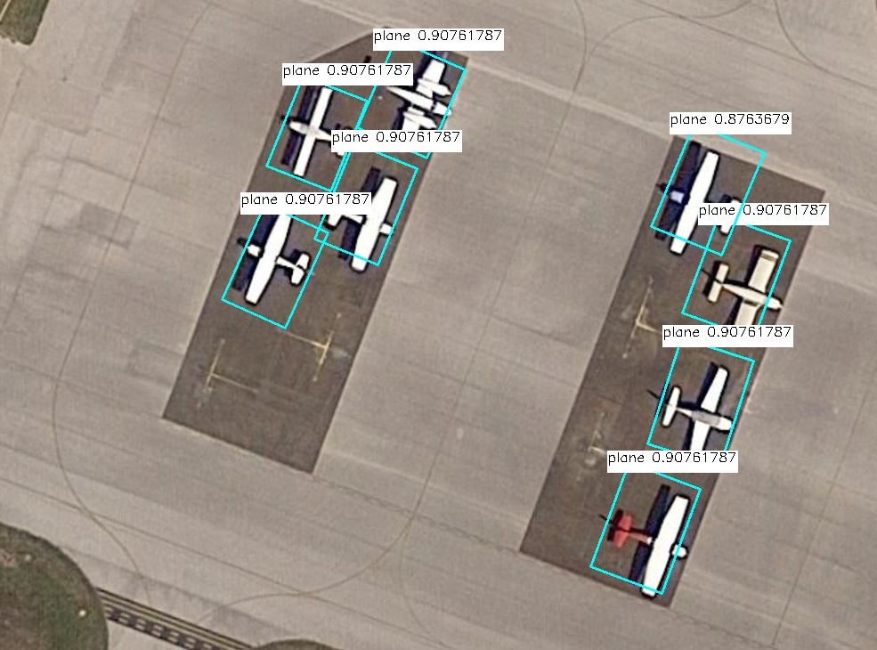

# YOLO11 定向检测
该模型的功能是找到图片中所有在训练时标注的物品类型。但在检测模型的基础上，增加了对于物体旋转角度的检测。


## 模型文件准备
我们提供的程序包里会有一个名为`yolo11n-obb.nb`的文件，这就是在npu上运行的模型文件。

该文件是使用从[ultralytics release(v8.3.0)](https://github.com/ultralytics/assets/releases/tag/v8.3.0)下载的`yolo11n-obb.pt`文件，按照以下步骤,在电脑端进行格式转换而得到的。其他的smlx尺寸模型也可参照以下步骤来转换。

yolo11官方提供的模型训练了15种类别的物品

### 所需工具
需要使用安装了linux系统的电脑，或是在windows上使用虚拟机安装linux系统。开发板上不能运行模型格式转换工具
- [netron.app](https://netron.app/) 是一个网页工具，可用于查看模型的结构
- 需要下载一份 yolo11 的源码，用来将yolo11专用的模型文件转为通用的onnx模型文件
    ```shell
    git clone https://github.com/walnutpi/ultralytics_yolo11.git
    ```
- 下载核桃派提供的docker镜像和脚本工具，用于将通用onnx模型转为npu专用的模型格式

### 1. 将yolo的模型导出为onnx格式

yolo训练后会得到一个后缀名为`.pt`的文件，里面包含着yolo运行所需要的参数数值，但里面没有网络结构信息。如果要在npu上运行，需要将其导出为包含网络结构信息的onnx格式。这一步需要调用yolo11源码自带的工具。

先运行以下命令，临时修改环境变量PYTHONPATH，指定python的模块搜索路径到yolo11源码的存放位置。我的yolo11源码存放路径是/opt/ultralytics_yolo11，所以命令如下

```shell
export PYTHONPATH=/opt/ultralytics_yolo11
```

然后运行以下python代码，他会从刚刚设置的`PYTHONPATH`指向的路径中查找 YOLO 这个库，并导出这个代码里指定的模型文件为onnx格式。
```python
from ultralytics import YOLO

model = YOLO("./yolo11n-obb.pt")
model.export(format="onnx")
```

实践中发现在npu上运行yolo11模型时，自带的一些后处理操作会影响检测精度。所以我们提供的yolo11代码中增加了一些模型原始数据的输出。


### 2. 将onnx模型转为npu专用模型
这一步需要使用我们提供的docker镜像，里面搭建好了相关工具的运行环境，为了方便用户使用，我们将 导出模型信息、编写配置文件、模型量化、量化数据生成nb文件 等步骤都合并做成了一条命令 **npu-transfer-yolo**

模型在训练时使用的是float32类型来存储参数，在NPU上运行时，需要将参数转化为int8等存储范围较小的类型，以减小模型体积，同时提高模型运行速度。这个步骤就叫量化。量化不是直接对参数做四舍五入，而是需要输入一些图片给模型，根据模型的响应状态来优化各个参数。

我们需要准备几张图片用于量化，一般是从训练数据集里抽几张就行，将他们存放到一个文件夹下。

然后运行以下命令，传入两个参数，一个是onnx模型文件的路径，一个是存放图片的文件夹路径。

```bash
sudo npu-transfer-yolo yolo11n-obb.onnx ../image/
```

最后会在当前路径下生成一个`yolo11n-obb.nb`文件，这个文件就可以在npu上运行推理了

## python运行模型
### 1. 实例化yolo11类
实例化`YOLO11_OBB`类，需要传入模型文件的路径
```python
from walnutpi import YOLO11
yolo = YOLO11.YOLO11_OBB("model/yolo11n-obb.nb")
```
### 2. 运行模型-阻塞式
使用`run`方法即可运行模型，并返回检测结果，需要传入3个参数
- 图片数据， 使用opencv的读取图片方法进行读取即可
- 置信度阈值， 只会返回置信度高于这个值的检测框
- 检测框重叠度阈值， 模型经常会在物体周围同时命中多个检测框，如果框之间的面积重合度高于这个值，则只保留置信度最高的框，删除其他重合框

```python
# 读取图片
import cv2
img = cv2.imread("image/plane.jpg")

# 检测
boxes = yolo.run(img, 0.5, 0.1)
```

### 3. 运行模型-非阻塞式
使用`run_async`方法会创建一个线程来运行模型,然后立刻返回。需要传入3个参数
- 图片数据， 使用opencv的读取图片方法进行读取即可
- 置信度阈值， 只会返回置信度高于这个值的检测框
- 检测框重叠度阈值， 模型经常会在物体周围同时命中多个检测框，如果框之间的面积重合度高于这个值，则只保留置信度最高的框，删除其他重合框

非阻塞式运行需要配合 `is_running` 属性使用，他的值是 true或false，表示后台是否跑着`run_async`启动的模型运行线程。如果后台已经跑着一个运行线程了，则运行`run_async`时不会再启动新的线程。也可以用此属性来判断模型运行线程跑完了没，是否可以获取结果了。

使用`get_result()`方法 会返回后台的识别结果，与阻塞式方法`run`得到的是相同的东西

```python
import cv2
img = cv2.imread("image/plane.jpg")

yolo.run_async(img, 0.5, 0.1)
while yolo.is_running:
    time.sleep(0.1)
boxes = yolo.get_result()
```

### 4. 检测结果
`run`方法和`get_result`方法返回的都是一个列表，如果图片中检测不到东西则返回一个空的列表。列表里每个值都代表一个命中了的检测框，每个检测框对象都包含以下属性

| 属性        | 说明                          |
| ----------- | ----------------------------- |
| x           | 检测框中心点的x坐标           |
| y           | 检测框中心点的y坐标           |
| w           | 检测框的宽度                  |
| h           | 检测框的高度                  |
| reliability | 表示检测框的置信度，例如:0.78 |
| label       | 检测框的标签                  |
| angle       | 检测框的旋转角度              |

注意label是一个数字，例如yolo官方模型训练时标注了15个类型，检测出来的label属性就会是0-14

每个检测框对象都包含以下方法，用于计算旋转后的检测框的四个点的坐标

| 方法             | 说明                   |
| ---------------- | ---------------------- |
| get_top_left     | 获取旋转后的左上角坐标 |
| get_bottom_left  | 获取旋转后的左下角坐标 |
| get_top_right    | 获取旋转后的右上角坐标 |
| get_bottom_right | 获取旋转后的右下角坐标 |


可以使用以下代码输出所有检测到的框的信息
```python
print(f"boxes: {boxes.__len__()}")
for box in boxes:
    print(
        "{:f} ({:4d},{:4d} r{:f} ) w{:4d} h{:4d} {:d}".format(
            box.reliability,
            box.x,
            box.y,
            box.angle,
            box.w,
            box.h,
            box.label,
        )
    )
```
## 示例程序
### 示例-读取图片做检测，并保存结果


```python
from walnutpi import YOLO11
import cv2

label_names = ["plane","ship","storage tank","baseball diamond","tennis court","basketball court","ground track field","harbor","bridge","large vehicle","small vehicle","helicopter","roundabout","soccer ball field","swimming pool",]

model_path = "model/yolo11n-obb.nb"
picture_path = "image/plane.jpg"
output_path = ".result.jpg"

# 检测图片
yolo = YOLO11.YOLO11_OBB(model_path)
boxes = yolo.run(picture_path, 0.6, 0.1)

# 输出检测结果
print(f"boxes: {boxes.__len__()}")
for box in boxes:
    print(
        "{:f} ({:4d},{:4d} r{:f} ) w{:4d} h{:4d} {:s}".format(
            box.reliability,
            box.x,
            box.y,
            box.angle,
            box.w,
            box.h,
            label_names[box.label],
        )
    )

# 将检测框画到图像上
img = cv2.imread(picture_path)
for box in boxes:
    left_x = int(box.x - box.w / 2)
    left_y = int(box.y - box.h / 2)
    right_x = int(box.x + box.w / 2)
    right_y = int(box.y + box.h / 2)
    label = str(label_names[box.label]) + " " + str(box.reliability)
    (label_width, label_height), bottom = cv2.getTextSize(
        label,
        cv2.FONT_HERSHEY_SIMPLEX,
        0.5,
        1,
    )

    cv2.line(img, box.get_top_left(), box.get_top_right(), (255, 255, 0), 2)
    cv2.line(img, box.get_top_left(), box.get_bottom_left(), (255, 255, 0), 2)
    cv2.line(img, box.get_bottom_right(), box.get_bottom_left(), (255, 255, 0), 2)
    cv2.line(img, box.get_bottom_right(), box.get_top_right(), (255, 255, 0), 2)
    cv2.rectangle(
        img,
        (left_x, left_y - label_height * 2),
        (left_x + label_width, left_y),
        (255, 255, 255),
        -1,
    )
    cv2.putText(
        img,
        label,
        (left_x, left_y - label_height),
        cv2.FONT_HERSHEY_SIMPLEX,
        0.5,
        (0, 0, 0),
        1,
    )

# 保存图片
cv2.imwrite(output_path, img)
```

