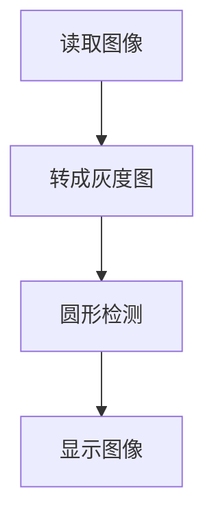

# 圆形检测

## 前言

本节学习使用OpenCV对图像中的圆形进行检测。

## 实验目的

检测图像中的线段并画图显示。

## 实验讲解

OpenCV Python库提供了HoughCircles()函数用于检测图像中的圆形。

### HoughCircles() 使用方法

```python
circles = cv2.HoughCircles(image, method, dp, minDist, param1, param2, minRadius, maxRadius)
```
圆形检测。返回circles为多个圆形数组（圆心坐标 + 半径）。例：[[x0,y0,r0],[x1,y1,r1]]
- `iamge` ：原始图像。
- `method` ：检测方法，默认使用cv2.HOUGH_GRADIENT。
- `dp` ：累加器分辨率设置，通常为1。
- `minDist` ：圆心之间最小间距。
- `param1` ：Canny边缘检测最大阈值（可选）。
- `param2` ：值越大，检测到的圆越小，越精确（可选）。
- `minRadius` ：检测圆的最小半径（可选）。
- `maxRadius` ：检测圆的最大半径（可选）。

读取图像，转化为灰度图，然后进行圆形检测。代码编写流程如下：



<br></br>

参考代码如下:

```python
'''
实验名称：圆形检测
实验平台：核桃派
'''

import cv2
import numpy as np

img0 = cv2.imread('circle.jpg') #读取图像
cv2.imshow('circle2', img0) #显示原图像

#将彩色图像转化为灰度图像（单通道）
img1 = cv2.cvtColor(img0, cv2.COLOR_BGR2GRAY)
#cv2.imshow('gray', img1) #显示图像

#检测圆形
circles = cv2.HoughCircles(img1, cv2.HOUGH_GRADIENT, 1, 50, 100, 20)

#将所有坐标和半信息取整数
circles = np.uint(np.around(circles))

print(circles) #打印线段信息

#在原始图像画圆
for c in circles[0]:    
    x, y, r = c
    cv2.circle(img0, (x, y), 2, (0,255,0), 3) #画圆心
    cv2.circle(img0, (x, y), r, (0,255,0), 3) #画圆环

cv2.imshow('result', img0) #显示图像

cv2.waitKey() #等待键盘任意按键按下
cv2.destroyAllWindows() #关闭窗口

```

## 实验结果

在核桃派运行上面代码，实验结果如下, 可以看到圆形物体被检测出来：

