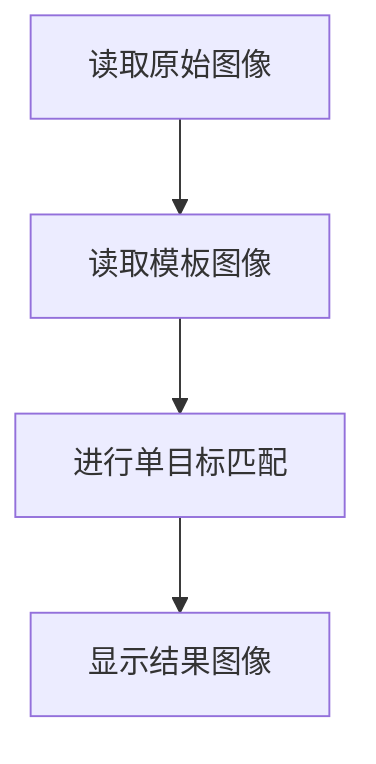

# 模板匹配

## 前言

模板匹配是指在图像中找到指定目标物体（或图像），原理是通过目标图像在原始图像上逐个位置进行对比匹配，从而找到目标物体（或图像）在图像上的位置。


## 实验目的

通过模板匹配找到图片中指定图像（物体）。本实验实现在下面图片中找出数字2。


在上图截取了数字2作为模板图片。


## 实验讲解

OpenCV Python库提供了matchTemplate()函数用于模板匹配。实际应用有单目标匹配和多目标匹配，单目标匹配表示只找一个最接近的，多目标匹配表示在图像中找到多个近似的物体（或图像）。

### HoughCircles() 使用方法

```python
result = cv2.matchTemplate(image, templ, method, mask)
```
模板匹配。返回result为二维数组。可通过代码print查看。
- `iamge` ：原始图像。
- `templ` ：模板图像，尺寸必须小于或等于原始图像。
- `method` ：匹配方法。
    - `cv2.TM_SQDIFF` ：0, 差值平方和匹配（平方差匹配），匹配程度越高，计算结果越小，完全匹配结果为0。
    - `cv2.TM_SQDIFF_NORMED` ：1, 标准差值平方和匹配（标准平方差匹配），匹配程度越高，计算结果越小，完全匹配结果为0。
    - `cv2.TM_CCORR` ：2, 相关匹配，匹配程度越高，计算结果越大。
    - `cv2.TM_CCORR_NORMED` ：3, 标准相关匹配，匹配程度越高，计算结果越大。
    - `cv2.TM_CCOEFF` ：4, 相关系数匹配，计算结果为-1~1的浮点数。1表示完全匹配，0表示完全不匹配，-1表示模板和原图亮度相反。
    - `cv2.TM_CCOEFF_NORMED` ：5, 标准相关系数匹配，计算结果为-1~1的浮点数。1表示完全匹配，0表示完全不匹配，-1表示模板和原图亮度相反。
- `mask` ：掩膜（可选参数），建议使用默认值。
 
## 单目标匹配

单目标匹配只寻找一个最优结果。

matchTemplate()计算结果是一个二维数组，单目标匹配通过minMaxLoc()函数来解析这个数组坐标值。

```python
minValue, maxValue, minLoc, maxLoc = cv2.minMaxLoc(src, mask)
```
参数说明：
- `src` ：matchTemplate()计算结果。
- `mask` ：掩膜（可选参数），建议使用默认值。

返回结果：
- `minValue` ：数组中最小值。
- `maxValue` ：数组中最大值。
- `minLoc` ：最小值坐标，格式为(x,y)。
- `maxLoc` ：最大值坐标，格式为(x,y)。

以`cv2.TM_SQDIFF_NORMED`标准平方差匹配为例，计算结果越小，匹配程度越高，因此minValue为匹配最优结果，minLoc为匹配区域左上角坐标，尺寸和模板尺寸一致。


单目标匹配代码编写流程如下：



<br></br>

### 参考代码

参考代码如下:

```python
'''
实验名称：模板匹配(单目标)
实验平台：核桃派
'''

import cv2
import numpy as np

img = cv2.imread('number.jpg') #读取原始图像
temp = cv2.imread('2.jpg') #读取模板图像

h, w, c = temp.shape #获取模板图像信息，高、宽、通道数

#使用标准平方差方式匹配，结果越小，匹配度越大
result = cv2.matchTemplate(img, temp, cv2.TM_SQDIFF_NORMED)

print(result) #打印结果

#单目标匹配计算,最小值minValue为匹配结果，minLoc为匹配结果左上角坐标
minValue, maxValue, minLoc, maxLoc = cv2.minMaxLoc(result)

#画矩形用于展示
p1 = minLoc #矩形左上角坐标
p2 = (p1[0] + w, p1[1] + h) #矩形右下角坐标
cv2.rectangle(img, p1, p2, (0, 0, 255),2)

cv2.imshow('result', img) #显示图像

cv2.waitKey() #等待键盘任意按键按下
cv2.destroyAllWindows() #关闭窗口

```

### 实验结果

在核桃派运行上面代码，实验结果如下, 可以看到数字2模板图片被检测出来，结果只有1个（单目标）：


通过打印匹配结果可以看到matchTemplate()函数返回结果本质是一堆数字，再通过minMaxLoc()函数找到这个结果里面的最小值。


## 多目标匹配

多目标匹配可根据指定参数（识别值）寻找多个结果。

matchTemplate()计算结果是一个二维数组，多目标匹配可以通过这个结果每一组数据里面的相关系数跟设定值来判断目标是否匹配。

这里使用`cv2.TM_CCORR_NORMED`标准相关匹配，计算结果越大，匹配程度越高。代码编写流程如下：


<br></br>

### 参考代码

参考代码如下:

```python
'''
实验名称：模板匹配(多目标)
实验平台：核桃派
'''

import cv2
import numpy as np

img = cv2.imread('number.jpg') #读取原始图像
temp = cv2.imread('2.jpg') #读取模板图像

h, w, c = temp.shape #获取模板图像信息，高、宽、通道数

#使用标准相关匹配，结果越大，匹配度越大
result = cv2.matchTemplate(img, temp, cv2.TM_CCORR_NORMED)

print(result) #打印结果

#计算匹配结果并画矩形
num = 0 #用于计算匹配结果数量
for y in range(len(result)): #遍历每行
    for x in range(len(result[y])): #遍历每列
        
        if result[y][x] > 0.999: #可修改(需要小于1)，数值越大，匹配度精度高，得到的结果减少。
            
            cv2.rectangle(img, (x, y), (x+w, y+h), (0, 0, 255),2) #画矩形
            
            num = num + 1 

print(num)  #计算匹配结果，可通过修改参数为0.9, 0.999观察数量。

cv2.imshow('result', img) #显示结果图像

cv2.waitKey() #等待键盘任意按键按下
cv2.destroyAllWindows() #关闭窗口

```

### 实验结果

在核桃派运行上面代码，实验结果如下, 可以看到数字2模板图片被检测出来：

