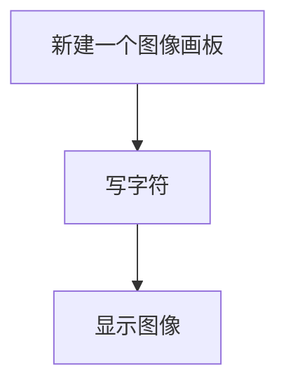

# 写字符

## 前言

字符是常用的描述功能，比如可以描述照片信息，以及摄像头拍摄帧率等。这些字符可以写在图像任意位置，以便更直观观察。

## 实验目的

使用OpenCV库写字符。

## 实验讲解

OpenCV Python库提供写字符函数putText()，我们直接使用即可。

### putText() 使用方法

```python
img = cv2.putText(img, text, org, fontFace, fontScale, color, thinkness, lineType, bottomLeftOrigin)
```
写字符：
- `img` ：图像。
- `text` ：要写的字符。
- `org` ：字符左下角坐标。
- `fontFace` ：字体样式，有以下字体类型。示例：cv2.FONT_HERSHEY_SIMPLEX
    - `FONT_HERSHEY_SIMPLEX` ：正常大小的无衬线字体。
    - `FONT_HERSHEY_PLAIN` ：小号无衬线字体。
    - `FONT_HERSHEY_DUPLEX` ：正常大小无衬线字体（比FONT_HERSHEY_SIMPLEX复杂）。
    - `FONT_HERSHEY_COMPLEX` ：正常大小的衬线字体。
    - `FONT_HERSHEY_TRIPLEX` ：正常大小衬线字体（比FONT_HERSHEY_COMPLEX复杂）。
    - `FONT_HERSHEY_COMPLEX_SMALL` ：FONT_HERSHEY_COMPLEX字体简化版。
    - `FONT_HERSHEY_SCRIPT_SIMPLEX` ：手写风格字体。
    - `FONT_HERSHEY_SCRIPT_COMPLEX` ：手写风格字体（比FONT_HERSHEY_SCRIPT_SIMPLEX复杂）。
    - `FONT_ITALIC` ：斜体。
- `fontScale` ：字体大小。
- `color` ：颜色。
- `thickness` ：粗细。

熟悉写字符使用方法后，我们在图像画布上写一个字符串并显示。代码编写流程如下：



<br></br>

参考代码如下，代码中用到了numpy新建数组功能，本章numpy用得不多，这里不展开，可以自行网上搜索学习。

```python
'''
实验名称：写字符
实验平台：核桃派
'''

import cv2
import numpy as np

#新建一个500x500像素的彩色RGB888纯白色图像
img = np.ones((500,500,3),np.uint8)*255

#写字符‘WalnutPi’,坐标(20,100),普通衬线字体，大小2,颜色红色，粗细2。
cv2.putText(img, 'WalnutPi', (20,100), cv2.FONT_HERSHEY_SIMPLEX, 2, (0,0,255), 2)

cv2.imshow('String', img) #显示图像

cv2.waitKey() #等待键盘任意按键按下
cv2.destroyAllWindows() #关闭窗口

```

## 实验结果

在核桃派运行代码，可以看到实验结果如下图：

