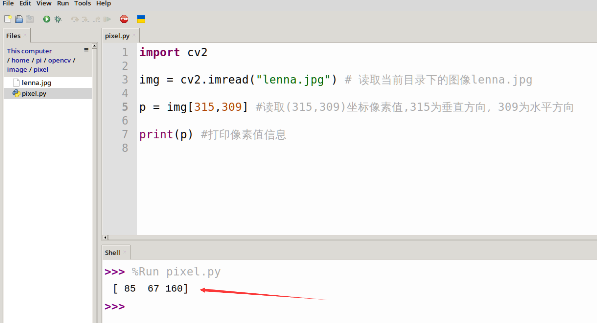
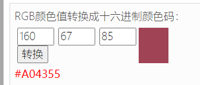
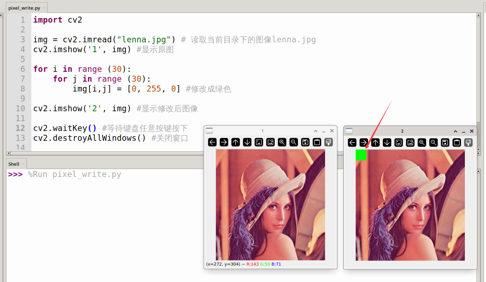

# 图像基础知识

## 像素简介

 

上图是十几年前的一款游戏，由于当时技术有限，所以显示屏的像素都是很小，而且像素可见。一幅完整的图像就是有上面一个个像素点构成。随着技术的进步，我们现在所使用的手机、笔记本显示器分辨率非常大，所以肉眼看不出来。但原理也是一样。

## 读取某个像素

像素是构成图像的最小单位，各类视觉算法应用最终都是在处理和计算这些像素。我们可以使用opencv库来取一张图片以及上面的像素来深入了解opencv是如何处理图像的。

以下面图片为例：

 

在电脑中可以看到属性：

 


我们通过opencv的imread()函数读取图片坐标方向如下，左上角为（0, 0）原点，垂直方向像素为316个[0-315], 水平方向像素为310个[0-309]。

 

可通过下面代码读取某一像素点的值。

```python
'''
实验名称：读取像素
实验平台：核桃派1B
'''

import cv2

img = cv2.imread("lenna.jpg") # 读取当前目录下的图像lenna.jpg

p = image[315,309] #读取(315,309)坐标像素值,315为垂直方向，309为水平方向

print(p) #打印像素值信息

```

在核桃派开发板上运行代码，输出[85 67 160]。

 

[85 67 160] 实际是下图右下角像素点的BGR值**（opencv读取像素按BGR顺序，非RGB）**。这设计三原色知识，接下来会讲解。

 

## 三原色

三原色光模式（RGB color model，又称RGB表色系统、RGB颜色模型、红绿蓝颜色模型，是一种加色模型，将红（Red）、绿（Green）、蓝（Blue）三原色的色光以不同的比例相加混色，以合成产生各种色彩光。

 

因此在前面读取像素数据得到的结果 [85 67 160], 实际上是B=85，G=67, R=160**（opencv读取像素按BGR顺序，非RGB）**，由这3个通道颜色混合而成的色彩。每个通道值共2^8 = 256种阶级[0-255]。所以常说的RGB888就是指24位真彩色，其中RGB三个通道，每个通道均为8位的色彩。

我们可以使用在线色彩转换工具来测试颜色和数值对应关系：

在线RGB工具链接：https://www.sioe.cn/yingyong/yanse-rgb-16/

输入 RGB值 (255, 0, 0) ,即可获得红色：

 

前面读取像素原始值为：[85 67 160]，转成 RGB值为 (160, 67, 85) ,输入可获得相应颜色：

 

## 修改像素值

使用OpenCV能读取某个像素值，当然也能写某个像素值，为了方便查看结果，这里使用代码将图片左上角30x30区域的区域填充成绿色。

直接给图像指定的像素坐标赋值即可修改图像像素值，参考代码如下：

```python
'''
实验名称：修改像素
实验平台：核桃派1B
'''

import cv2

img = cv2.imread("lenna.jpg") # 读取当前目录下的图像lenna.jpg
cv2.imshow('1', img) #显示原图

for i in range (30):
    for j in range (30):
        img[i,j] = [0, 255, 0] #修改成绿色
        
cv2.imshow('2', img) #显示修改后图像

cv2.waitKey() #等待键盘任意按键按下
cv2.destroyAllWindows() #关闭窗口
```

运行代码，可以看到图像左上角的30x30区域像素被修改成了绿色。（运行后2张图片可能会堆叠一起，使用鼠标拖动即可。）

 

## GRAY灰度图像

前面我们看到彩色RGB888图像中一个像素点的B/G/R每个通道值均为[0,255] , 而灰度图像只有1个通道，即[0,255]，`0`表示纯黑色，`255`表示纯白色，0~255之间数值表示不同深浅程度，如深灰色或浅灰色。

 

:::tip 提示
由于灰度图像相对于RGB888图像拥有更少的图片信息，因此常用于一些无需彩色的视觉算法场合，如图形识别和人脸识别，通过转换成灰度图像再处理可以大大降低计算量，实现更快的识别速度。
:::

下面代码为读取灰度图像的像素值：
```python
import cv2

img = cv2.imread("lenna.jpg", 0) # 读取当前目录下的图像lenna.jpg并转换成灰度图像
cv2.imshow('grey', img) #显示图像

p = img[315,309] #读取(315,309)坐标像素值,315为垂直方向，309为水平方向
print(p) #打印像素值信息

cv2.waitKey() #等待键盘任意按键按下
cv2.destroyAllWindows() #关闭窗口

```
 
