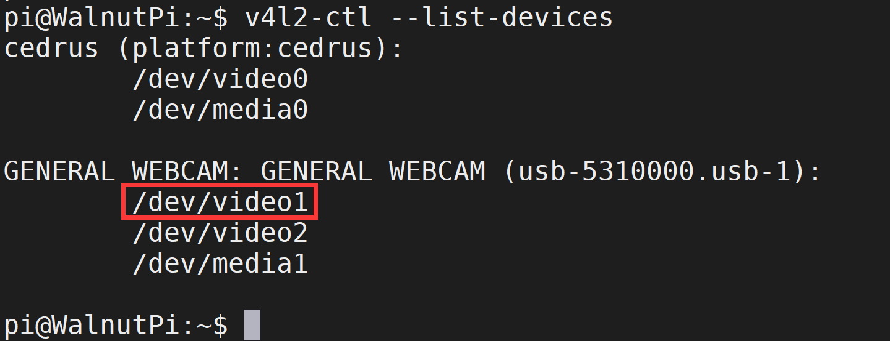

# USB摄像头使用

# USB摄像头使用

摄像头相当于OpenCV的眼睛，有了摄像头，就可以实时处理摄像头采集的视频流和图片，在上面实现图像处理和机器视觉算法。

核桃派系统内置USB摄像头驱动。市面上大部分USB CAM都可以使用，这里使用下面这款讲解：[**点击购买->**](https://item.taobao.com/item.htm?spm=a213gs.success.result.1.6c854831c6UKif&id=740242931183) 


直接插到核桃派其中一个USB口就好。


## 获取USB摄像头设备信息

先使用v4l2-ctl查看当前USB摄像头设备信息，这要安装 v4l ，核桃派大部分软件都可以通过 sudo apt install 方式安装：

```bash
sudo apt install v4l-utils
```

安装完成后运行下面指令查看插入的USB摄像头信息：

```bash
v4l2-ctl --list-devices
```

可以看到这款摄像头有多个video，通常是第一个。这里是：video1

 

## 通过OpenCV使用摄像头

OpenCV可以通过VideoCapture()函数获取摄像头视频流。摄像头视频流本质是一帧帧的图像，因此结合前面学习的读取、显示和保存图像，即可对摄像头图像进行采集显示（由于速度较快，因此跟看视频一样）。参考代码如下：

```python
'''
实验名称：USB摄像头使用
实验平台：核桃派
'''

import cv2

cam = cv2.VideoCapture(1) # 打开摄像头，确认好编号

while (cam.isOpened()): # 确认被打开
    
    retval, img = cam.read() # 从摄像头中实时读取图像
    
    cv2.imshow("Video", img) # 在窗口中显示读取到的图像
    
    key = cv2.waitKey(1) # 窗口的图像刷新时间为1毫秒，防止阻塞
    
    if key == 32: # 如果按下空格键，打断
        break
    
capture.release() # 关闭摄像头
cv2.destroyAllWindows() # 销毁显示摄像头视频的窗口

```

在核桃派上运行代码，可以看到摄像头采集到的视频图像实时显示出来：

 

代码中获得的 **img** 就是每一帧图像，可以用于我们之前学习的所有opencv图像处理操作。