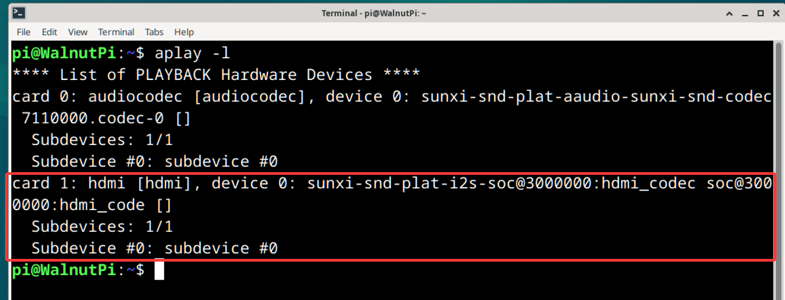
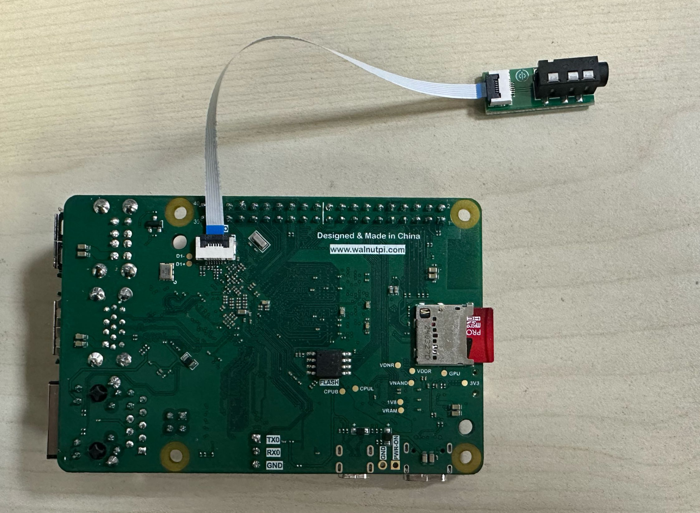
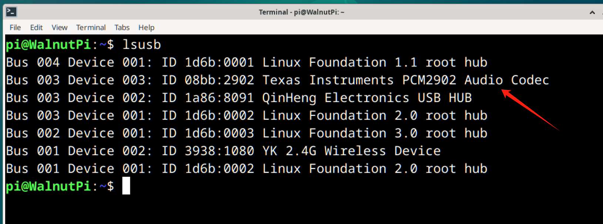
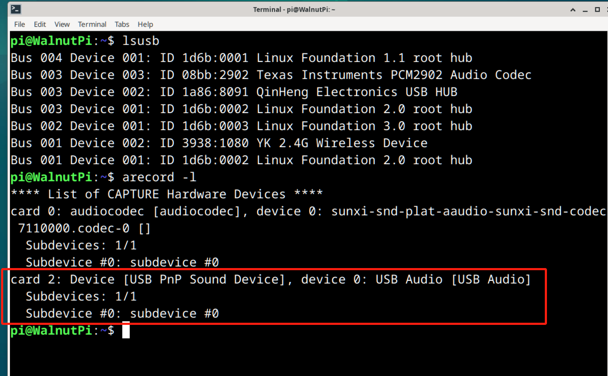
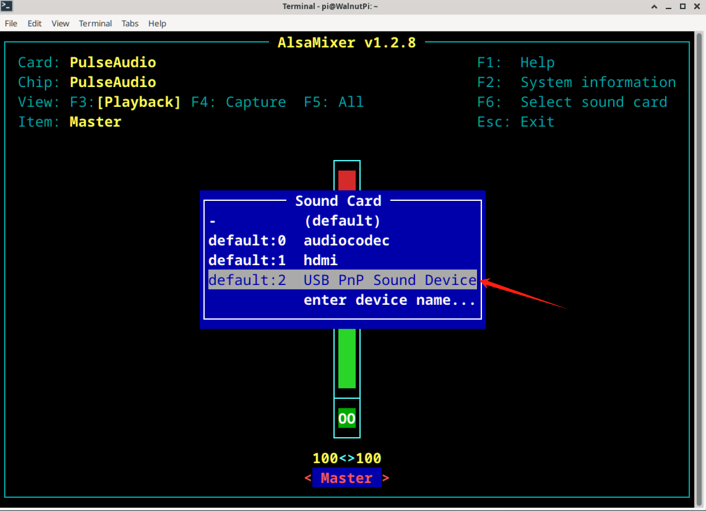
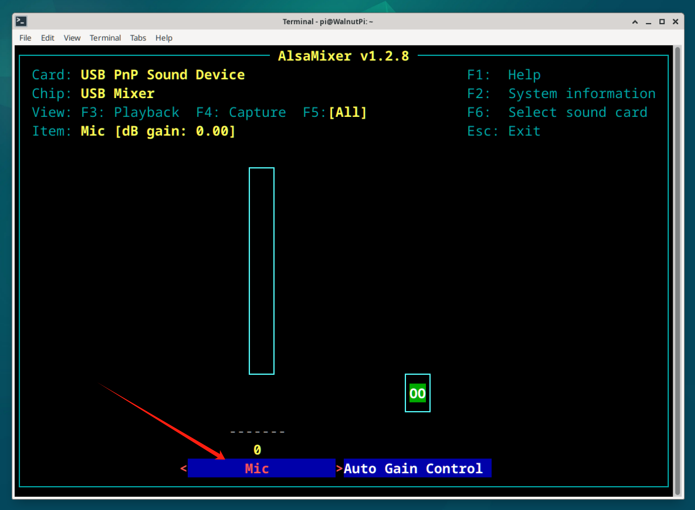

# 音频和录音

核桃派2B支持HDMI音频和3.5mm耳机口音频输出。

## HDMI音频

如果你的HDMI显示器带扬声器功能，不清楚显示器是否带扬声器功能的可以使用一台windows电脑连接，能通过音频选择输出实现播放音频说明该HDMI显示器带音频功能。

### 查看音频设备

可以使用下面指令来查看HDMI音频信息：

```bash
aplay -l
```



### 音频播放测试

播放系统自带wav音频文件测试, 下面指令的**ahubhdmi**为上面指令查看到的HDMI音频设备名称：(**注意该指令使用【plughw】而非前面耳机口的【hw】**)

```bash
aplay -D plughw:hdmi /usr/share/sounds/alsa/Noise.wav
```


### 桌面系统音乐播放

可以直接使用带桌面系统预装的VLC媒体播放器播放音频。核桃派系统默认使用耳机口作为音频输出，只需要在导航栏右下角切换至HDMI即可实现播放器、网页等全局音频切换。


先将音频文件通过U盘或者ssh其它方式拷贝到核桃派，然后点击鼠标右键，**使用VLC媒体播放**即可：


## 3.5mm耳机口

核桃派2B背面预留一个音频FPC座，可以通过转接板转成3.5mm音频座，也就是常见的耳机插孔。可以用于连接耳机或扬声器得到更强大的声音。

:::tip 提示：
核桃派2B的3.5mm音频输出口，该接口有一定的输出功率，可以使用耳机或者带功放的扬声器都可以播放声音。
:::




### 查看音频设备

可以使用下面指令来查看音频信息：

```bash
aplay -l
```


### 音频播放测试

播放系统自带wav音频文件测试, 下面指令的**audiocodec**为上面指令查看到的耳机口设备名称：

```bash
aplay -D hw:audiocodec /usr/share/sounds/alsa/Noise.wav
```


音频口接上耳机或者扬声器，可以听到播放出声音。

### 桌面系统音乐播放

可以直接使用带桌面系统预装的VLC媒体播放器播放音频。

先将音频文件通过U盘或者ssh其它方式拷贝到核桃派，然后点击鼠标右键，**使用VLC媒体播放**即可：


## 录音

核桃派可以使用USB麦克风作为录音输入设备。本教程使用下面这款常见的树莓派USB麦克风：

:::tip 提示
核桃派2B需要使用V1.1.0以上版本镜像。
:::


将该USB麦克风插到核桃派任意USB口。


通过下面指令可以识别出USB麦克风设备：

```bash
lsusb
```


下面指令可以列出音频设备：

```bash
arecord -l
```


### 录音测试

可以通过下面指令录音：

```bash
arecord -D "plughw:2,0" -f S16_LE -r 16000 -d 10 -t wav test.wav
```

- -D: 设备名称，从上面`arecode -l`可以看到这里是card2,device0,可使用："plughw:2,0"；
- -f：录音格式，S16_LE表示16位；
- -r: 采样率，16000表示16KHz;
- -d: 录音时长，10表示10秒；
- -t: 录音格式, wav表示wav格式；
- test.wav 表示在当前路径下生成test.wav文件。

录完后在当前目录可以看到生成test.wav文件：


可以使用下面指令通过背面音频口播放：

```bash
aplay -D hw:audiocodec test.wav
```

### 调整麦克风音量

默认配置的麦克风音量可能偏小，可以通过以下方式调整：

输入下面命令：
```bash
alsamixer
```

在弹出界面按F6，选择USB麦克风。



然后再按F5，用鼠标或者键盘左右键选择MIC：



通过键盘上下按键来增减音量。设置完直接按ESE退出即可。


再次执行上面的录音指令，可以听到产生的音频音量变化。

:::tip 提示
如果是你使用的是桌面版，可以直接在右下角音频图标调整麦克风音量。

:::

