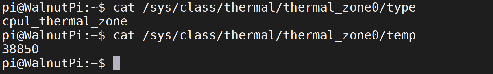
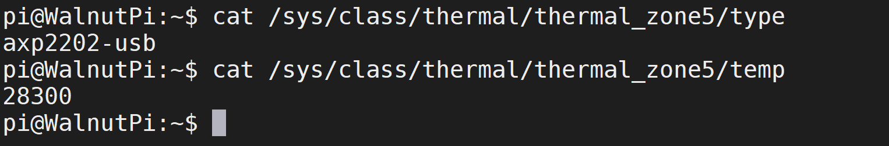

# 温度信息

核桃派2B的T527有6个温度传感器，分别是：
- `sensor0`: CPUL小核温度
- `sensor1`: CPUB大核温度
- `sensor2`: GPU温度
- `sensor3`: NPU温度
- `sensor4`: DDR温度
- `sensor5`: PMC电源芯片温度

:::tip 提示
下面命令获取的温度数据值需要除以1000。
:::

## CPU温度信息

### CPUL

查看传感器类型指令：

```bash
cat /sys/class/thermal/thermal_zone0/type
```

查看温度信息指令：
```bash
cat /sys/class/thermal/thermal_zone0/temp
```



### CPUB

查看传感器类型指令：

```bash
cat /sys/class/thermal/thermal_zone1/type
```

查看温度信息指令：
```bash
cat /sys/class/thermal/thermal_zone1/temp
```


## GPU温度信息

查看传感器类型指令：

```bash
cat /sys/class/thermal/thermal_zone2/type
```

查看温度信息指令：
```bash
cat /sys/class/thermal/thermal_zone2/temp
```


## NPU温度信息

查看传感器类型指令：

```bash
cat /sys/class/thermal/thermal_zone3/type
```

查看温度信息指令：
```bash
cat /sys/class/thermal/thermal_zone3/temp
```


## DDR温度信息

查看传感器类型指令：

```bash
cat /sys/class/thermal/thermal_zone4/type
```

查看温度信息指令：
```bash
cat /sys/class/thermal/thermal_zone4/temp
```


## PMC电源芯片温度信息

查看传感器类型指令：

```bash
cat /sys/class/thermal/thermal_zone5/type
```

查看温度信息指令：
```bash
cat /sys/class/thermal/thermal_zone5/temp
```

