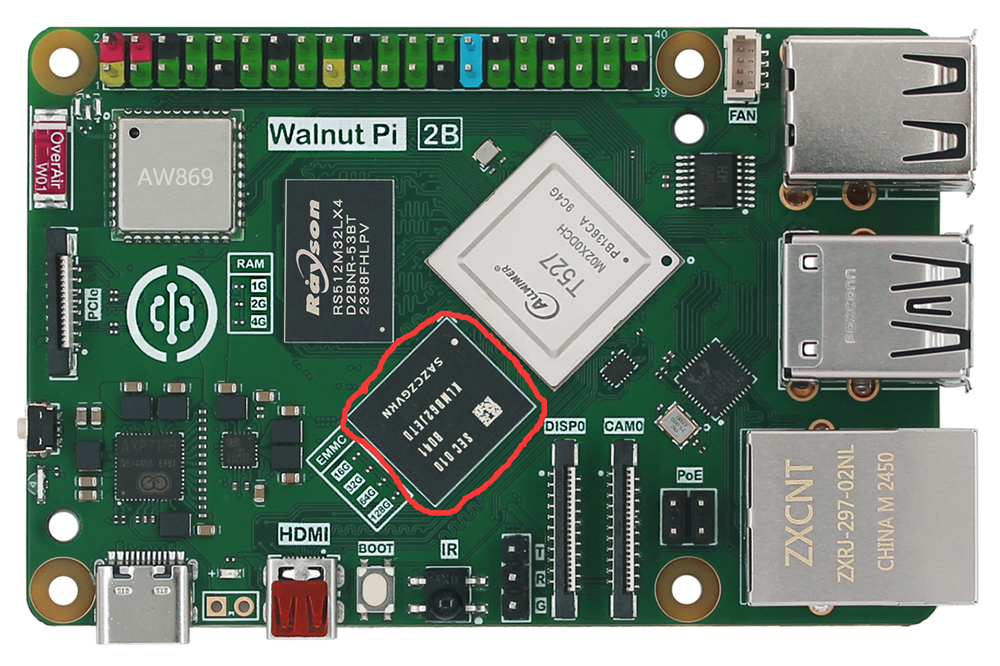

# EMMC闪存

核桃派2B可选配带EMMC闪存版本，默认标配32GB容量。传输速度比SD卡要快很多。可用于安装核桃派系统或当作硬盘盘符使用。



## EMMC作为系统启动盘

将核桃派OS烧录到EMMC并启动。参考教程：[EMMC烧录镜像方法](../getting_start/os-install.md#emmc烧录)

## EMMC作为硬盘使用

当核桃派2B通过SD卡系统启动时，可以将EMMC设置为硬盘使用，相当于拥有一个容量为32GB的硬盘。

核桃派系统自带快速设置指令，指令如下：

```bash
sudo set-emmc to_disk
```

:::danger 警告
该指令表示将emmc配置成硬盘。会格式化EMMC，清除所有内容。如有重要文件请提前做好备份。
:::

运行后弹出提示框，按“y”键继续：


设置成功如下图所示：


可以在桌面看到出现了一个约32G容量的盘符。


双击即可挂载使用。出现提示框输入password为系统密码，即 `pi`。


