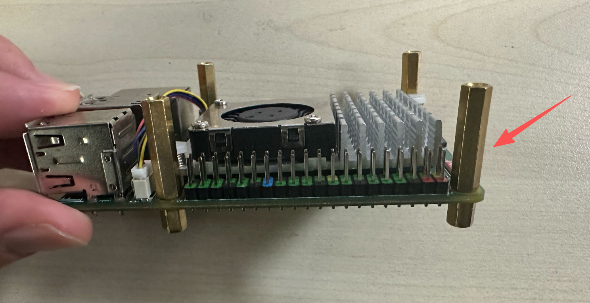
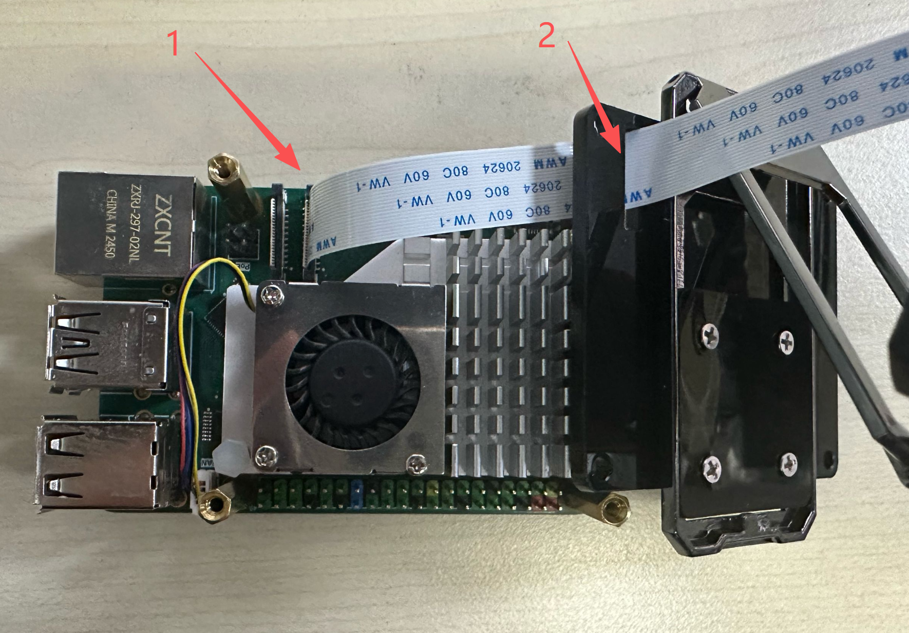
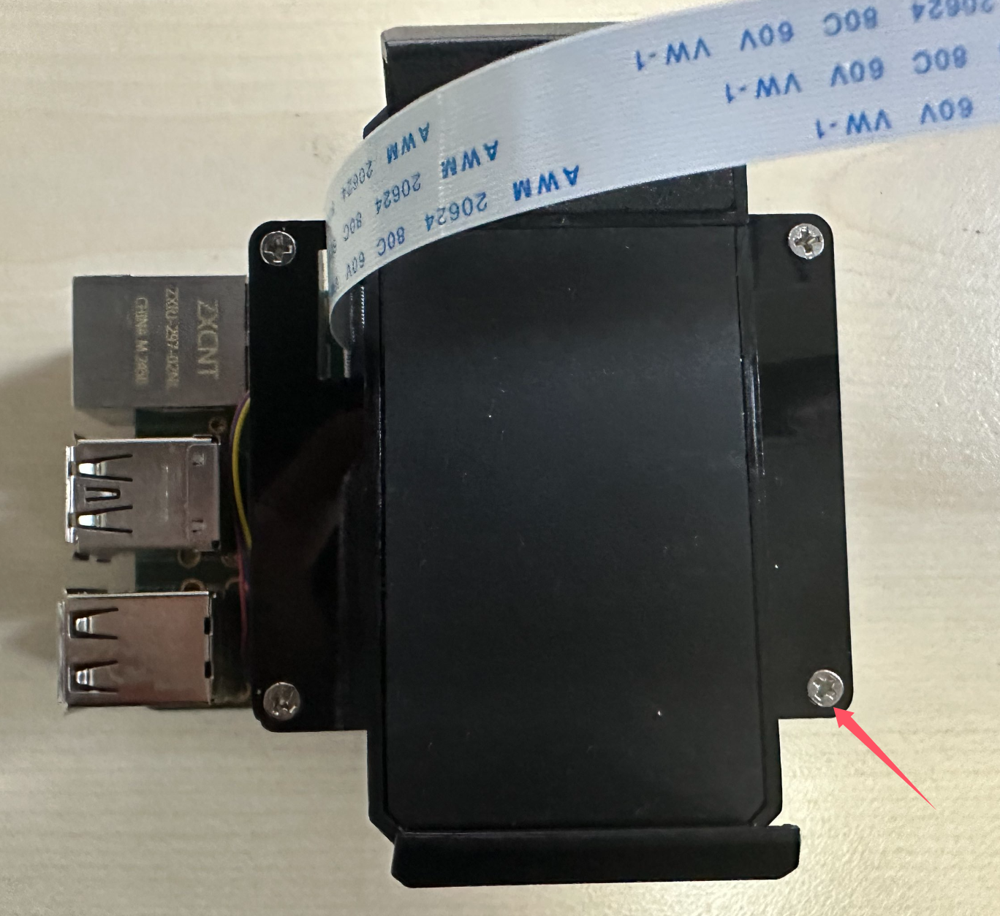
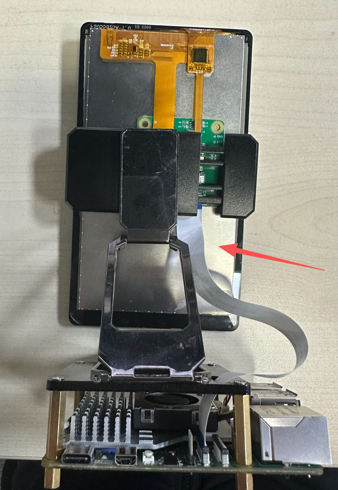
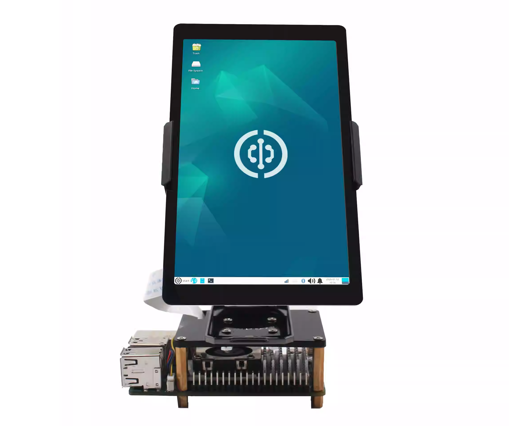

# MIPI显示屏

:::tip 提示:
本节教程功能需要使用核桃派2B V1.6.0以上系统版本。
:::

核桃派2B拥有1路MIPI DSI接口（1x4 lane DSI，兼容2 lane）。可外接MIPI显示屏，支持1080P@60fps。接口定义兼容树莓派。


## 核桃派官方5.5寸MIPI屏

核桃派官方推出的5.5寸MIPI屏分辨率为1080P（1920x1080）。[购买连接>>](https://item.taobao.com/item.htm?id=1013424344059)


|  产品参数 |
|  :---:  | ---  |
| 尺寸  | 5.5寸 |
| 分辨率  | 1920x1080 |
| 显示视觉  | IPS（全视角） |
| 接口  | mipi 4lane |
| 电容触摸  | GT911 |
| 工作温度  | -20℃ ~ 60℃ |
| 储存温度  | -30℃ ~ 70℃  |
| 外形尺寸  | 140.8 x 80mm (带电容触摸) |
| 重量  | 60g (带电容触摸) |

### 组装（无支架）

记得要断电组装，先将核桃派2B座子DSI 22P黑色卡扣提起，排线金手指如下图所示方向插入，然后下压卡扣锁紧：


另一端接5.5寸MIPI屏，组装后如下图：


### 组装（含支架）

核桃派5.5寸mipi屏可选购官方支架，支持横、竖屏和任意角度调节。主体部分组装好发货。[购买连接>>](https://item.taobao.com/item.htm?id=627655701617)


- 安装支撑铜柱

将配套的铜柱按下图所示装好：



- 安装支架

将22p排线连接核桃派DSI接口，然后从支架的孔穿出。



将支架使用螺丝固定到铜柱位置：



连接屏幕，排线金手指朝下：


拉开支架，将屏幕按下图方式固定。


背面排线方向如下图：


当需要竖屏时，旋转后排线如下图方向。**（注意调整竖屏时请勿往另一个方向旋转，可能导致排线拉扯损坏）**



至此安装完成。

### 开启LCD显示功能

核桃派系统已经带了相关显示屏驱动，桌面版和无桌面版均支持。使用下面指令即可开启显示桌面：（该指令支持TAB键补全）

```bash
sudo set-lcd dsi-1920x1080 install
```

配置成功后重启开发板：

```bash
sudo reboot
```

:::tip 提示：
也可以通过修改 /boot/config.txt文件下的screen参数来配置 `screen=dsi-1920x1080`。[config.txt显示屏配置教程](./config.txt.md#显示屏配置)
:::

**配置完成后首次重启时间会久一点。**启动后如下图：


### 调整显示方向和缩放比例

#### 横屏模式

首次配置默认是竖屏，我们可以通过下面方式调整为横屏模式：

打开设置-Display界面：


将`Scale`调整到 Custom, 值为0.7（图标放大好看一点）；方向`rotation`调整为right：


调整后即为下图横屏模式。而且重启系统依然能保持生效。


#### 竖屏模式

将`Scale`调整到 Custom, 值为0.7（图标放大好看一点）；方向`rotation`调整为inverted：


调整后即为下图竖屏模式。而且重启系统依然能保持生效。




:::tip 提示：
如果配置后没有插入mipi显示屏或者没检测到mipi显示屏，系统判断加载mipi屏失败将自动重启并从hdmi进入桌面。
:::

### 关闭LCD显示功能

使用下面指令可移除LCD显示功能，从HDMI启动：

```bash
sudo set-lcd dsi-1920x1080 remove
```

### 双屏异显

当同时接入MIPI屏和HDMI时，核桃派桌面版系统启动后自动进入双屏模式。可以通过setting - display 设置异显等任意显示模式。


例：下图将dsi-1窗口拖到HDMI显示器下方，表示将鼠标移动并超出HDMI显示器左下方就能进入MIPI显示屏。跟电脑扩屏类似。


:::tip 提示
无桌面版系统只支持单一显示器显示方式。
:::


## 树莓派MIPI屏

核桃派2B系统适配了当前市面上分辨率为800x480的树莓派MIPI屏, 有4.3寸、5寸和7寸可以选购。[购买连接>>](https://item.taobao.com/item.htm?id=627655701617)


### 组装

核桃派2B的DSI是22P 4Lane 接口，大部分树莓派MIPI屏是15Pin接口，因此你需要一根22P转15P排线用于连接（通常屏厂家会提供）。

记得要断电组装，将核桃派2B座子黑色卡扣提起，排线金手指如下图所示方向插入，然后下压卡扣锁紧：


组装后如下图：


### 开启LCD显示功能

核桃派系统已经带了相关显示屏驱动，桌面版和无桌面版均支持。使用下面指令即可开启显示桌面：（该指令支持TAB键补全）

```bash
sudo set-lcd dsi-800x480 install
```

配置成功后重启开发板：

```bash
sudo reboot
```

:::tip 提示：
也可以通过修改 /boot/config.txt文件下的screen参数来配置 `screen=dsi-800x480`。[config.txt显示屏配置教程](./config.txt.md#显示屏配置)
:::

**配置完成后首次重启时间会久一点。**启动后如下图：


**如果配置后没有插入mipi显示屏或者没检测到mipi显示屏，系统判断加载mipi屏失败将自动重启并从hdmi进入桌面。**

### 关闭LCD显示功能

使用下面指令可移除LCD显示功能，从HDMI启动：

```bash
sudo set-lcd dsi-800x480 remove
```

### 双屏异显

当同时接入MIPI屏和HDMI时，核桃派桌面版系统启动后自动进入双屏模式。默认同屏显示，如下图所示：


可以通过setting - display 设置异显等任意显示模式。


例：下图将dsi-1窗口拖到HDMI显示器下方，表示将鼠标移动并超出HDMI显示器左下方就能进入MIPI显示屏。跟电脑扩屏类似。


:::tip 提示
无桌面版系统只支持单一显示器显示。
:::


