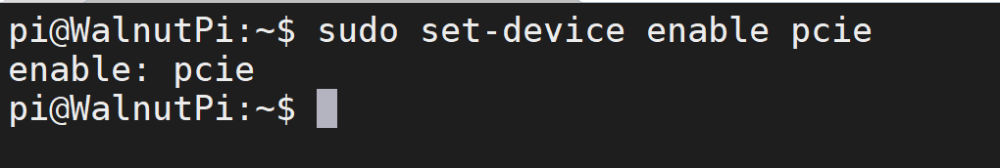
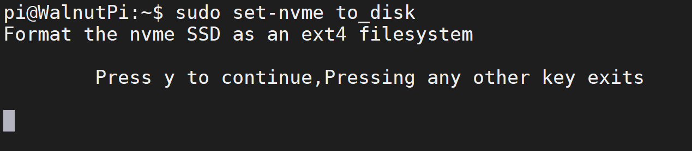

# NVMe固态硬盘

核桃派2B有一个PCIe 2.1接口，支持NVMe协议的固态硬盘，是核桃派2B上传输速度最快的非易失性储存介质。


核桃派PCIe 2.1接口兼容树莓派5，用户可以购买树莓派5官方固态硬盘转接板或第三方转接板使用，通过16P排线连接到核桃派2B。


## 使能PCIe 2.1接口

由于核桃派2B的USB3.0和PCIe 2.1引脚复用，系统启动默认是使用USB3.0，因此先通过下面指令将系统配置为启动PCIe 2.1。

```bash
sudo set-device enable pcie
```



重启后生效。

```bash
sudo reboot
```

## 设置为硬盘

开启后接下来将nvme固态硬盘配置成核桃派2B能使用的硬盘。核桃派系统自带快速设置指令，具体如下：

```bash
sudo set-nvme to_disk
```

:::danger 警告
该指令表示将nvme固态硬盘配置成核桃派硬盘使用。会格式化nvme固态硬盘，清除所有内容。如有重要文件请提前做好备份。
:::

运行后弹出提示框，按“y”键继续：



**执行将耗时数十秒，具体跟硬盘容量有关，请耐心等待。**执行完成如下图所示：


可以在桌面看到出现一个当前nvme固态硬盘容量大小的盘符。


双击即可挂载使用。出现提示框输入password为系统密码，即 `pi`。


