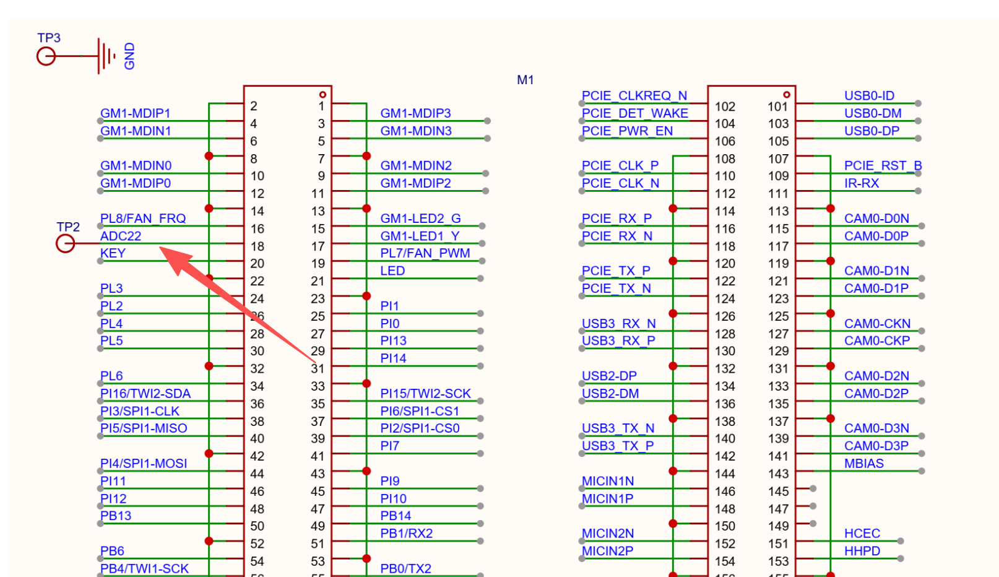
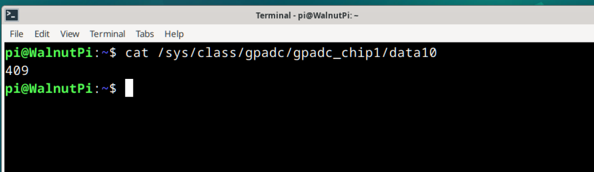

# ADC（电压测量）

## 前言

ADC(analog to digital conversion) 模拟数字转换。意思就是将模拟信号转化成数字信号，由于单片机只能识别二级制数字，所以外界模拟信号常常会通过ADC转换成其可以识别的数字信息。常见的应用就是将变化的电压转成数字信号实现对电压值测量。

可以用于测量电池电量或其它相关ADC输入设备。

## 实验目的

使用Python编程实现ADC测量。

## 实验讲解

目前只有[CM2计算模块](../../intro/hw-parameter.md#核桃派cm2)有引出ADC引脚。ADC22。**注意量程只有1.8V，超过的在外部自行添加电阻分压电路。**



在IO底板背面有引出焊盘。可以通过焊接引线测试。


可以通过下面终端命令实时获取ADC22电压值：
```bash
cat /sys/class/gpadc/gpadc_chip1/data10
```

获取的值除以1000即为真实电压值。如下图表示电压值为0.409V（悬空时有波动）




## 参考代码

在python下可以使用 [Python调用终端命令](../skills/command.md) 方式编程获取电压值。

```python
import os, time

while True
    res = os.popen('cat /sys/class/gpadc/gpadc_chip1/data10').read()
    print(int(res)/1000) #得到结果除以1000为实际温度值
    
    time.sleep(1)
```

## 实验结果

运行上方python代码，可以看到每秒打样ADC采样结果。


:::danger
最大量程为1.8V，请勿输入超过1.8V量程电压，否则可能损坏主控。
:::

