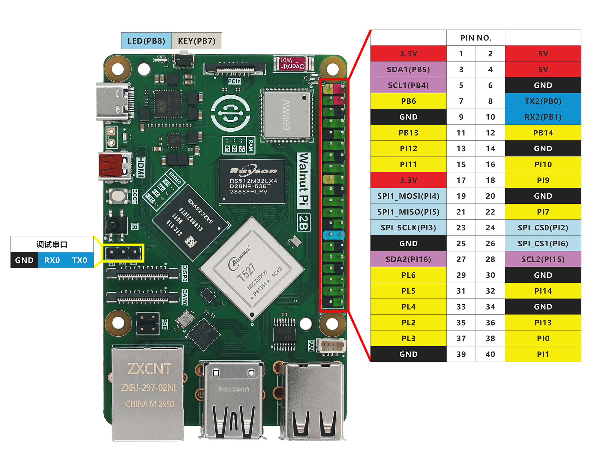
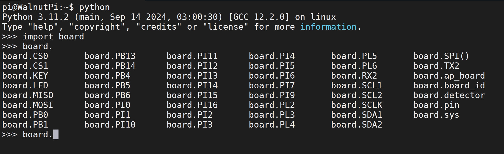

# GPIO介绍

在开始学习之前，我们详细介绍一下核桃派的 GPIO 口，也就是前面提到的40P GPIO，核桃派已经是一个很棒的卡片电脑，但 GPIO 的设计让用户使用核桃派进行各类 DIY 电子设计变得更容易，让你拥使用一个强大的单片机开发板一样的体验。


下面是核桃派GPIO的引脚图：


从上面表格和图例可以看到， GPIO和传统的单片机开发相似，除了普通IO口外，也有I2C、串口（UART）、SPI等总线接口，在今后的实验中你可以看到，用python来编程让入门核桃派变得非常容易，我们只需要熟悉 python 库的对象函数和用法，便可以轻松玩转核桃派嵌入式编程。

我们可以在终端通过python指令查看引脚编号。

在终端输入python进入Python交互：
```bash
python
```

然后输入：
```python
import board
```
再输入：
```python
board.
```
按键盘Tab键即可补全看到所有核桃派Python库引脚名称。



这在后面的实验会用到。