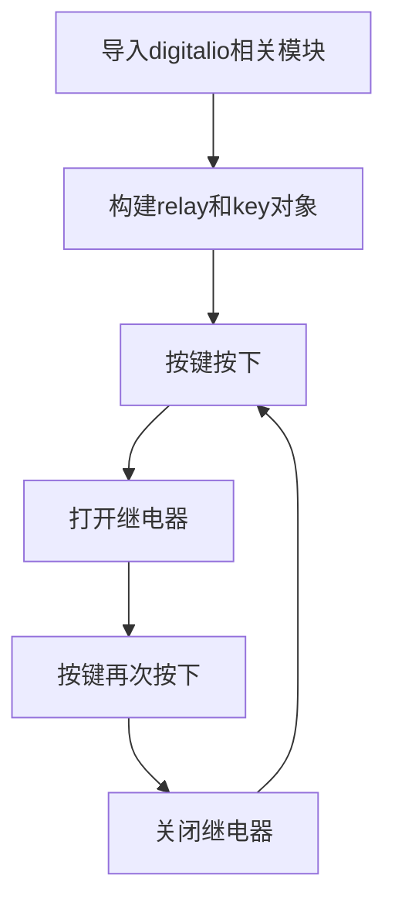

# 继电器

## 前言
我们知道核桃派开发板GPIO输出的电平是3.3V的，这是不能直接控制一些高电压的设备，比如电灯（220V）。这时候就可以使用我们常用的低压控制高压模块—继电器。

## 实验目的
使用按键控制继电器通断。

## 实验讲解

下图是一款常用的继电器模块，左侧低压控制接口主要有供电引脚和信号控制引脚（供电电压一般为3.3V，具体以厂家参数为准）。右侧蓝色为高压部分，可连接220V电器。
:::tip 提示

建议使用3.3V电平控制的继电器，因为核桃派GPIO输出为3.3V，使用5V控制的继电器操作不当可能会烧坏核桃派开发板。

:::

 

下图为电器连接示意图，左侧为低压控制部分，右侧为高压控制部分 **(接线注意用电安全)**：

 


继电器跟前面gpio章节LED的操作方式类似，只需要将模块信号引脚连接到核桃派，然后通过编程控制核桃派GPIO引脚高低电平变化即可控制继电器，从而控制高压开关通断。

## digitalio对象

在CircuitPython中可以直接使用 digitalio（数字 IO）模块编程实现IO输入从而实现按键的输入电平检测。具体介绍如下表：

### 构造函数
```python
relay=digitalio.DigitalInOut(pin)
```
参数说明：
- `pin` 开发板引脚编号。例：board.PB6

### 使用方法
```python
relay.direction = value
```
引脚定义输入/输出。value匹配值如下：
- `digitalio.Direction.INPUT` ：输入。
- `digitalio.Direction.OUTPUT` ：输出。

<br></br>

```python
relay.pull = value
```
设置上下拉电阻。value匹配值如下：
- `digitalio.Pull.UP` :上拉。  
- `digitalio.Pull.DOWN` :下拉。  

<br></br>

```python
relay.value = value
```
GPIO输出值。value匹配值如下：
- `True` 或 `1` ：高电平。
- `False` 或 `0` ：低电平。

<br></br>

更多用法请阅读官方文档：<br></br>
https://docs.circuitpython.org/en/latest/shared-bindings/digitalio/index.html


在本实验中我们通过按键来实现继电器通断，按一下打开，再按一下关闭，如此循环。代码编写流程图如下：



## 参考代码

```python
'''
实验名称：继电器
实验平台：核桃派2B
'''

#导入相关模块
import board,time
from digitalio import DigitalInOut, Direction, Pull

#构建继电器对象和初始化
relay = DigitalInOut(board.PB6) #定义引脚编号
relay.direction = Direction.OUTPUT  #IO为输出
relay.value = 1 #初始化关闭继电器

#构建按键对象和初始化
switch = DigitalInOut(board.KEY) #定义引脚编号
switch.direction = Direction.INPUT #IO为输入

state = 1 #继电器初始状态，高电平关闭

while True:

    if switch.value == 0: #按键被按下
        time.sleep(0.01) #延时10ms消抖
        if switch.value == 0: #按键被按下
            state = not state #状态翻转
            relay.value = state #改变继电器状态
            
            #等待按键释放
            while switch.value ==0:
                pass
```

## 实验结果

这里使用Thonny远程核桃派运行以上Python代码，关于核桃派运行python代码方法请参考： [运行Python代码](../python_run.md)

 

当传感器检测到有人时候，蓝灯亮。

 

没人时候蓝灯熄灭。

 


