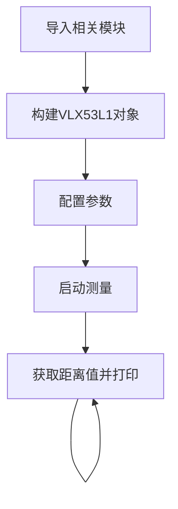
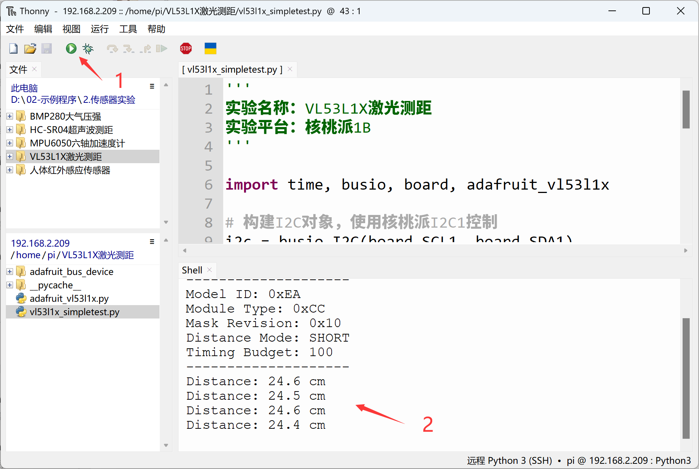

# VL53L1X激光测距

## 前言
VL53L1X飞行时间(ToF)测距模块，精确测距范围可达4米，精度1mm，快速测距频率可达50Hz，I2C接口通信，低功耗。相比于前面的HC-SR04超声波模块具有精度高，响应快，抗干扰能力更强的特点，常用于高精度和实时性要求较高的测距场合。

## 实验目的
通过python编程实现VL53L1X传感器距离测量！

## 实验讲解

市面上大多VL53L1X模块都通用，使用I2C总线通讯，下图是一款VL53L1X传感器模块：

 

|  模块参数 |
|  :---:  | ---  |
| 供电电压  | 3.3V |
| 通信方式  | I2C总线（默认地址：0x29） |
| 测量距离  | 4cm - 4m |
| 测量精度  | 1mm |
| 引脚说明  | `VCC`: 接3.3V <br></br> `GND`: 接地 <br></br>  `SDA`: I2C数据引脚  <br></br> `SCL`: I2C时钟引脚 |

<br></br>

从上面介绍可以看到VL53L1X是一款通过I2C接口驱动的传感器。我们通过核桃派I2C接口编程，即可以对该模块实现数据通讯。

本例程使用核桃派的I2C1来连接VL53L1X传感器：

 

 

## 开启I2C1

在终端输入下面指令：
```bash
sudo set-device enable i2c1
```

重启开发板：
```bash
sudo reboot
```

启动后查看开启情况：
```bash
gpio pins
```

出现下图表示开启成功：


更多GPIO配置教程请看：[GPIO设备配置](../../gpio/gpio_config.md)

## VL53L1X对象

在CircuitPython中可以直接使用写好的Python库来获取VL53L1X传感器数据。具体介绍如下：

### 构造函数
```python
vl53 = adafruit_vl53l1x.VL53L1X(i2c, address=0x29)
```
构建VL53L1X对象。

参数说明：
- `i2c` 需要构建i2c对象，参考: [I2C对象说明](../gpio/i2c_oled#i2c对象)；这里不再重复。
- `address` 模块I2C地址。默认：0x29；

### 使用方法

```python
vl53.distance_mode = value
```
- `value`: 模式值
    - `1`: 短距离模式
    - `2`: 长距离模式

<br></br>

```python
vl53.timing_budget = value
```
- `value`: 测距持续时间，单位ms。

    增加测距持续时间能增加设备的最大测距距离并改进重复性误差。功耗相应增大。可以设置的值有 ms = 15（仅限短距离模式）、20、33、50、100、200、500。默认为 50。

<br></br>

```python
vl53.start_ranging()
```
启动测量。

<br></br>

```python
vl53.data_ready
```
传感器测量状态。返回1：有测量数据；返回0：无测量数据。

<br></br>

```python
vl53.distance
```
读取测量结果。单位cm，数据类型 `float`。

<br></br>

理解了VL53L1X传感器原理和对象使用方法后，我们可以整理出编程思路，流程图如下 ：



## 参考代码
```python
'''
实验名称：VL53L1X激光测距
实验平台：核桃派1B
'''

import time, busio, board, adafruit_vl53l1x

# 构建I2C对象，使用核桃派I2C1控制
i2c = busio.I2C(board.SCL1, board.SDA1)

vl53 = adafruit_vl53l1x.VL53L1X(i2c, address=0x29)

#参数设置
vl53.distance_mode = 1  #1:短距离模式；2:长距离模式。
vl53.timing_budget = 100 #测距持续时间，单位ms。

#传感器信息
print("VL53L1X Simple Test.")
print("--------------------")
model_id, module_type, mask_rev = vl53.model_info
print("Model ID: 0x{:0X}".format(model_id))
print("Module Type: 0x{:0X}".format(module_type))
print("Mask Revision: 0x{:0X}".format(mask_rev))
print("Distance Mode: ", end="")
if vl53.distance_mode == 1:
    print("SHORT")
elif vl53.distance_mode == 2:
    print("LONG")
else:
    print("UNKNOWN")
print("Timing Budget: {}".format(vl53.timing_budget))
print("--------------------")

# 开始测量
vl53.start_ranging()

while True:
    
    if vl53.data_ready:
        print("Distance: {} cm".format(vl53.distance))
        vl53.clear_interrupt()
        time.sleep(0.5)
```

## 实验结果

终端输入下面指令确认I2C1开启情况：
```bash
gpio pins
```

出现下图表示开启成功：

 

如没开启请按前面内容打开：[开启I2C1](#开启i2c1)

有需要可以将VL53L1X传感器保护膜撕开，注意不要刮花表面，精度会提高一点点。

 

将VL53L1X传感器按下图连接到核桃派， SDA1连接到模块SDA引脚, SCL1连接到模块SCL引脚：

 

由于本例程代码依赖其它py库，所以需要将整个例程文件夹上传到核桃派：

 

发送成功后需要打开远程目录（核桃派）的py文件来运行，因为运行会导入文件夹里面的其它库文件，因此这类型代码在电脑本地运行是无效的。

 

这里使用Thonny远程核桃派运行以上Python代码，关于核桃派运行python代码方法请参考： [运行Python代码](../python_run.md)。运行成功后可以看到终端打印出距离信息：

 
