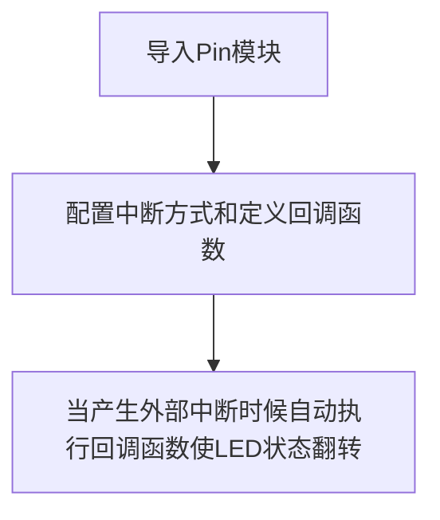

# 外部中断

## 前言

前面我们在做普通的按键（GPIO）时候，虽然能实现IO口输入输出功能，但代码是一直在检测IO输入口的变化，因此效率不高，特别是在一些特定的场合，比如某个按键，可能1天才按下一次去执行相关功能，这样我们就浪费大量时间来实时检测按键的情况。

为了解决这样的问题，我们引入外部中断概念，顾名思义，就是当按键被按下(产生中断)时，我们才去执行相关功能。这大大节省了CPU的资源，因此中断的在实际项目的应用非常普遍。


## 实验目的
利用中断方式来检查按键KEY状态，被按键被按下（产生外部中断）后使LED的亮灭状态翻转。

## 实验讲解
按键对应核桃派PicoW的IO在上一节已经讲过，为引脚0。


外部中断也是通过machine模块的Pin子模块来配置，我们先来看看其配构造函数和使用方法：

## Pin对象

Pin引脚对象。

### 构造函数
```python
KEY = machine.Pin(id, mode, pull)
```

Pin位于machine模块下:

- `id` ：芯片引脚编号。如：0、2、46。
- `mode` ：输入/输出模式。
    - `Pin.IN` : 输入模式；
    - `Pin.OUT` : 输出模式；   
- `pull`: 上下拉电阻配置。
    - `None` : 无上下拉电阻；
    - `Pin.PULL_UP` : 上拉电阻启用；
    - `Pin.PULL_DOWN` : 下拉电阻启用。


### 使用方法
```python
KEY.irq(handler,trigger)
```
配置中断方式：
- `handler` ：产生中断时执行的回调函数。
- `trigger` ：触发中断方式，共4种。
    - `Pin.IRQ_FALLING` : 下降沿触发；
    - `Pin.IRQ_RISING` : 上升沿触发。
    - `Pin.IRQ_LOW_LEVEL` : 低电平触发；
    - `Pin.IRQ_HIGH_LEVEL` : 高电平触发。

<br></br>

更多用法请阅读官方文档：<br></br>
https://docs.micropython.org/en/latest/library/machine.Pin.html#machine-pin

<br></br>

我们先来了解一下上升沿和下降沿的概念，由于按键KEY引脚是通过按键接到GND，也就是我们所说的低电平“0”，所以当按键被按下再松开时，引脚先获得下降沿，再获得上升沿，如下图所示：


按键被按下时候可能会发生抖动，抖动如下图，有可能造成误判，因此我们需要使用延时函数来进行消抖：


我们可以选择下降沿方式触发外部中断，也就是当按键被按下的时候立即产生中断。

外部中断编程思路跟GPIO按键章节类似，在初始化中断后，当系统检测到外部中断时候，执行LED状态反转的代码即可。流程图如下：



## 参考代码

```python
'''
实验名称：外部中断
版本：v1.0
作者：WalnutPi
说明：通过按键改变LED的亮灭状态（外部中断方式）
'''

from machine import Pin
import time

LED=Pin(46,Pin.OUT) #构建LED对象,开始熄灭
KEY=Pin(0,Pin.IN,Pin.PULL_UP) #构建KEY对象
state=0  #LED引脚状态

#LED状态翻转函数
def fun(KEY):
    global state
    time.sleep_ms(10) #消除抖动
    if KEY.value()==0: #确认按键被按下
        state = not state
        LED.value(state)

KEY.irq(fun,Pin.IRQ_FALLING) #定义中断，下降沿触发
```

以上代码中需要注意的地方：

1、state是全局变量，因此在fun函数里面用该变量必须添加global state代码，否则会在函数里面新建一个样的变量造成冲突。

2、在定义回调函数fun的时候，需要将Pin对象KEY传递进去。


## 实验结果

在Thonny IDE中运行代码：


每次按下按键KEY时候，可以看到LED蓝灯的亮灭状态翻转。


从参考代码来看，只是用了几行代码就实现了实验功能，而且相对于使用while True实时检测函数来看，代码的效率大大增强。外部中断的应用非常广，出来普通的按键输入和电平检测外，很大一部分输入设备，比如传感器也是通过外部中断方式来实时检测，这个在后面的章节会讲述。