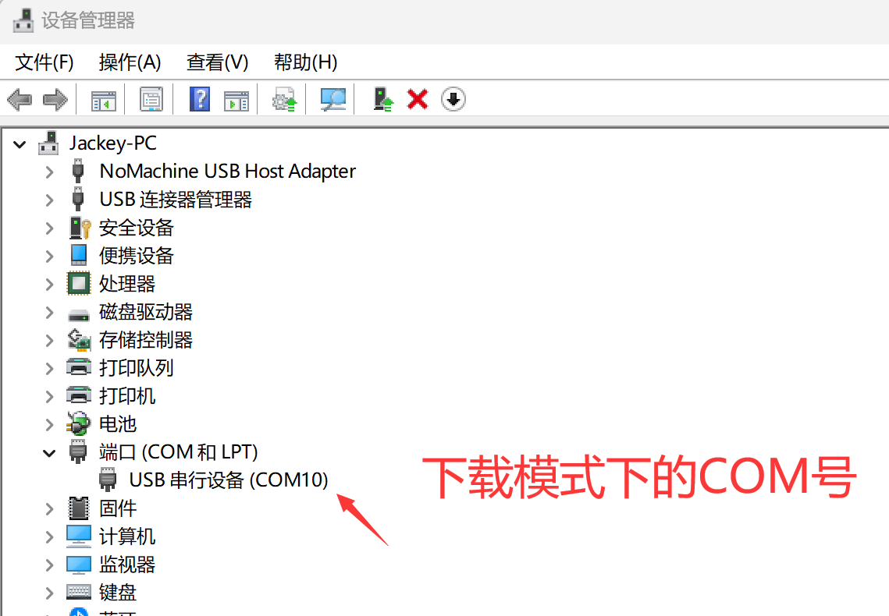
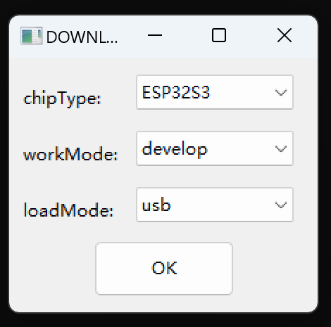
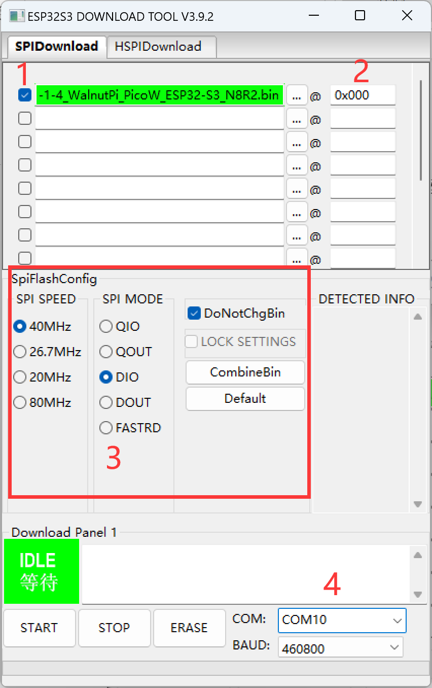
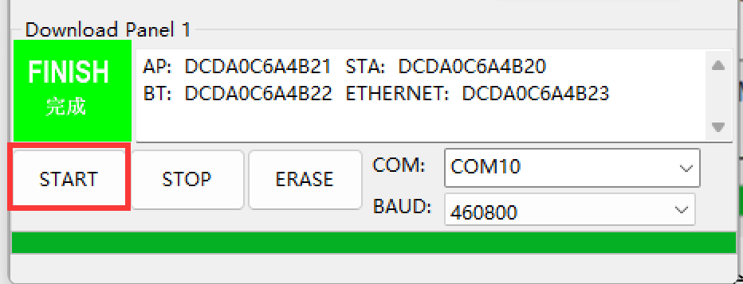

# 固件更新

核桃派PicoW开发板出厂已经烧录好了固件，固件更新是指重新烧写开发板的出厂文件或者是升级固件。

核桃派PicoW进入下载模式：
按着开发板KEY按键不放，插入Type-C线，即可进入下载模式:

这时候设备管理器会弹出一个新COM号，通常情况下和开发过程的COM号码不一样：

使用上海乐鑫提供的官方软件烧录, 找到路径：**核桃派PicoW（ESP32-S3）资料下载\01-开发工具\固件更新工具\flash_download_tools_v3.9.2 下的flash_download_tools_v3.9.2.exe软件**，双击打开。

芯片选择**ESP32-S3，develop开发者模式，USB模式**然后点击OK :

在箭头所示位置选择固件，固件位于**资料包--相关固件**文件夹下：

下载配置参考下图，下面几项是注意的地方：

1、务必勾选，未勾选也能下载但无法使用；

2、地址：0x000 ;

3、按图配置；

4、选择下载模式下自己电脑的COM号。

配置好后，先点击“ERASE”按钮刷除模块里面内容。点击软件下方“ERASE”按钮，刷除成功后，左边绿色框出现完成字样。

刷除成功后，点击“START”按钮开始烧录，烧录完成有左边绿色框出现“完成”字样。完成后记得点”stop”按钮或者关闭软件释放串口。

烧写完成后复位开发板生效。