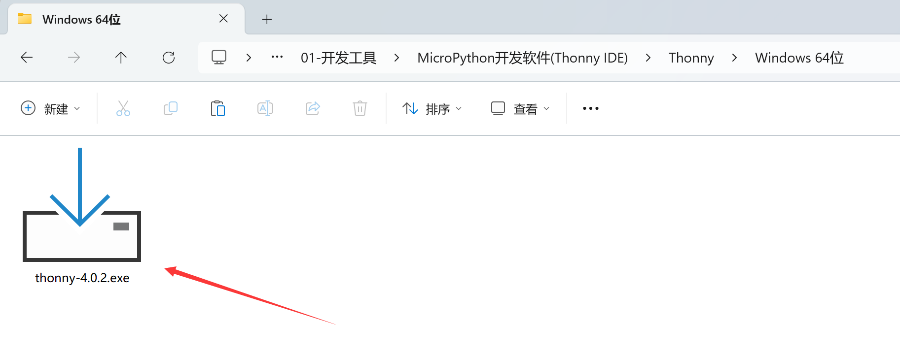
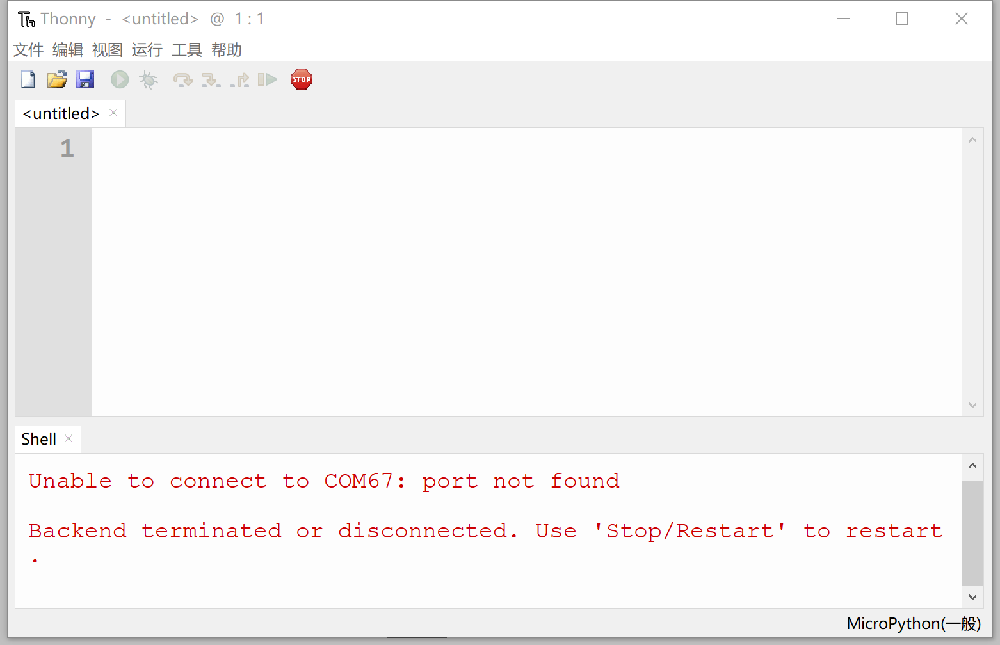

# Thonny IDE开发软件安装

开发软件是指我们用来写代码的工具，Python 拥有众多的编程器，如果你之前已经熟练掌握python或已经使用python开发，那么可以直接使用你原来习惯的开发软件来编程。如果你是初学者或者喜欢简单而快速应用，我们使用官方推荐的Thonny Python IDE。

Thonny IDE是一款开源软件，以极简方式设计，对MicroPython的兼容性非常友善。而且支持Windows、Mac OS、Linux、树莓派。由于开源，所以软件迭代速度非常快，功能日趋成熟。具体安装方法如下：

该软件可以在 **核桃派PicoW（ESP32-S3）资料下载\01-开发工具\MicroPython开发软件(Thonny IDE)\Thonny** 目录下获取。默认提供Windows的安装包。

当然你也可以在在 https://thonny.org/ 下载最新版，选择自己的开发平台进行下载安装即可(这里选择Windows！)：

打开后根据提示安装即可，安装完成后如果在桌面没用找到该软件，可以在安装路径或者在系统搜索栏搜索 thonny关键词找到该软件。打开软件，如下图所示，至此安装完成。

