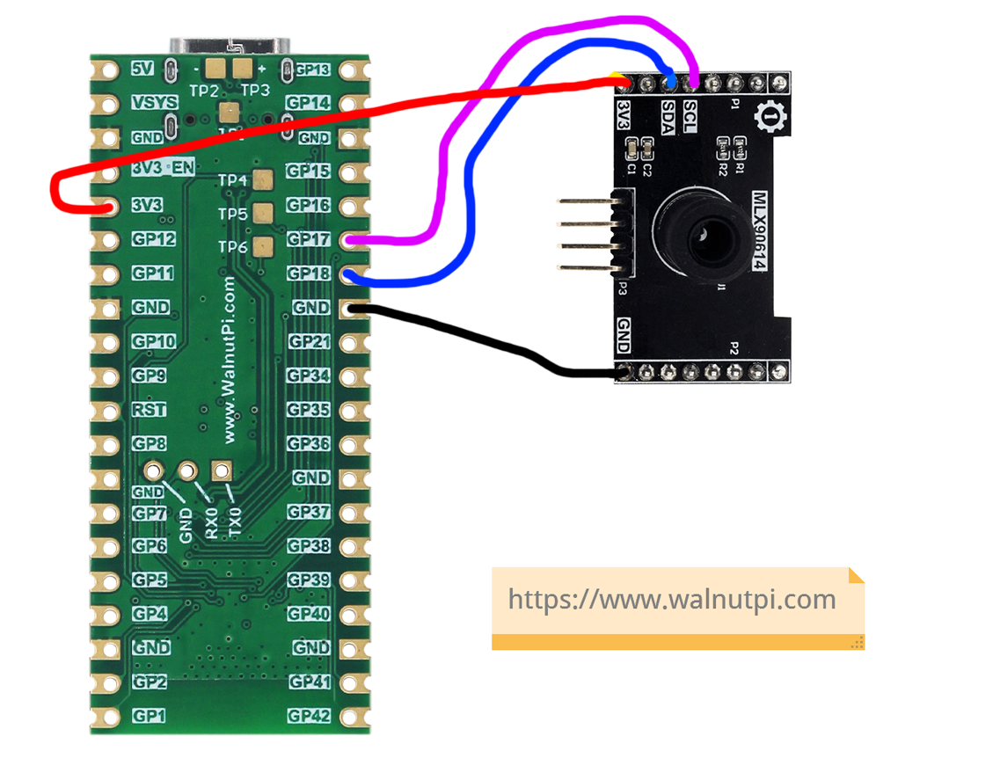
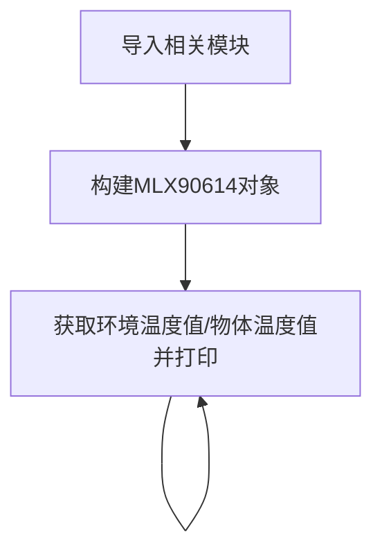
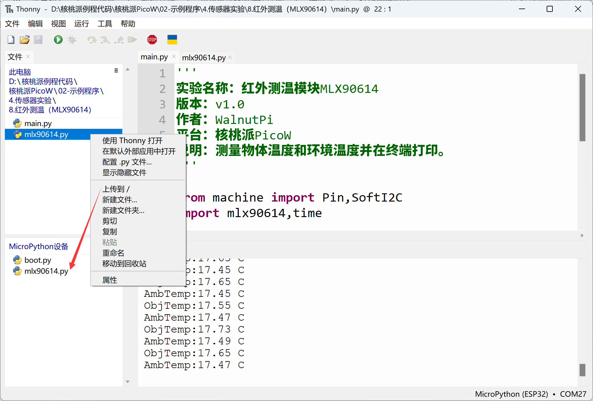
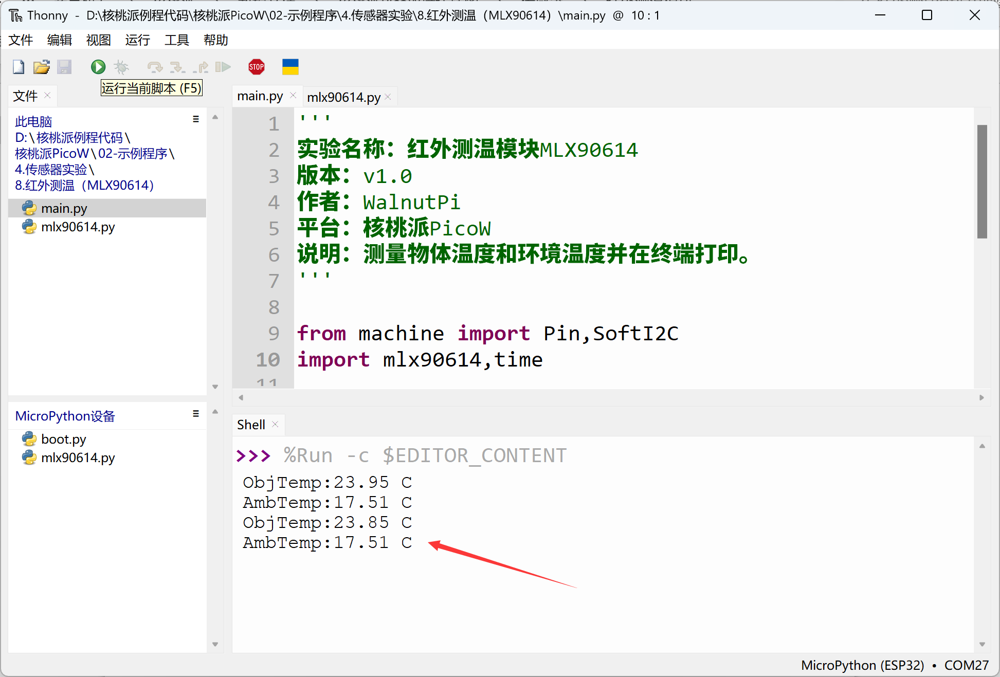

# 红外测温（MLX90614）

## 前言
MLX90614是一款用于非接触式温度测量的红外温度计，能够测量-70至380°C之间的物体。该传感器采用红外敏感热电堆探测器芯片，可在温度范围内以0.02°C的分辨率测量温度。

## 实验目的
通过python编程实现MLX90614非接触式测温。

## 实验讲解

市面上大多MLX90614模块都通用，使用I2C总线通讯，下图是一款MLX90614传感器模块，有DCC（短距离10cm）和DCI（远距离100cm）两个型号，代码通用。

 

|  模块参数 |
|  :---:  | ---  |
| 供电电压  | 3.3V |
| 测量距离  | DCC(10cm) 和 DCI(100cm)|
| 测量范围  | -70℃ - 382℃ |
| 测量精度  | 0.5℃ |
| 通信方式  | I2C总线（默认地址：0x5a） |
| 引脚说明  | `VCC`: 接3.3V <br></br> `GND`: 接地 <br></br>  `SDA`: I2C数据引脚  <br></br> `SCL`: I2C时钟引脚 |

<br></br>

从上面介绍可以看到VL53L1X是一款通过I2C接口驱动的传感器。我们通过核桃派PicoW的I2C接口编程，即可以对该模块实现数据通讯。

核桃派PicoW的MicroPython固件集成了软件模拟SoftI2C，支持任意GPIO引脚定义为相关引脚，非常方便。本例程使用核桃派PicoW的GPIO17连接VL53L1X传感器SCL引脚，GPIO18连接SDA引脚，如下图：

 


## MLX90614对象

### 构造函数
```python
mlx = mlx90614.MLX90614(i2c)
```
构建MLX90614对象。

参数说明：
- `i2c` 定义好的I2C对象。

### 使用方法

```python
mlx.ObjectTemp()
```
返回物体温度，单位℃，数据类型：`float`。
<br></br>

```python
mlx.AmbientTemp()
```
返回环境温度，单位℃，数据类型：`float`。

<br></br>

理解了MLX90614传感器原理和对象使用方法后，我们可以整理出编程思路，流程图如下 ：



## 参考代码
```python
'''
实验名称：红外测温模块MLX90614
版本：v1.0
作者：WalnutPi
平台：核桃派PicoW
说明：测量物体温度和环境温度并在终端打印。
'''

from machine import Pin,SoftI2C
import mlx90614,time

#构建红外测温对象
i2c1 = SoftI2C( scl=Pin(17), sda=Pin(18),freq=100000)
mlx = mlx90614.MLX90614(i2c1)

while True:
    
    #物体温度
    print('ObjTemp:'+str('%.2f'%mlx.ObjectTemp()+' C'))
    
    #环境温度
    print('AmbTemp:'+str('%.2f'%mlx.AmbientTemp()+' C'))
    
    time.sleep(1)
```

## 实验结果

由于本例程代码依赖其它py库，所以需要将mlx90614.py文件上传到核桃派PicoW：

 

使用Thonny IDE运行主程序代码，可以看到终端打印出终端打印出环境温度和物体温度信息：

 
