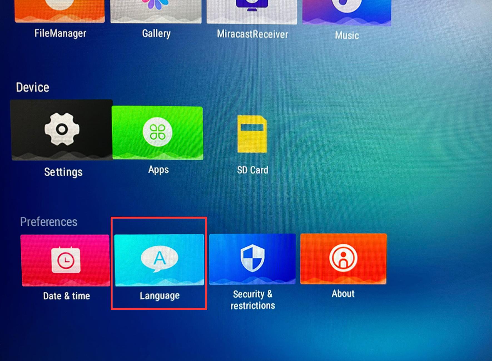
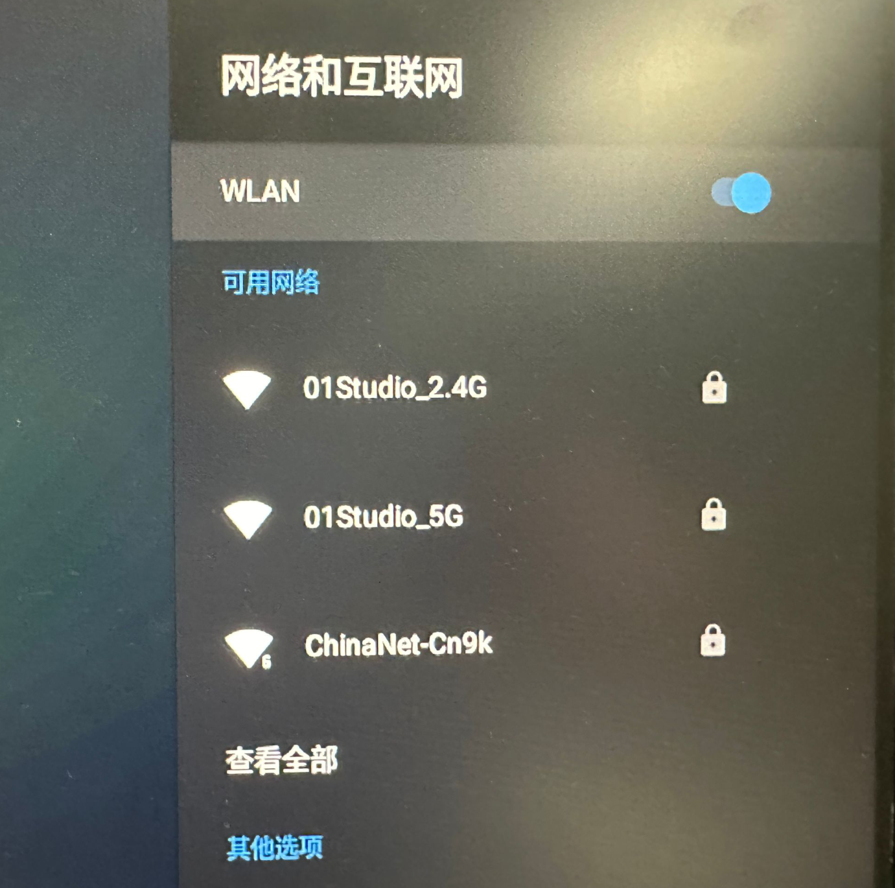
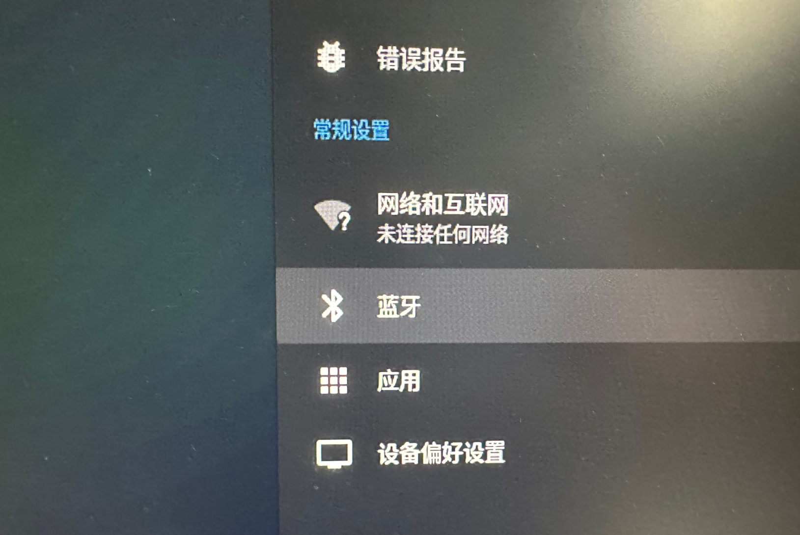
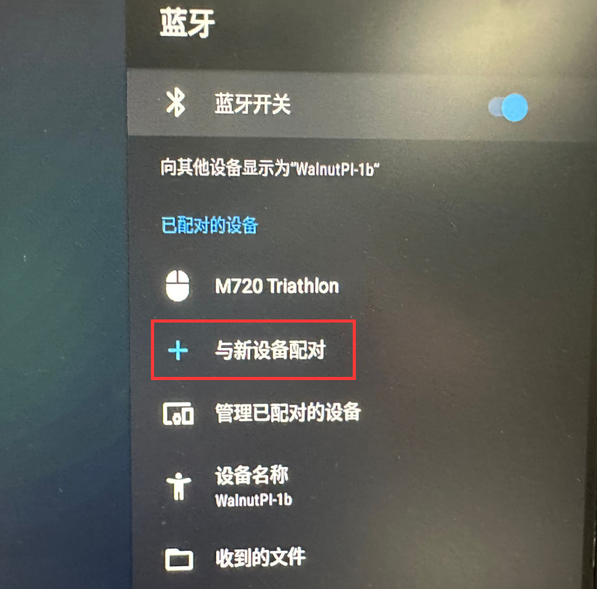
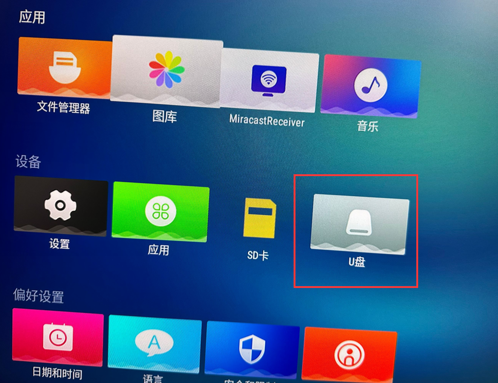
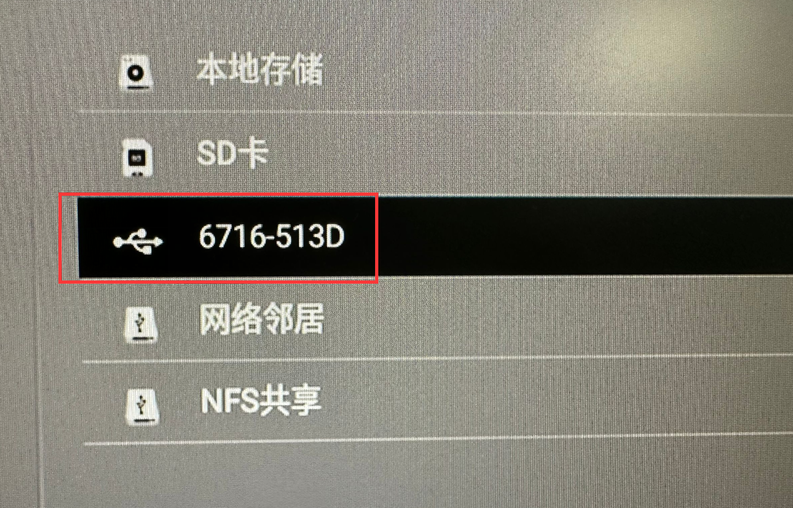
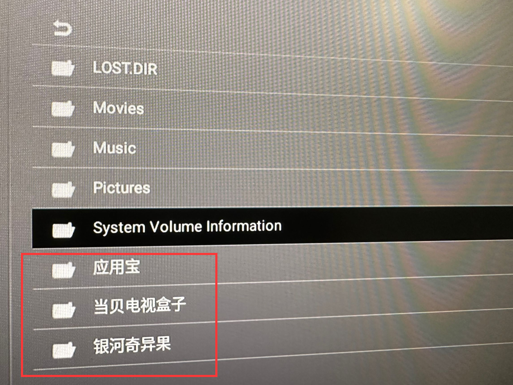
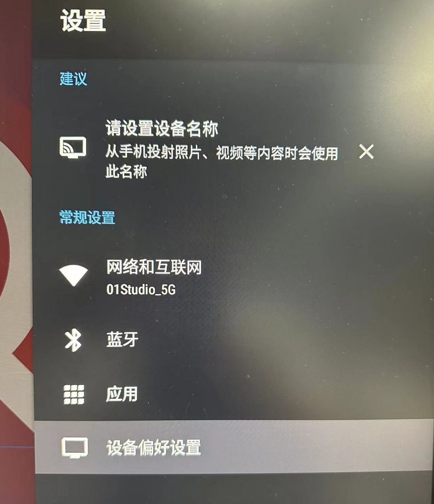
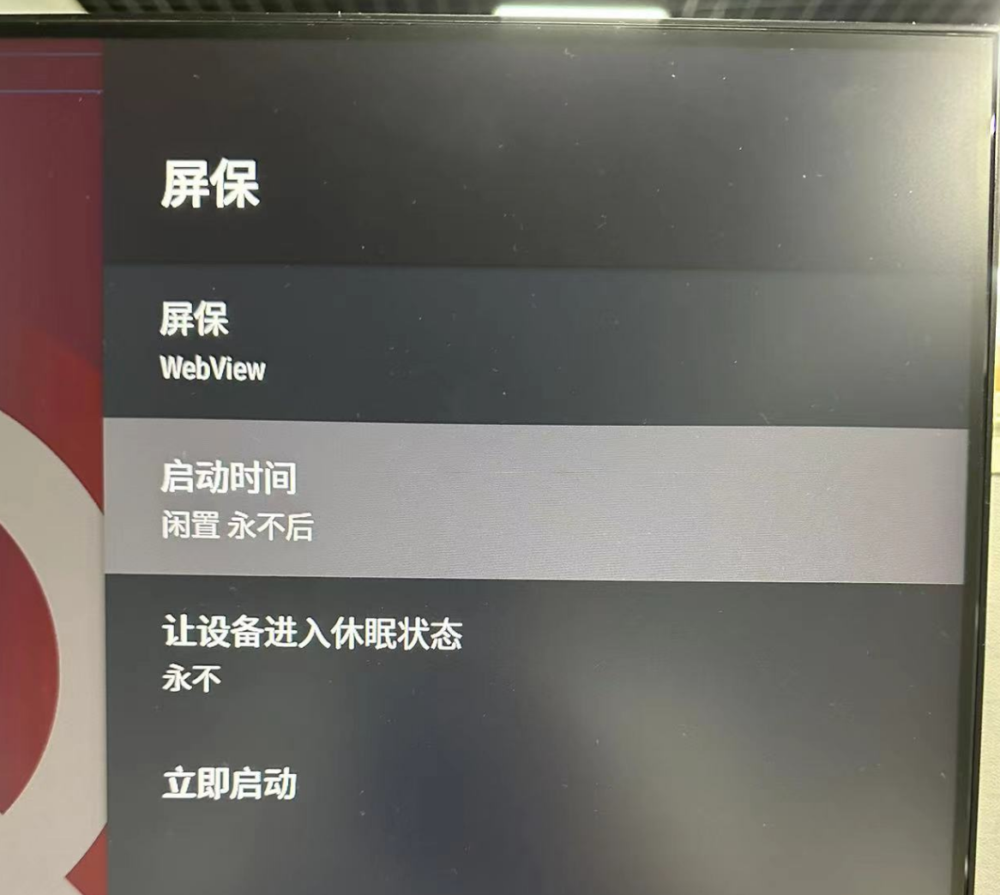

# 系统使用

这节我们来讲解核桃派1B Android TV系统的常用功能。

## 红外遥控器 （推荐）

核桃派1B板载红外接收头，可以使用Android TV盒子通用遥控器控制。[点击购买>>](https://item.taobao.com/item.htm?id=822980807230)

接收成功蓝灯会闪烁一下。

## USB键盘鼠标

可以插入USB无线或有线鼠标对Android 系统进行操作。实测有部分无线鼠标不支持，下面这款支持的。

插入后会界面显示出鼠标。键盘按下触发后蓝灯会闪烁一下。

也可以使用蓝牙键鼠：

## 语音设置

开机后语言默认是英文的，我们可以通过下面方式设置为中文或其它语言。

## 联网

核桃派支持WiFi(2.4G和5G双频) 和 百兆以太网连接到互联网。

### WiFi

点击 `设置`：

在弹出右边栏选择**网络和互联网**:

选择搜索到的WiFi SSID然后按提示输入密码连接即可：

### 以太网

直接将网线插入核桃派以太网口即可，连接后网口指示灯会亮起来。

## 蓝牙设备连接

核桃派Android系统可以通过下面方式连接各类蓝牙设备，如蓝牙键鼠、蓝牙音响等。

点击 `设置`：

在弹出右边栏选择**蓝牙**:

点击：**与新设备配对** 搜索和配对蓝牙设备即可：

## U盘文件传输

核桃派Android系统支持U盘即插即用。可用于apk安装文件、照片视频等文件的拷贝。

插入U盘：

即可在桌面看到U盘图标：

也可以提供给下面方式打开，点击：文件管理

选择新弹出的USB设备：

点击进入即可看到U盘文件，其它文件夹内容是首次插入核桃派Android系统自动生成的，可以忽略。

## 取消屏保待机

核桃派安卓系统没任何操作半小时后会进入屏保状态导致无法操作。可以通过以下方式关闭屏保。

点击 `设置`：

点击 `设备偏好设置`：

点击 `屏保`：

将屏保启动时间设置为**永不**即可。

更多其它功能用户可以自行研究测试。

