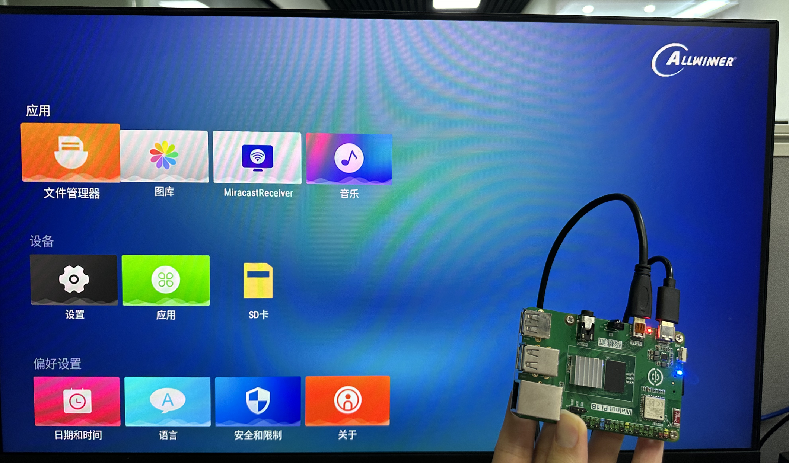

# Booting Up

After completing the system image flashing in the previous section, the MicroSD card now contains the WalnutPi Android system. Insert it into the SD card slot on the back of the WalnutPi, connect an HDMI display, and power on. You should then see the operating system boot up normally.

## Login via HDMI Display

When the system boots up normally, the blue LED will stay solid on. After a successful boot, the Android TV desktop will be displayed.

::::tip Note

If the blue LED is solid on but HDMI has no display, try a different HDMI monitor. If it still doesn't work, you can use the serial terminal method below to check the system boot information.

:::: 

## Login via Serial Terminal

If you don't have a monitor, you can use a USB-to-TTL adapter to connect to the WalnutPi's debug serial port and log in via a serial terminal. For details, refer to: [Open Terminal via Debug Serial Port](../os_software/terminal#opening-terminal-via-debug-serial-port).
