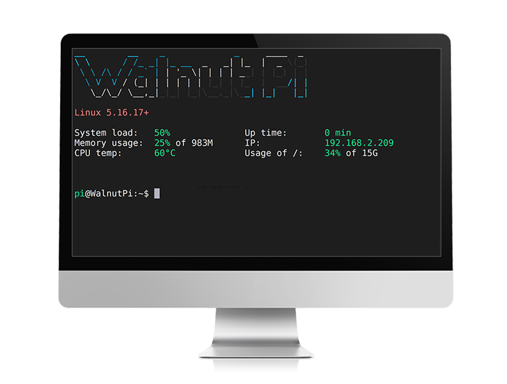

# Booting Up

After completing the system image flashing in the previous section, the MicroSD card now contains the WalnutPi Linux system. Insert it into the SD card slot on the back of WalnutPi, connect the HDMI display, and once powered on, the operating system should boot normally.

- `Normal User (default)` Username: pi ; Password: pi
- `Administrator Account` Username: root ; Password: root

:::tip Note

The first boot of WalnutPi Desktop version takes quite a long time — approximately several minutes — due to initial software initialization. Please wait patiently for the system desktop to appear. Subsequent boots will be much faster, taking about tens of seconds.

::: 

## Login via HDMI Display

When the system boots normally, the blue LED will stay on. After successful startup, the desktop system displays the WalnutPi desktop, while the server (no-desktop) system displays a terminal.

- `Desktop System` : Default pi user auto-login.

- `Server (No-Desktop) System` : Requires entering username and password to log in.

:::tip Note

If the blue LED stays on but the HDMI display shows nothing, try a different HDMI display. If it still doesn't work, you can use the serial terminal method below to check system boot messages.

::: 

## Login via Serial Terminal

If you don't have a display, you can use a USB-to-TTL tool to connect to WalnutPi's debug serial port and log in via the serial terminal. For details, refer to: [Debug Serial Terminal](../os_software/terminal#opening-terminal-via-debug-serial-port) section.
