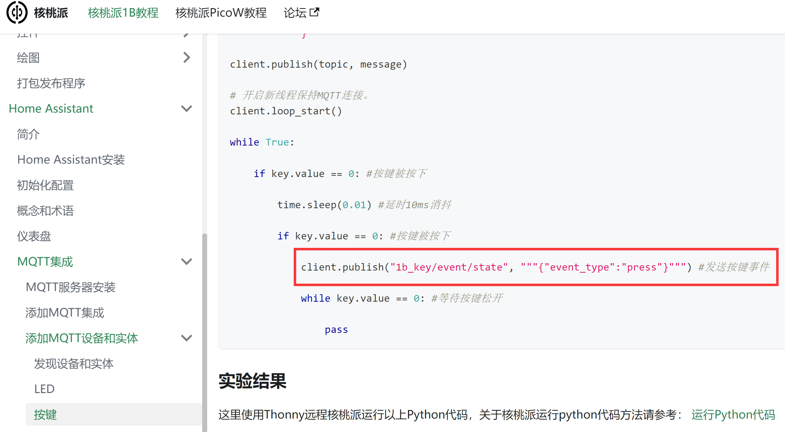
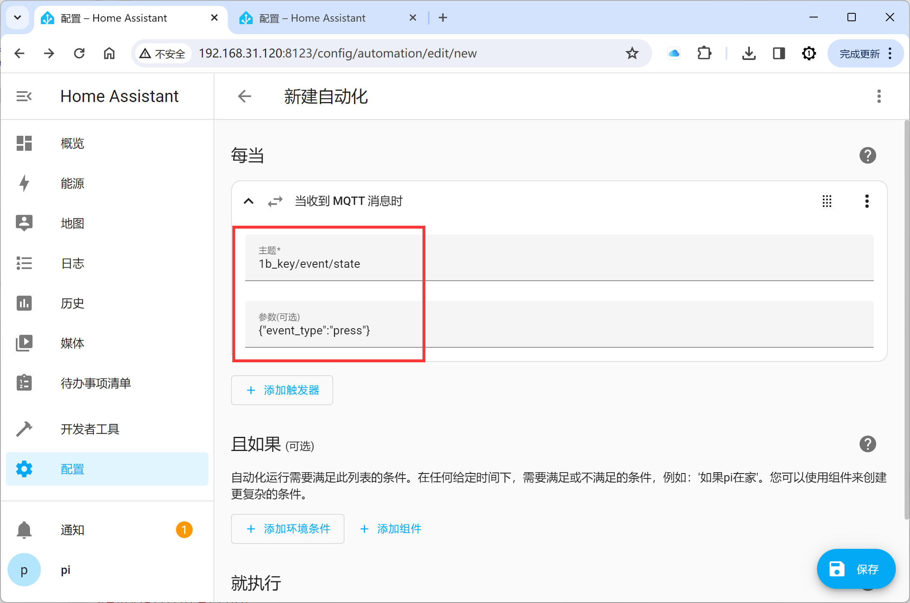
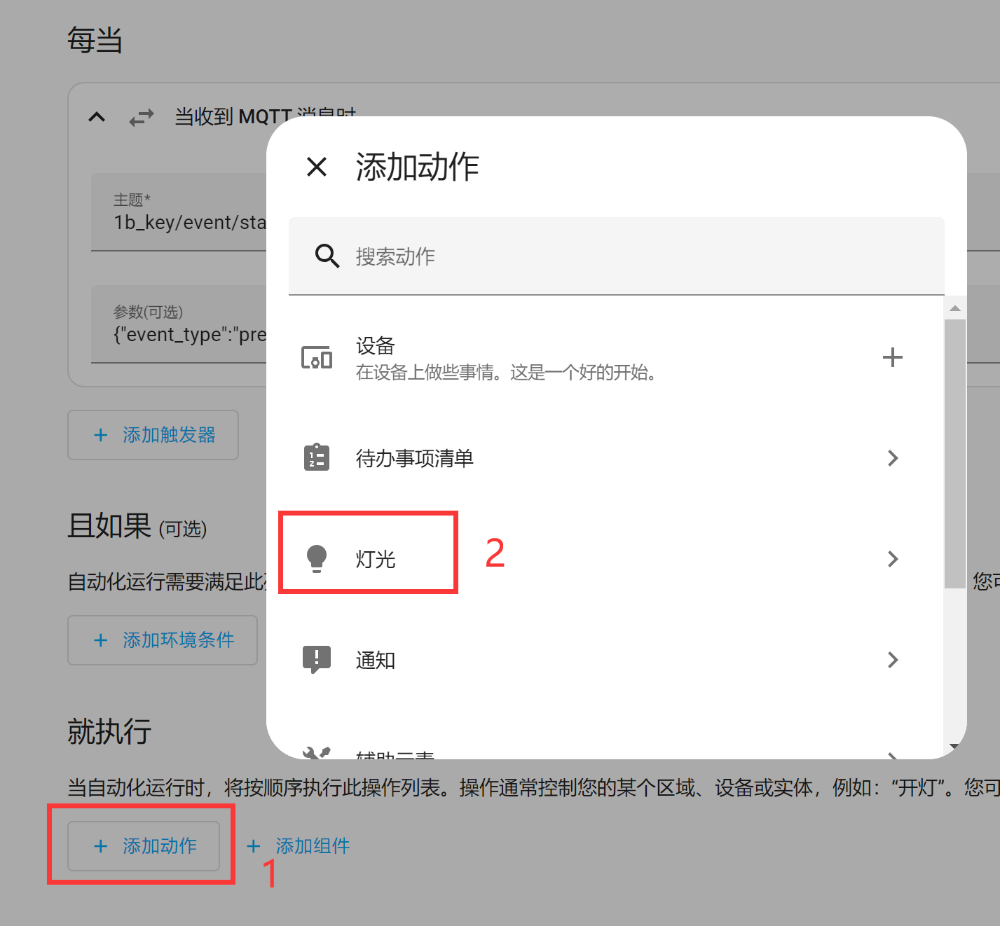
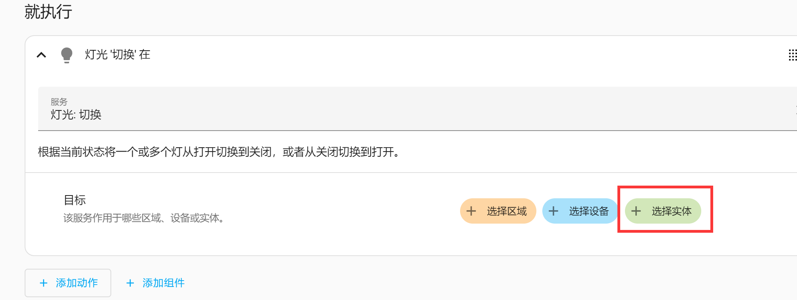

# 自动化

在前面我们新增了很多设备和实体，本节的自动化功能，就是实现这些设备、实体和事件之间的联动。

自动化由3个关键组件组成：

1. 触发器 - 启动自动化的事件。例如，当太阳落山或运动传感器被激活时。
2. 条件 - 操作必须满足的可选测试可以运行。例如，如果有人在家。
3. 操作 - - 与设备交互。例如开灯。

## 按键和LED

在MQTT集成里面我们新增了LED和按键实体，他们都是使用Home Assistant界面控制的，这里我们就通过添加一个自动化，实现核桃派1B开发板上按键按下改变LED亮灭状态，来学习Home Assistant的自动化使用。

LED和按键实体添加教程参考教程：[LED](../home_assistant/mqtt/device_entity/led.md) 和 [按键](../home_assistant/mqtt/device_entity/key.md) ，这里不再重复。

将上面例程的LED和按键代码拷贝到核桃派1B开发板， 可以在终端使用下面指令同时运行2个代码，将实体注册到Home Assistant：

```bash
sudo python led.py & sudo python key.py
```


更多python脚本代码运行方法可以参考教程：[运行Python代码](../python/python_run.md)

运行代码成功后打开Home Assistant MQTT设备，可以看到新增的2个实体：


接下来开始设置自动化，点击**配置--自动化与场景**：


<br></br>

然后点击右下角`创建自动化`：


<br></br>

点击 **创建新的自动化**：


<br></br>

点击 **添加触发器** ，选择 **其它触发器**：（因为Home Assistant的设备触发器不支持按键设备，所以我们可以使用MQTT消息来触发。）


<br></br>

搜索 “mqtt” ， 然后点击 **+** 新增：


<br></br>

在弹出的窗口填写MQTT主题和消息，从[按键](../home_assistant/mqtt/device_entity/key.md)实验中可以看到核桃派1B按键按下时候发布的主题和代码如下：


<br></br>

MQTT主题：
```
1b_key/event/state
```
MQTT消息：
```
{"event_type":"press"}
```

将上面的主题和消息填写到触发器中：


<br></br>

在下方**就执行**栏点击`添加动作` ，选择**灯光**：


<br></br>

选择 **切换** ， 表示每按一次按键LED亮灭状态就切换改变一次：


<br></br>

然后点击 `+选择实体`：


<br></br>

自动识别出来LED实体，点击选中：


<br></br>

点击右下角 `保存`：


<br></br>

在弹出窗口输入刚创建这个自动化的名称，内容自定义即可：


<br></br>

返回自动化主界面，可以看到多了刚刚创建的“自动化”：


<br></br>


依次按下核桃派1B上的按键KEY，可以发现LED蓝灯的亮灭状态会改变，实现了开关灯自动化功能：


<br></br>