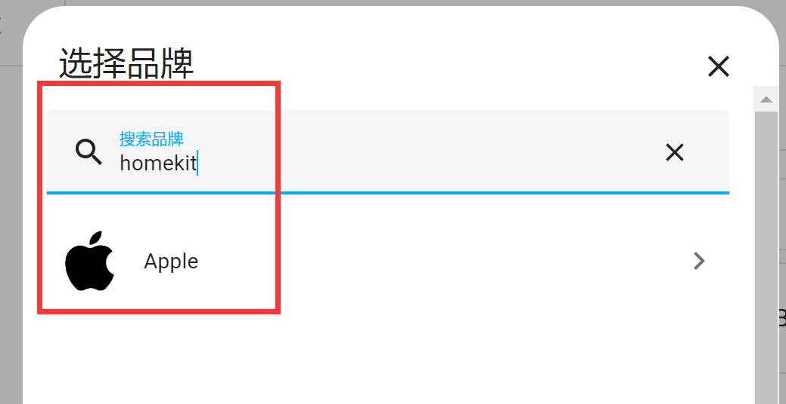
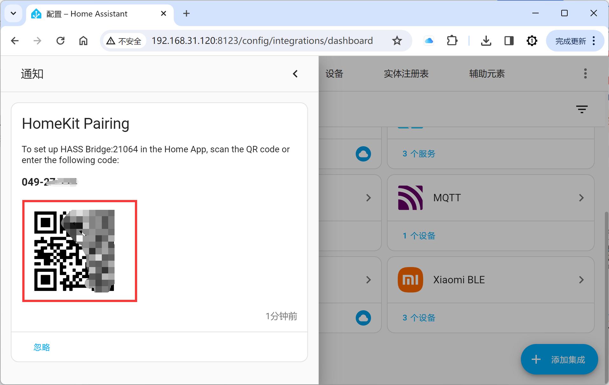
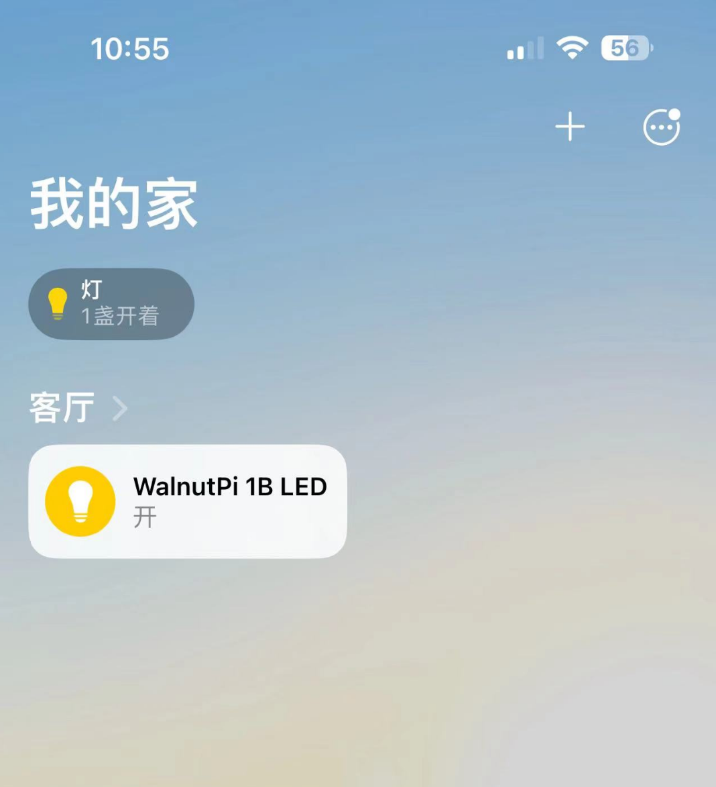

# 接入苹果HomeKit

苹果HomeKit是苹果手机自带的智能家居APP，只需要在核桃派Home Assistant添加HomeKit bridge集成即可将特定设备绑定，在苹果手机上实现设备控制。

本节以LED灯为例，将注册的LED实体加入HomeKit。确保已经加入了LED实体，可参考教程：[LED](../home_assistant/mqtt/device_entity/led.md) 章节内容。

首先添加HomeKit Bridge集成，用于桥接Home Kit和Home Assistant设备。

搜索 “homekit” 关键词，点击弹出的苹果栏：

点击`HomeKit Bridge` :

这里选择包含的域，实际是Home Assistant的元件分类，由于这里使用的LED是归属light，所以确保light已经勾选即可。

点击完成：

这时候在左侧通知栏会有新通知：

出现一个二维码。

打开苹果手机自带应用的“家庭”APP：

选择扫描配件：

扫描刚刚Home Assistant弹出的二维码：

然后按提示添加, 添加成功后可以看到LED设备实体出现在苹果APP上。

可以通过苹果家庭APP控制核桃派的LED了。

