# Installing Home Assistant

The first step to using Home Assistant is to install it on your device. This chapter provides multiple installation methods for users to choose from.

Image, installation package and related materials download:

- Baidu Netdisk Download

Baidu Netdisk link: https://pan.baidu.com/s/1g069bvqYN0xQDPcXTzelaA?pwd=WPKJ

Extraction code: **WPKJ**

- QQ Group File Download

WalnutPi Open Source Support Group: **677173708**

::::tip Note
Forward the group files to your own device or another QQ account in the group for high-speed downloads.
::::

## DIY with WalnutPi Development Board

WalnutPi is a mini, low-cost single-board computer. For users who have already purchased WalnutPi 1B or other Linux development boards, you can install Home Assistant on your WalnutPi system.

### Using Image Installation

WalnutPi officially provides images pre-installed with Home Assistant, fully adapted for all WalnutPi Linux development boards. Simply flash the image and power on to get started. Refer to the [**System Image Flashing**](../getting_start/os-install.md#using-rufus-recommended) section for flashing methods.

The WalnutPi 1B 2G/4G RAM version can use the Home Assistant Desktop or Server edition image; the 1G version has limited memory and can only use the Home Assistant Server edition image. **It is recommended to use the 2G/4G version — having a desktop environment makes initial configuration easier for beginners.**

### Using Package Installation

For users who are already using WalnutPi and want to keep their existing operating system and configuration, you can install using the official WalnutPi installation package. This primarily involves installing Docker and the Home Assistant image. Ensure your device is connected to the internet during the installation process.

Copy the installation package from the materials to your WalnutPi using a USB drive:

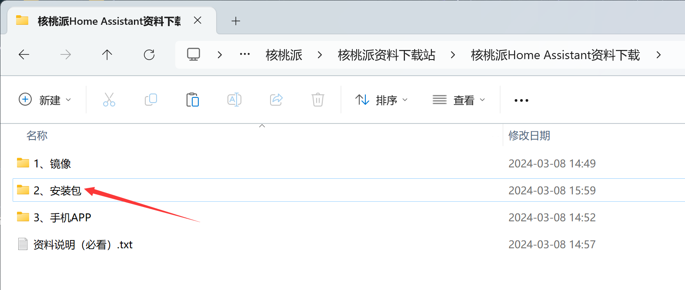

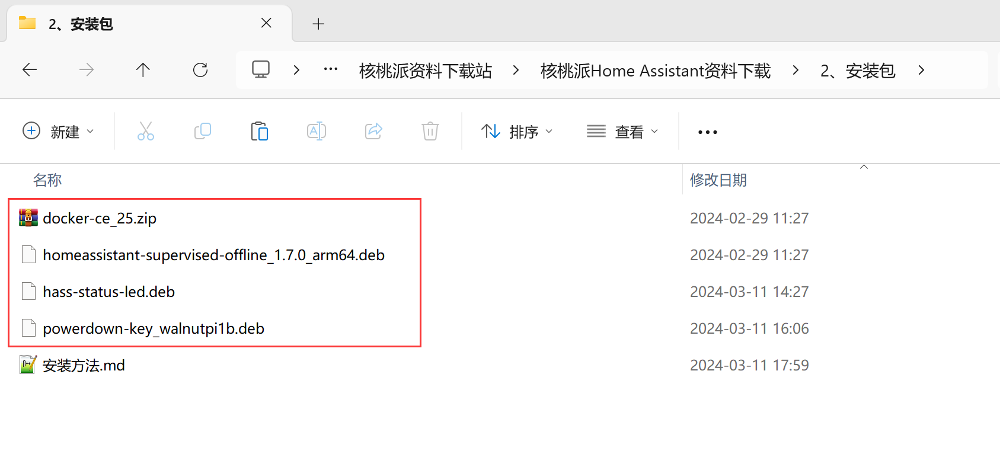

After copying, open a terminal inside the installation package folder on the WalnutPi development board:

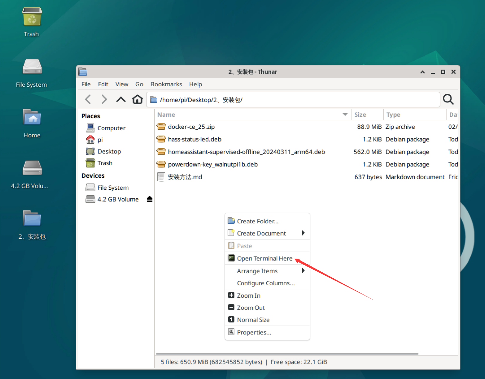

#### Installing Docker

Extract the Docker installation package:

```bash
unzip docker-ce_25.zip
```

Enter the folder:

```bash
cd docker-ce_25
```

Install all packages:

```bash
sudo apt install -y ./*
```

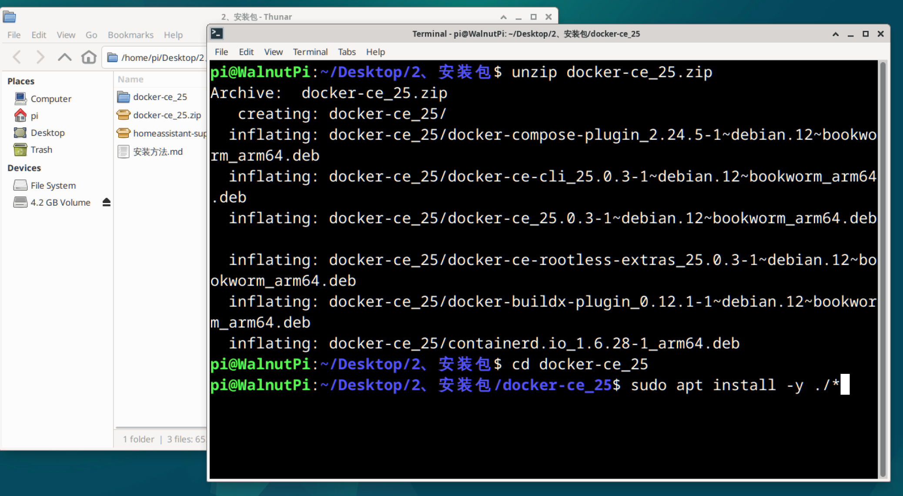

#### Installing Home Assistant

Install prerequisite software:

```bash
sudo apt update
```

```
sudo apt install apparmor cifs-utils curl dbus jq libglib2.0-bin lsb-release network-manager nfs-common systemd-journal-remote systemd-resolved udisks2 wget -y
```

**Reboot**, because the systemd-resolved package modifies network configuration during installation:

```bash
sudo reboot
```

After the reboot, open the installation package folder again and open a terminal in the homeassistant offline installation package directory:

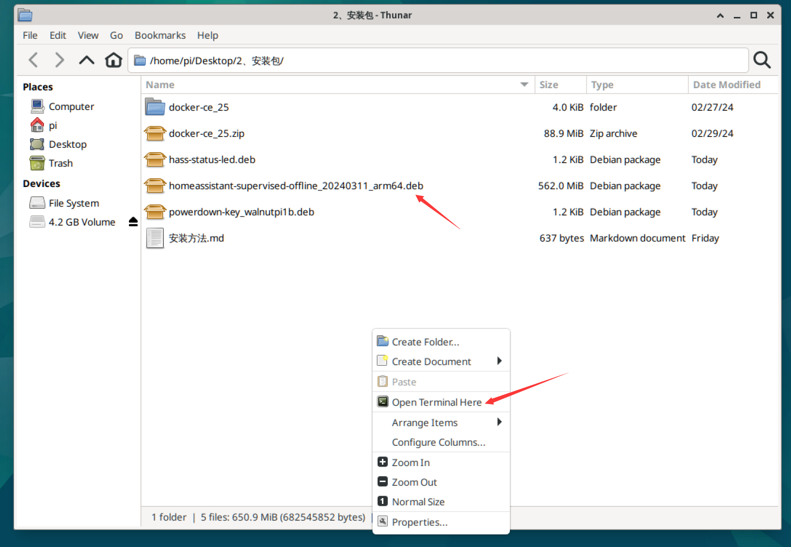

Use the following command to install. The filename may vary by version (you can type the first few characters and use Tab to auto-complete):

```bash
sudo apt install ./homeassistant-supervised-offline_20240311_arm64.deb
```

The installation process takes approximately 20 minutes.

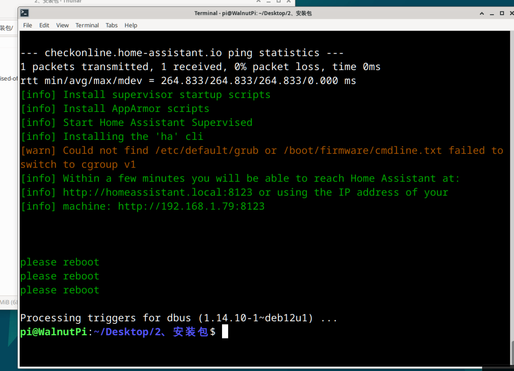

<br></br>

- **Install Home Assistant LED Status Indicator (Optional)**

After installation, the blue LED on the WalnutPi board will blink during startup and remain solid once Home Assistant is ready, making it easy to observe the Home Assistant host's working status. Users who need this can install it.

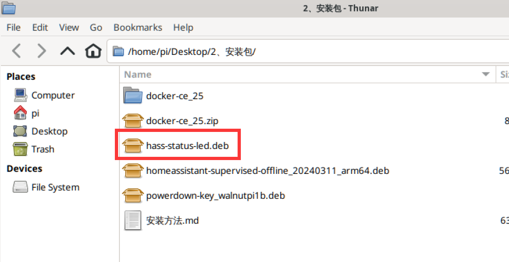

Installation command:

```bash
sudo apt install ./hass-status-led.deb
```

<br></br>

- **Install Long-Press Button Shutdown Function (Optional)**

After installation, press and hold the button on the WalnutPi 1B for 6 seconds — the LED will blink and the development board will perform a safe shutdown. Since directly cutting power may cause data loss, users who need this can install it.

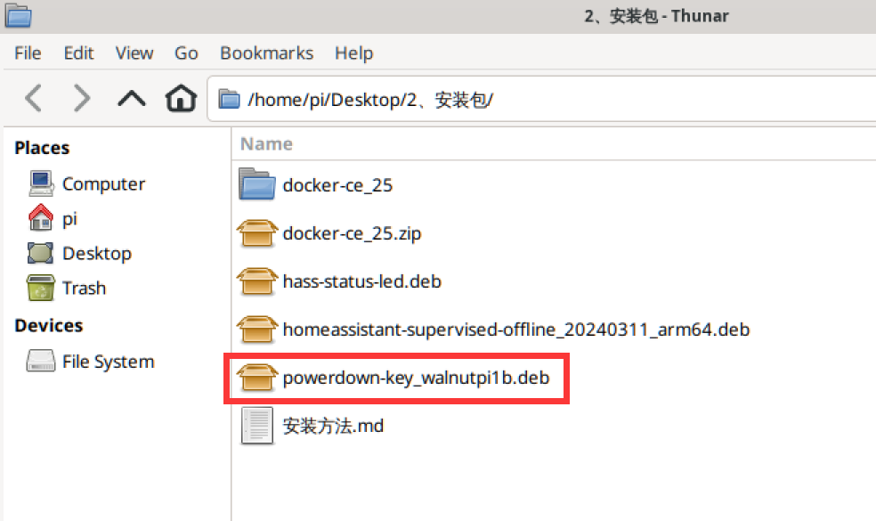

Installation command:

```bash
sudo apt install ./powerdown-key_walnutpi1b.deb
```
<br></br>

**After installation, be sure to reboot the WalnutPi development board:**

```bash
sudo reboot
```
<br></br>

::::danger Warning
When using Home Assistant on the WalnutPi **Desktop Edition system**, you need to close the BlueMan Bluetooth application and disable it from starting at boot. This application conflicts with Home Assistant's Bluetooth calls, causing continuous memory leaks. (This operation is required for manual installation; Home Assistant images have this disabled by default at the factory.)

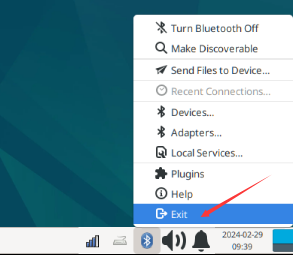

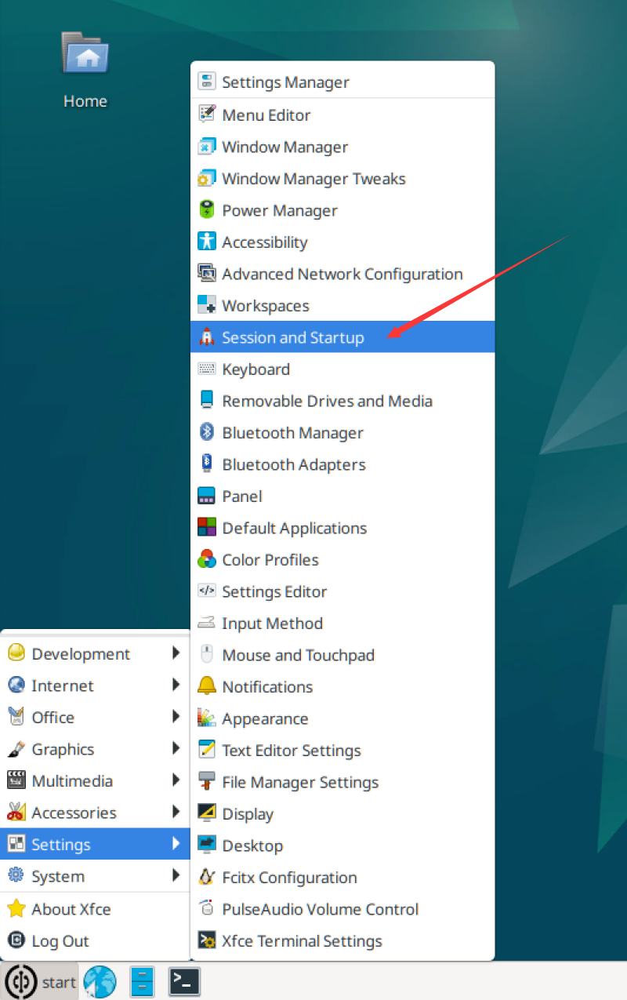

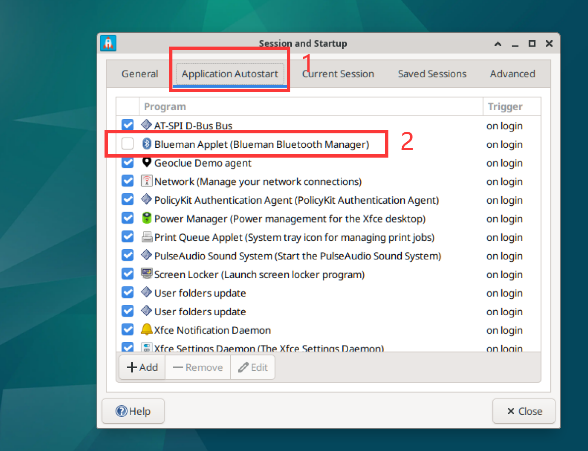

::::

After installation is complete, proceed to the next section for initial configuration.
