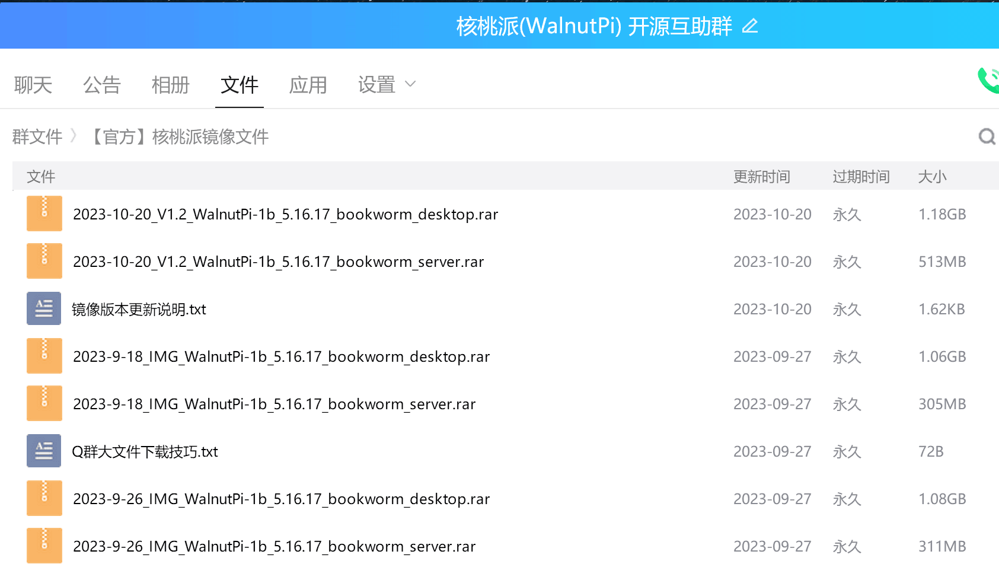
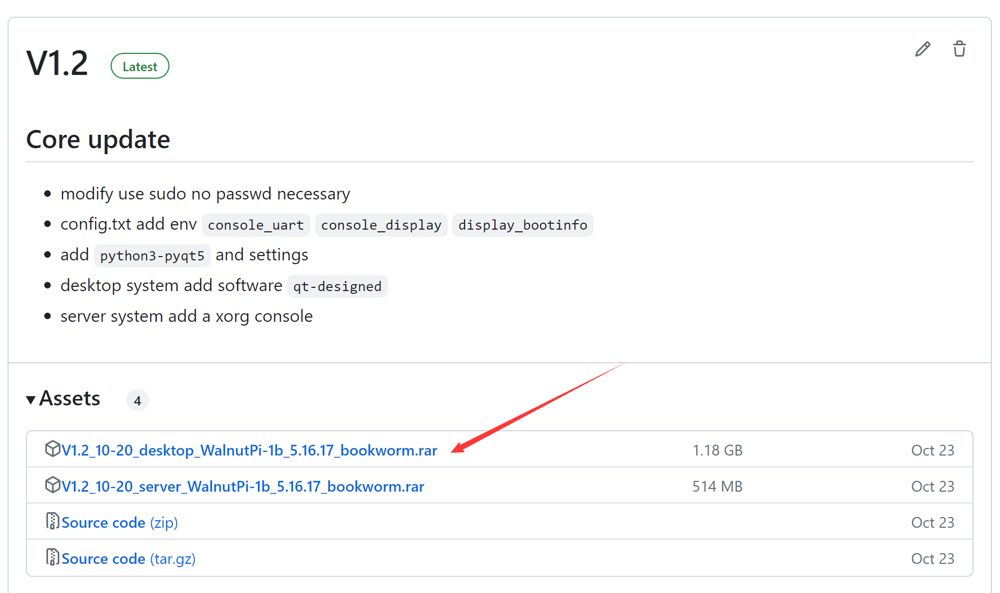
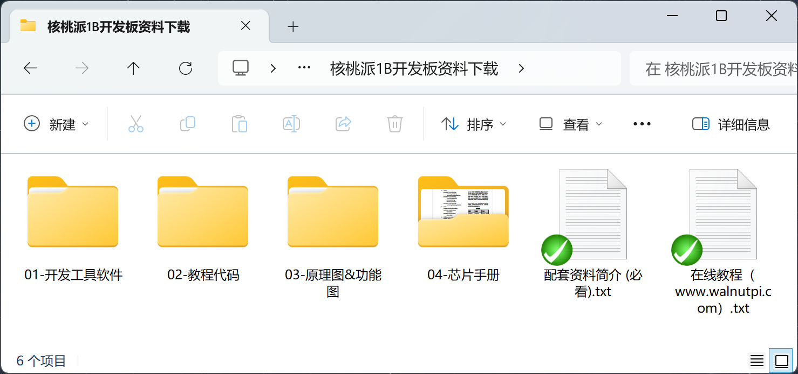

# Downloads

## System Images

WalnutPi currently provides WalnutPi OS (Debian 12), Ubuntu 22.04, Home Assistant, and Android TV images. This tutorial is primarily based on WalnutPi OS (Debian 12), which is our recommended image. It comes in Desktop version and Server (non-desktop) version. The following download methods are available.

### Baidu Netdisk

- Baidu Netdisk Link: https://pan.baidu.com/s/1-ytTK-KI1RP2KsoZpjFSrA?pwd=WPKJ
- Extraction Code: **WPKJ**

### QQ Group Files

WalnutPi Open Source Support Group: **677173708**

:::tip Note
In the QQ group, forwarding group files to your own device or another QQ account enables high-speed downloads.
:::

### GitHub

Users in overseas regions can use this method to download:

https://github.com/walnutpi/walnutpi-1/releases

## Tutorial Resource Package

WalnutPi tutorial companion software, example source code, schematics, chip datasheets, etc.

### Baidu Netdisk Download

- Baidu Netdisk Link: https://pan.baidu.com/s/1Wu5De2rlShyz3wBCtZshPA?pwd=WPKJ
- Extraction Code: **WPKJ**

### GitHub Download

Users in overseas regions can browse and download the package from the GitHub repository:

https://github.com/walnutpi/walnutpi-1

### Package Contents

- **Development Tools**

Development software, host tools, related drivers.

- **Tutorial Code**

Source code for this online tutorial.

- **Schematics & Diagrams**

Development board schematics and interface documentation.

- **Chip Datasheets**

Key IC datasheets, etc.
