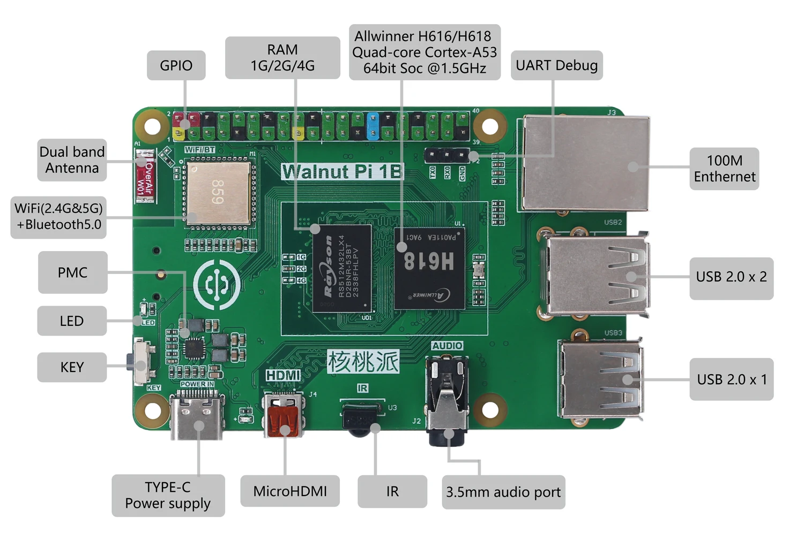
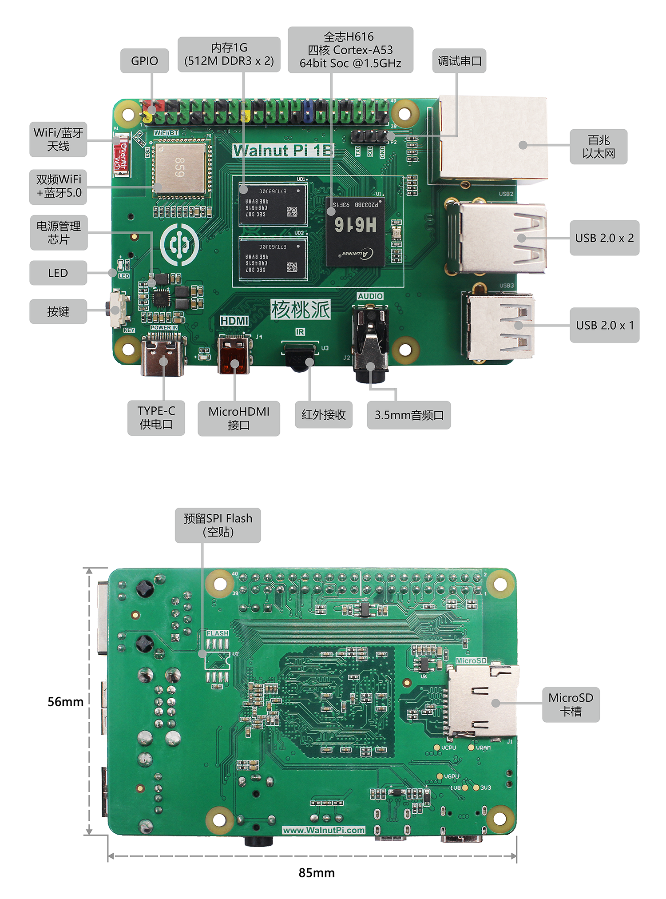
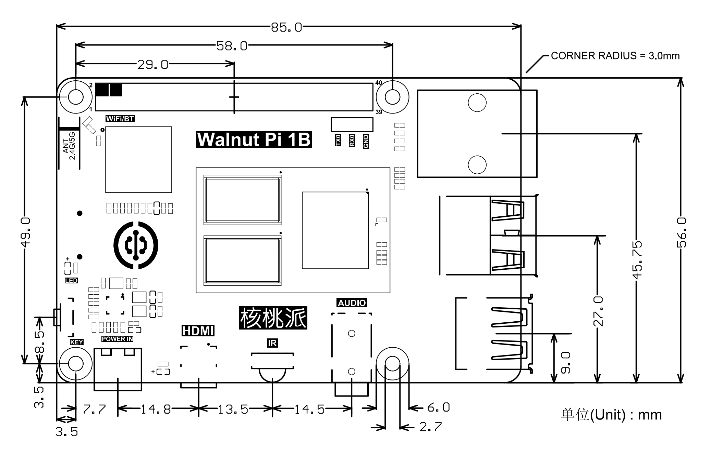
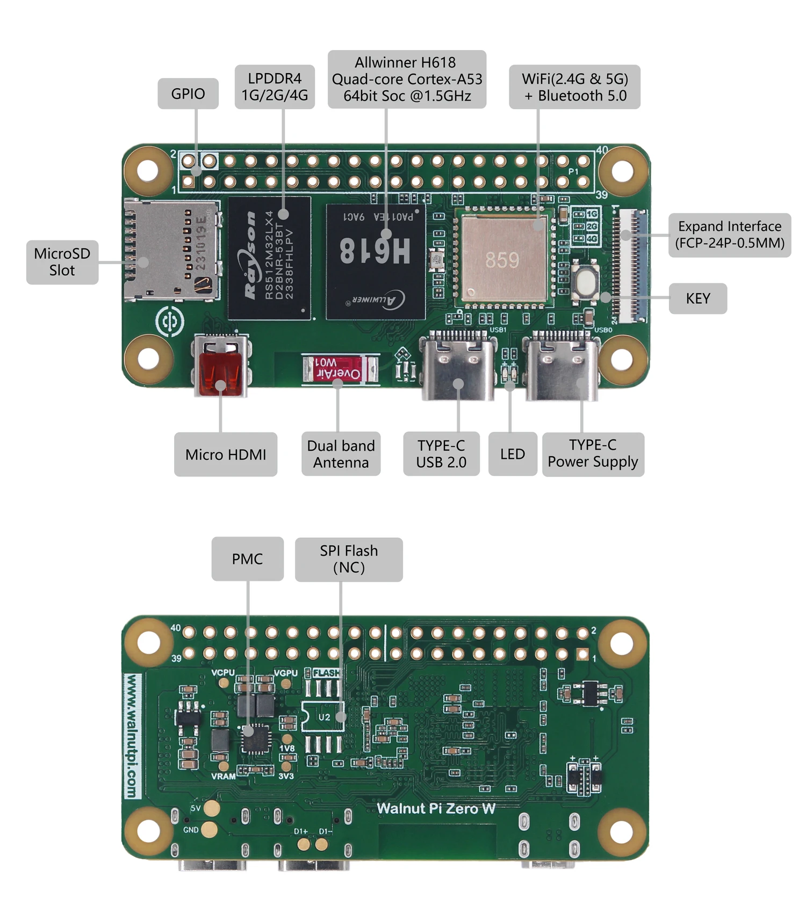
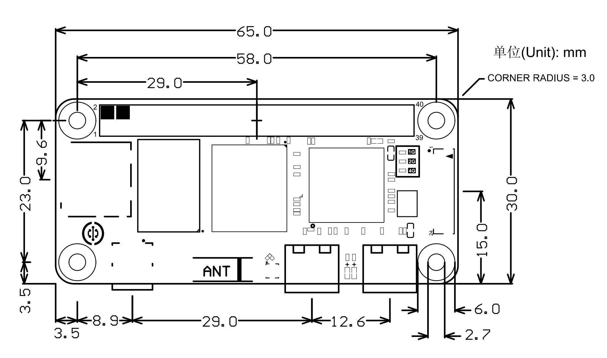
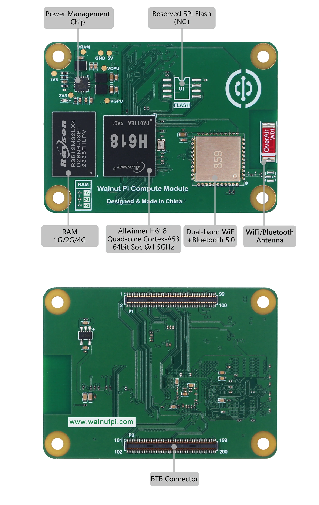
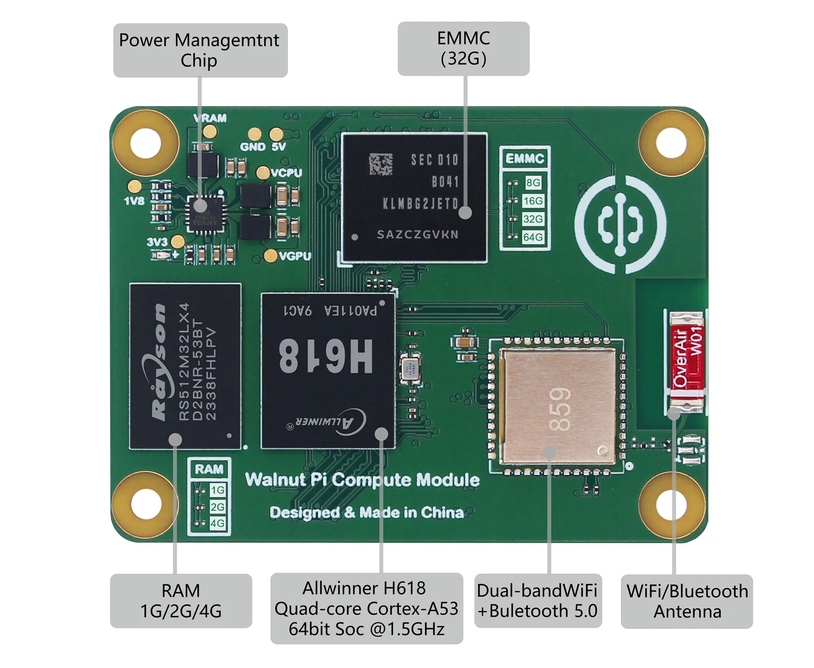
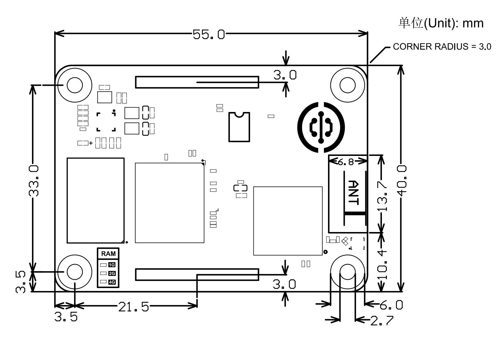
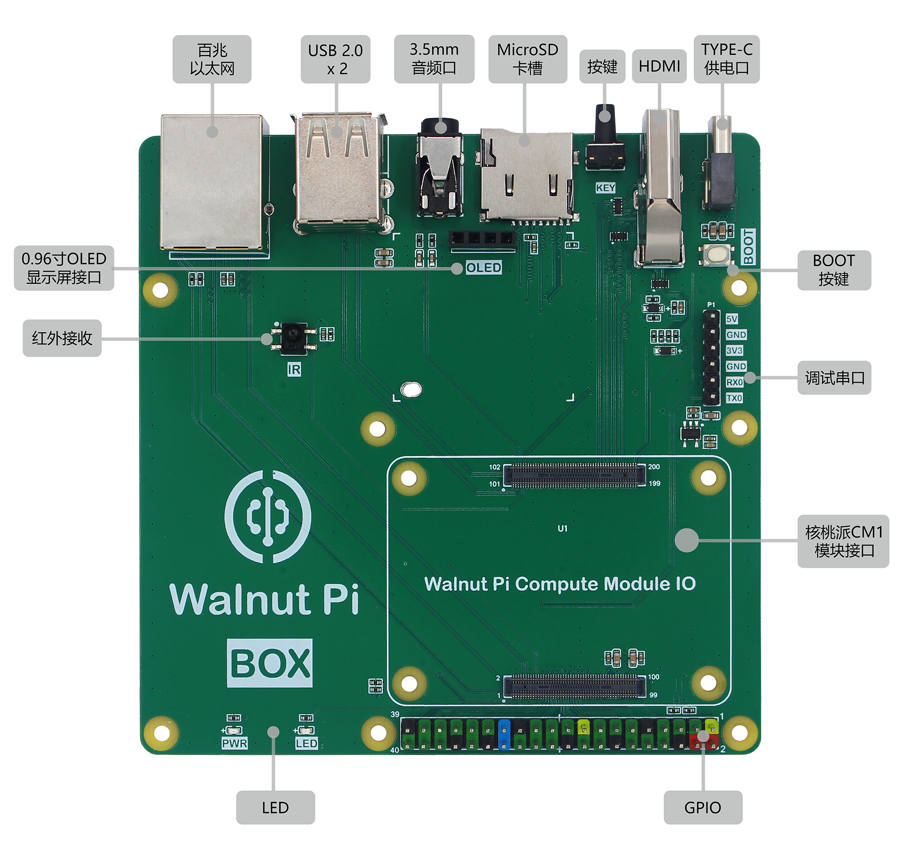
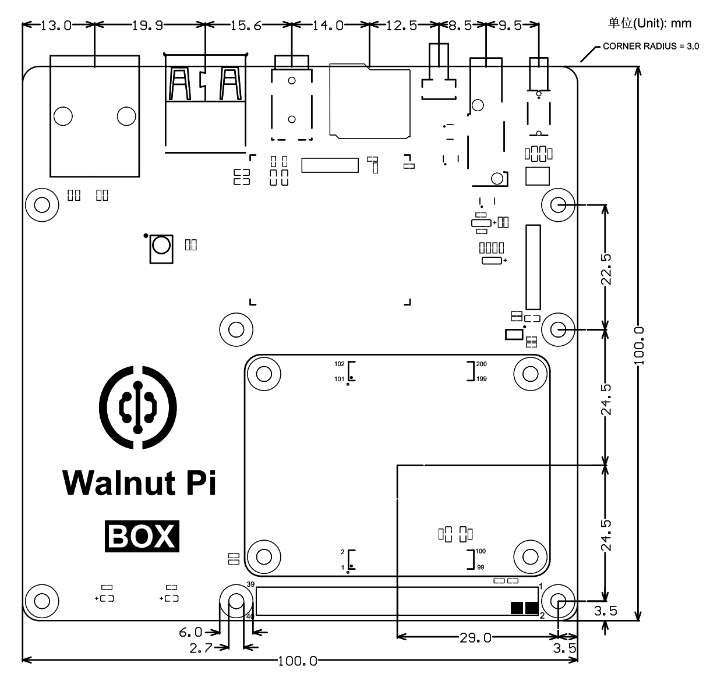

# Product Specifications

WalnutPi 1st generation is based on the Allwinner H616/H618 quad-core 64-bit Cortex-A53 high-performance processor.

## WalnutPi 1B

### Feature Overview

**1G/2G/4G LPDDR4 RAM Versions:**

**H616 + DDR3 (1GB) Version: [Discontinued]**

### Detailed Specifications

|  Product Specs |  |
|  :---:  | ---  |
| CPU  | Allwinner H618 64-bit / Quad-core high-performance Cortex-A53 processor, 1.5GHz |
| GPU  | Mali G31 MP2  Supports OpenGL ES 1.0/2.0/3.2, OpenCL 2.0|
| RAM (Optional)  | ● 1GB (LPDDR4)   ● 2GB (LPDDR4)   ● 4GB (LPDDR4)  | 
| Storage  | ● MicroSD card up to 512GB  ● Reserved SPI Flash (unpopulated)|
| Wireless  | Dual-band WiFi (2.4G & 5G) + Bluetooth 5.0 |
| Wired Network  | 100Mbps Ethernet port |
| Audio Output  | 3.5mm audio jack |
| Video Output  | MicroHDMI 2.0a, supports 4K@60fps |
| Peripherals  | ● USB 2.0 x 3  ● IR receiver x 1  ● Button x 1  ● LED x 1  ● 40-Pin GPIO header (Raspberry Pi compatible)  ● 3-Pin UART (serial) debug header |
| Power  | Type-C port, 5V/1A input |
| OS  | WalnutPi OS (Debian), Ubuntu 22.04, Home Assistant, Android |

|  Physical Specs |  |
|  :---:  | ---  |
| Dimensions  | 85 x 56 x 21mm (PCB size) |
| Weight  | 38g (bare board) |

### Dimensions

## WalnutPi ZeroW

### Feature Overview

### Detailed Specifications

|  Product Specs |  |
|  :---:  | ---  |
| CPU  | Allwinner H618 64-bit / Quad-core high-performance Cortex-A53 processor, 1.5GHz |
| GPU  | Mali G31 MP2  Supports OpenGL ES 1.0/2.0/3.2, OpenCL 2.0|
| RAM  | 1GB / 2GB / 4GB LPDDR4 (Optional)  | 
| Storage  | ● MicroSD card up to 512GB  ● Reserved SPI Flash (unpopulated)|
| Wireless  | Dual-band WiFi (2.4G & 5G) + Bluetooth 5.0    (Onboard dual-band high-gain ceramic antenna, optional external ipex4)   |
| Video Output  | MicroHDMI 2.0a, supports 4K@60fps |
| Peripherals  | ● USB 2.0 x 1 (Type-C)  ● Button x 1  ● LED x 1  ● 40-Pin GPIO header (Raspberry Pi compatible)  |
| FPC Connector  | ● USB 2.0 x 2   ● IR receiver x 1  ● Audio  ● 100Mbps Ethernet  ● Debug serial (UART)   ● Power output (5V and 3.3V)|
| Power  | Type-C port, 5V/1A input |
| OS  | WalnutPi OS (Debian), Ubuntu 22.04, Home Assistant, Android |

|  Physical Specs |  |
|  :---:  | ---  |
| Dimensions  | 65 x 30 x 5mm (PCB size) |
| Weight  | 8.5g (bare board) |

### Dimensions

## WalnutPi CM1

### Feature Overview

- **CM1 Standard Version**

- **CM1 EMMC Version**

:::tip Note
**The CM1 EMMC version occupies pins PC8, PC9, PC10, PC11, PC14, and PC15 on the WalnutPi 40-Pin GPIO.**
:::

### Detailed Specifications

|  Product Specs |  |
|  :---:  | ---  |
| CPU  | Allwinner H618 64-bit / Quad-core high-performance Cortex-A53 processor, 1.5GHz |
| GPU  | Mali G31 MP2  Supports OpenGL ES 1.0/2.0/3.2, OpenCL 2.0|
| RAM  | 1GB / 2GB / 4GB LPDDR4 (Optional)  | 
| Storage  | ● MicroSD card up to 512GB (via BTB connector)   ● EMMC Flash 0GB/32GB optional (other capacities available for custom orders)  ● Reserved SPI Flash (unpopulated, for non-EMMC versions)|
| Wireless  | Dual-band WiFi (2.4G & 5G) + Bluetooth 5.0    (Onboard dual-band high-gain ceramic antenna, optional external ipex4)   |
| Peripherals  (BTB Connector)  | ● Video Output: MicroHDMI 2.0a, supports 4K@60fps   ● Audio   ● 100Mbps Ethernet   ● USB 2.0 x 3   ● IR receiver x1 ● Button x 1  ● LED x 1  ● 40-Pin GPIO header (Raspberry Pi compatible)  ● Debug serial (UART)   ● BOOT pin   ● Power input (5V)|
| Power  | Type-C port, 5V/1A input |
| OS  | WalnutPi OS (Debian), Ubuntu 22.04, Home Assistant, Android |

|  Physical Specs |  |
|  :---:  | ---  |
| Dimensions  | 55 x 40 x 5mm |
| Weight  | 8.5g (bare board) |

### Dimensions

## WalnutPi BOX

WalnutPi BOX is composed of a CM1 compute module and an IO expansion board. It can be connected to a 0.96-inch OLED display (I2C), enclosure, and cooling fan.

### Feature Overview

#### WalnutPi BOX

#### IO Expansion Board

### Detailed Specifications

|  Product Specs |  |
|  :---:  | ---  |
| CPU  | Allwinner H618 64-bit / Quad-core high-performance Cortex-A53 processor, 1.5GHz |
| GPU  | Mali G31 MP2  Supports OpenGL ES 1.0/2.0/3.2, OpenCL 2.0|
| RAM  | 1GB / 2GB / 4GB LPDDR4 (Optional)  | 
| Storage  | ● MicroSD card up to 512GB  ● Reserved SPI Flash (unpopulated)|
| Wireless  | Dual-band WiFi (2.4G & 5G) + Bluetooth 5.0   (Onboard dual-band high-gain ceramic antenna, optional external ipex4)|
| Wired Network  | 100Mbps Ethernet port |
| Audio Output  | 3.5mm audio jack |
| Video Output  | HDMI 2.0a, supports 4K@60fps |
| Peripherals  | ● USB 2.0 x 2  ● IR receiver x 1  ● Button x 1  ● LED x 1  ● 40-Pin GPIO header (Raspberry Pi compatible)  ● 3-Pin UART (serial) debug header   ● 0.96-inch OLED display interface (I2C) |
| Power  | Type-C port, 5V/1A input |
| OS  | WalnutPi OS (Debian), Ubuntu 22.04, Home Assistant, Android |

|  Physical Specs |  |
|  :---:  | ---  |
| Dimensions  | 100 x 100 x 21 mm (without enclosure)   105 x 105 x 33.6 mm (with enclosure)|
| Weight  | 67.5g (without enclosure) |

### Dimensions

