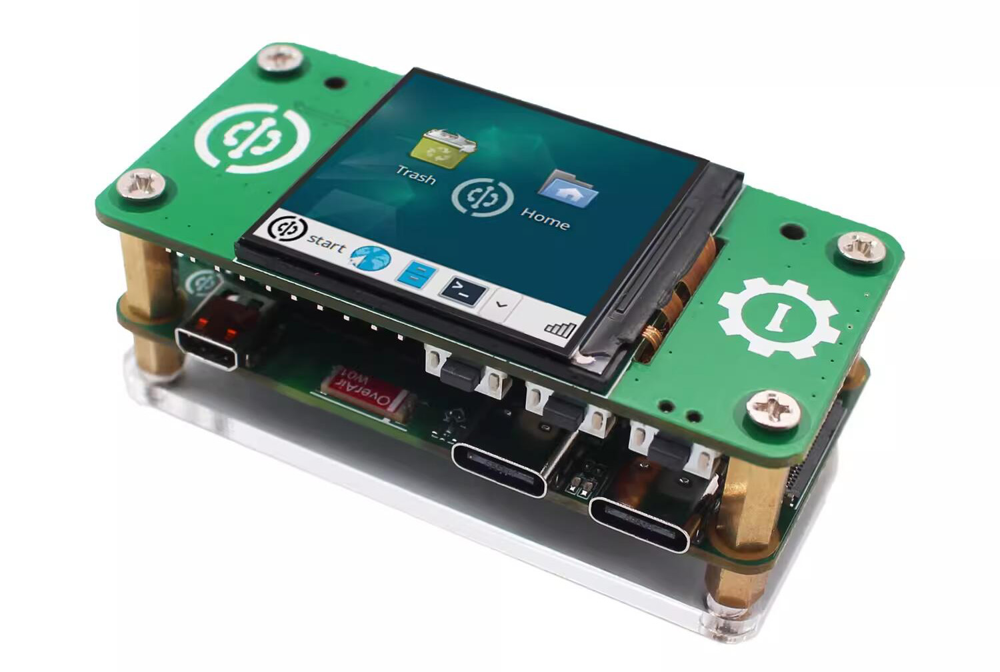
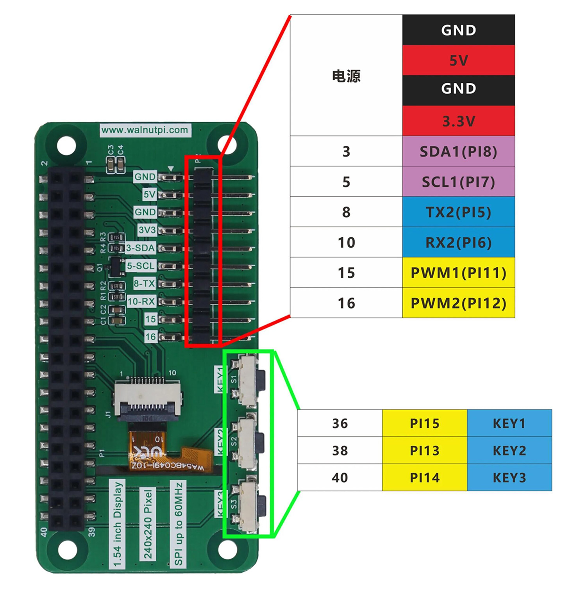
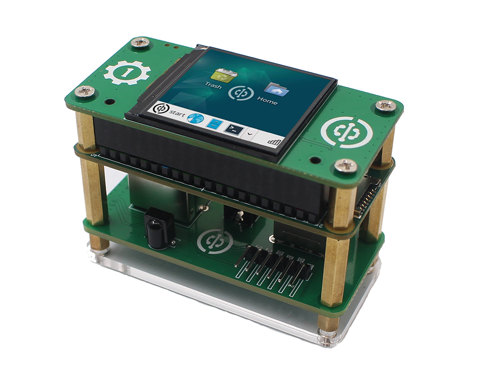
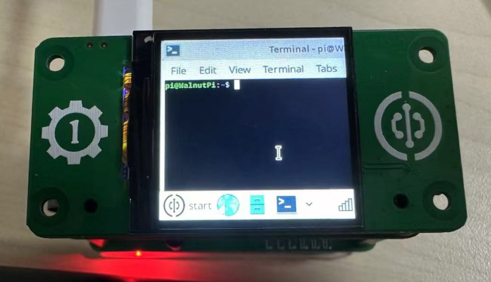

# 1.54-inch Display

- **Video Tutorial**

<iframe src="//player.bilibili.com/player.html?isOutside=true&aid=1303319197&bvid=BV1DM4m1D79Q&cid=1512602983&p=1" scrolling="no" border="0" frameborder="no" framespacing="0" allowfullscreen="true" width="100%" height="500"></iframe>

<br></br>
<br></br>

The official WalnutPi 1.54-inch display uses the SPI bus with a maximum speed of up to 60MHz. The backlight is controllable. Using the official driver, you can achieve desktop display, pyQt5, and other UI functions.



The back side features 3 programmable buttons and routes GPIO through SMT flat cables, meaning you can still connect I2C, serial communication devices, and other modules even with the display attached.



|  Specifications |  |
|  :---:  | ---  |
| Resolution  | 240x240(Pixel) |
| Interface  | 4-wire SPI (Max Speed: 60MHz) |
| Display IC  | st7789 |
| Operating Temperature  | -20℃ ~ 60℃ |
| Storage Temperature  | -30℃ ~ 70℃ |
| Dimensions  | 65x32mm |
| Weight  | 14g |

<br></br>

- Pin Description:

|  Pin |  Label |  Description |
|  ---  | ---  |  ---  |
| 1,17  | 3.3V | Power Positive (3.3V Input) |
| 2,4   | 5V | Power Positive (5V Input) |
| 6,9,14,20,25  | GND | Power Ground |
| 18  | LCD_DC | Command/Data Selection, Low for Command, High for Data |
| 19  | SPI_MOSI | LCD SPI Data Input |
| 21  | SPI_MISO | Touch Panel SPI Data Output |
| 22  | RST | Reset |
| 23  | SPI_CLK | LCD/Touch Panel Clock Signal |
| 24  | LCD_CS | LCD Chip Select, Active Low |


## Enabling LCD Display

The WalnutPi system already includes the relevant display driver, supported on both desktop and non-desktop versions. Use the following command to enable desktop display (TAB key auto-completion supported):

```bash
sudo set-lcd lcd15-st7789 install
```

Restart the board after configuration:

```bash
sudo reboot
```

**Unplug the HDMI cable**, wait patiently for the system to start, and you will see the desktop interface on the LCD (terminal for non-desktop system), displayed in the following default orientation:



<br></br>

::::tip Note

The above command is applicable to both WalnutPi desktop and non-desktop systems (the non-desktop system will display a terminal). After this configuration, if an HDMI display is connected, the display takes priority. To view on the LCD, be sure to unplug the HDMI cable.

::::

## Setting LCD Display Orientation

Use the following command to set the display orientation. Supported angles: 0, 90, 180, 270 degrees. The default is 270 degrees. For desktop systems, 270 or 90 is recommended as portrait orientation may cause content loss.

```bash
sudo set-lcd lcd15-st7789 set_rotate 270
```

## Disabling LCD Display

Use the following command to remove the LCD display function and boot from HDMI:

```bash
sudo set-lcd lcd15-st7789 remove
```

## Usage Tips

Due to the small size and resolution of the 1.54-inch LCD, it is primarily used interactively via the terminal (non-desktop system) or for pyQT5-related experiments.

When using on the desktop system, you can open a terminal and use keyboard shortcuts to zoom the terminal font for easier viewing.

- `Ctrl` + `Shift` + `+` : Increase font size

 - `Ctrl` + `-` : Decrease font size

 
