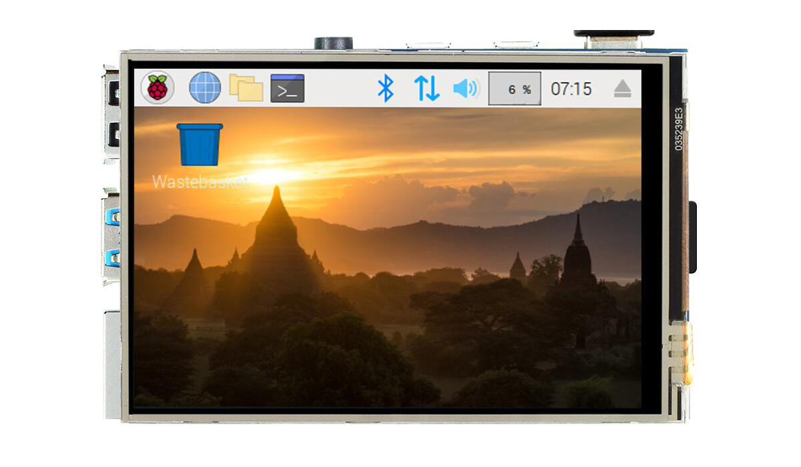

# 3.5-inch Display (Resistive Touch)

- **Video Tutorial**

<iframe src="//player.bilibili.com/player.html?isOutside=true&aid=1653352641&bvid=BV1cE421K7cG&cid=1512596512&p=1" scrolling="no" border="0" frameborder="no" framespacing="0" allowfullscreen="true" width="100%" height="500"></iframe>

<br></br>
<br></br>

The official WalnutPi 3.5-inch display (resistive touch) uses the SPI bus with a maximum speed of up to 80MHz. The backlight is controllable. Using the official driver, you can achieve desktop display and other UI functions.

::::tip Note

WalnutPi does not currently support other Raspberry Pi 3.5-inch displays on the market.

::::


The back side routes GPIO through SMT flat cables, meaning you can still connect I2C, serial communication devices, and other modules even with the display attached.


|  Specifications |  |
|  :---:  | ---  |
| Resolution  | 480x320(Pixel) |
| Interface  | 4-wire SPI (Max Speed: 80MHz) |
| Display IC  | st7796 |
| Touch Panel  | XPT2046 (Resistive Touch) |
| Operating Temperature  | -20℃ ~ 60℃ |
| Storage Temperature  | -30℃ ~ 70℃ |
| Dimensions  | 83x55mm |
| Weight  | 75g |

<br></br>

- Pin Description:

|  Pin |  Label |  Description |
|  ---  | ---  |  ---  |
| 1,17  | 3.3V | Power Positive (3.3V Input) |
| 2,4   | 5V | Power Positive (5V Input) |
| 6,9,14,20,25  | GND | Power Ground |
| 11  | TP_IRQ | Touch Panel Interrupt, Outputs Low When Pressed |
| 18  | LCD_DC | Command/Data Selection, Low for Command, High for Data |
| 19  | SPI_MOSI | LCD SPI Data Input |
| 21  | SPI_MISO | Touch Panel SPI Data Output |
| 22  | RST | Reset |
| 23  | SPI_CLK | LCD/Touch Panel Clock Signal |
| 24  | LCD_CS | LCD Chip Select, Active Low |
| 26  | TP_CS | Touch Panel Chip Select, Active Low |


## Enabling LCD Display

The WalnutPi system already includes the relevant display driver, supported on both desktop and non-desktop versions. Use the following command to enable desktop display (TAB key auto-completion supported):

```bash
sudo set-lcd lcd35-st7796 install
```

Restart the board after configuration:

```bash
sudo reboot
```

**Unplug the HDMI cable**, wait patiently for the system to start, and you will see the desktop interface on the LCD (terminal for non-desktop system), displayed in the following default orientation:


<br></br>

::::tip Note

The above command is applicable to both WalnutPi desktop and non-desktop systems (the non-desktop system will display a terminal). After this configuration, if an HDMI display is connected, the display takes priority. To view on the LCD, be sure to unplug the HDMI cable.

::::

## Setting LCD Display Orientation

Use the following command to set the display orientation. Supported angles: 0, 90, 180, 270 degrees. The default is 270 degrees. For desktop systems, 270 or 90 is recommended as portrait orientation may cause content loss.

```bash
sudo set-lcd lcd35-st7796 set_rotate 270
```

## Disabling LCD Display

Use the following command to remove the LCD display function and boot from HDMI:

```bash
sudo set-lcd lcd35-st7796 remove
```

## Using on Raspberry Pi

The WalnutPi 3.5-inch touch display provides driver software adapted for the Raspberry Pi. Once installed, it can be used on the Raspberry Pi. See the **README** document in the project for detailed usage instructions:

Project link: https://github.com/walnutpi/rpi-lcd


