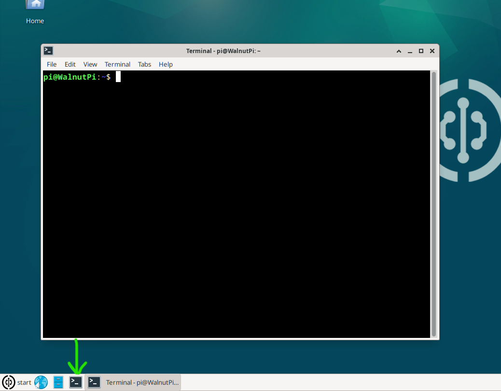
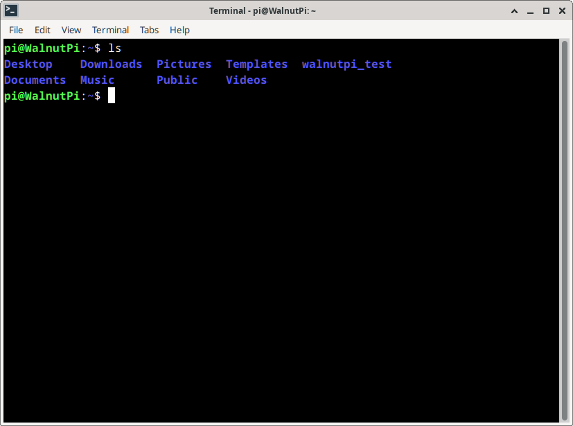
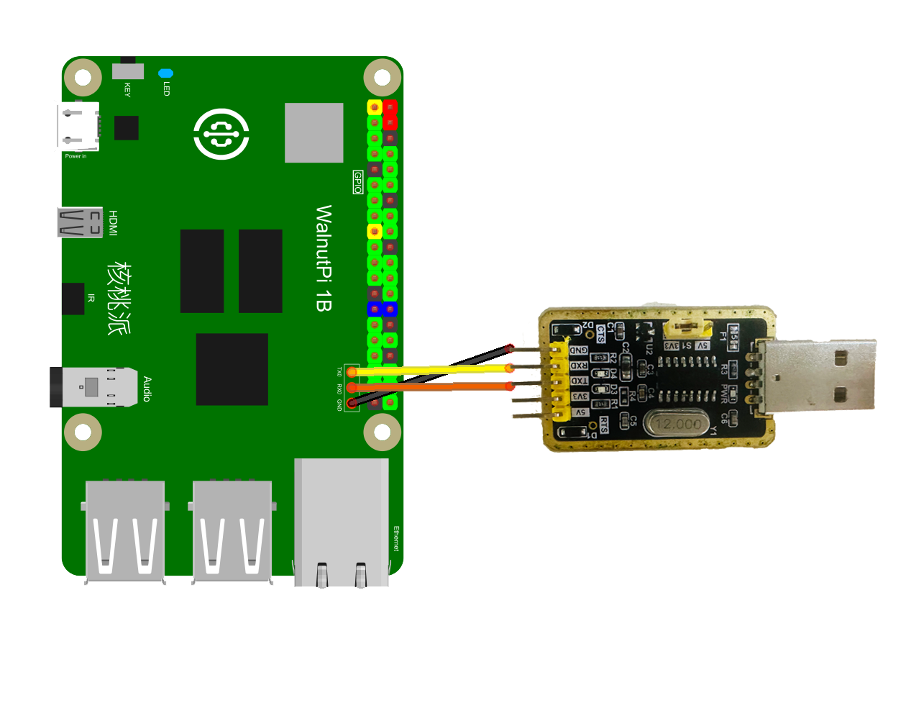
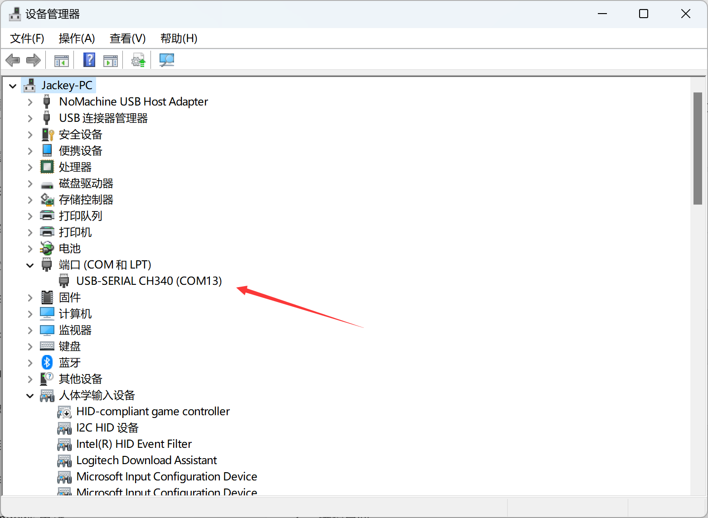
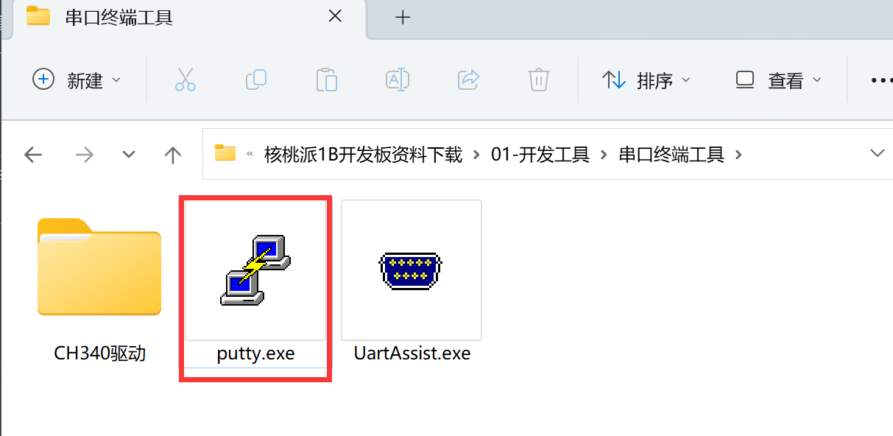
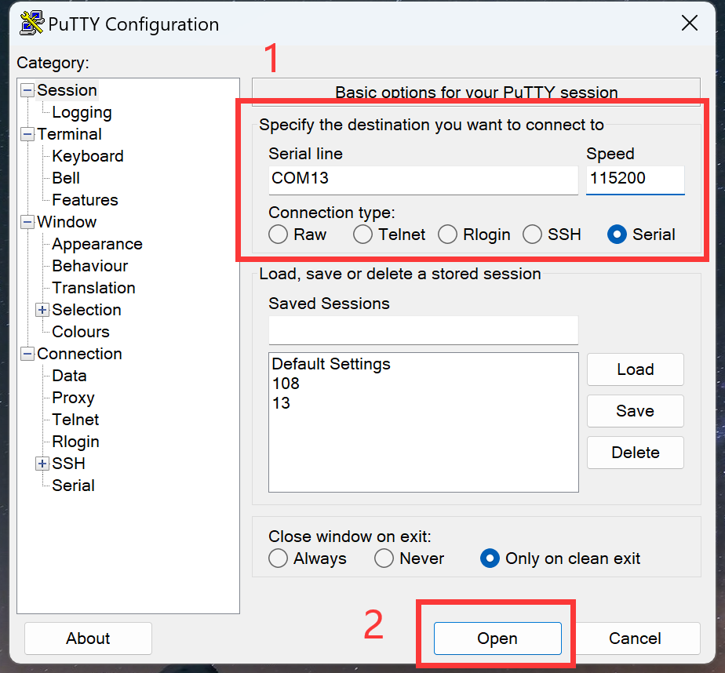
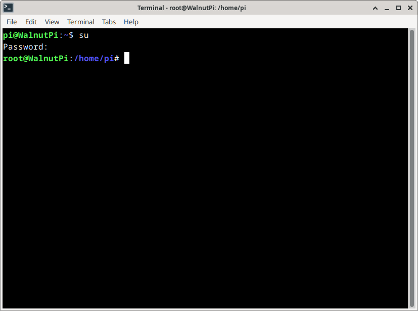

# Terminal & Common Commands

- **Video Tutorial**

<iframe src="//player.bilibili.com/player.html?isOutside=true&aid=1703287790&bvid=BV1xT42127X3&cid=1510989358&p=1" scrolling="no" border="0" frameborder="no" framespacing="0" allowfullscreen="true" width="100%" height="500"></iframe>

<br></br>
<br></br>

## Opening Terminal in Desktop System

The Terminal dates back to the early days of computing, when there were no visual desktops and many computer operations were performed through terminal commands. Even today, we use terminals in many scenarios and for debugging. Mastering common Linux terminal commands can make your development work much more efficient. **(The non-desktop system only displays this terminal after booting.)**

Click the third item **"Terminal"** in the Launch Bar to open the terminal. Items are: **Browser, File Manager, Terminal**



The first thing you see in the terminal is the prompt, waiting for your instructions. The prompt appears as follows:

<font color='#06fe00'>pi@WalnutPi</font>:~$

pi indicates the username; 

@ followed by WalnutPi indicates the hostname; 

~ indicates the current directory; 

**$** indicates a non-privileged user.

Let's do a simple terminal test. Enter `ls` in the terminal and press Enter. You will see a listing of files and folder names in the current directory (**the non-desktop system has no files in the pi directory by default**):

```bash
ls
```


Enter `cd Desktop` and press Enter. You will see the prompt change, indicating the current directory is now Desktop.

```bash
cd Desktop
```


## Opening Terminal via Debug Serial Port

Connect to the computer using a USB-to-TTL adapter via the serial terminal header pins reserved on the WalnutPi, then log in using terminal software such as PuTTY:

::::tip Note

When the system fails to boot normally, you can use this feature to observe boot messages. Note that TX and RX are cross-wired, and USB TTL tools with voltage switching functionality must be set to 3.3V.

::::



::::tip Note

If you are using a ZeroW, you can connect via the expansion board's debug serial port, or modify the config.txt file to change the debug serial port number, enabling terminal output via uart2 on the 40-pin header.
[config.txt Debug Serial Port Settings Tutorial](../os_software/config.txt#set-serial-terminal-location)

::::

In Device Manager, you can see the device's COM port number:



Open PuTTY:



Enter the COM port number you found for your computer, set the baud rate to 115200, and click Open:



Then a username and password prompt will appear. Enter "pi" for both the regular user account and password. **If nothing appears, try pressing the Enter key.** After successful login, the WalnutPi terminal information will be displayed.


## User Switching

The WalnutPi system has 2 preset users:

- **Regular Account (default for desktop system)** Username: pi Password: pi
- **Administrator** Username: root Password: root

Some terminal commands require administrator privileges to execute. You can run them using **sudo + command** in the terminal. To directly switch to the administrator account in the terminal, use the `su` command.

**Switch to administrator:** Enter `su` in the terminal, press Enter, and then at the Password: prompt enter the password **root** (the password is not displayed, mind the case). Press Enter again, and the current terminal session will switch to the administrator user.

```bash
su
```


**Switch to regular user:** Enter `su` followed by the username and press Enter. For example, to switch to the pi user, enter:

```bash
su pi
```


## Common Linux Commands

|  No. | Command | Full Name | Function |  
|  :---:  | :---:  | ---  | ---  |
| 1  | ls | list | List files in the current directory |
| 2  | pwd | print working directory | Output current directory |
| 3  | cd | change directory | Change directory |
| 4  | mkdir | make directory | Create a new directory |
| 5  | cat | concatenate | Display or concatenate file contents |
| 6  | rm | remove | Delete files |
| 7  | rmdir | remove directory | Delete directories |
| 8  | mv | move | Move/rename files or directories |
| 9  | cp | copy | Copy files or directories |
| 10  | echo |   | Display input content in terminal |
| 11  | date |  | Read system date and time |
| 12  | grep | global search regular <br/> expression and print | Search regular expressions comprehensively and print |
| 13  | man | manual  | Display command manual |
| 14  | sudo | super user do | Execute with root privileges |
| 15  | chmod | change mode | Change file read/write permissions |
| 16  | ./program |   | Run the program |
| 17  | apt | advance package tool | Install/remove software packages |
| 18  | exit |  | Exit |
| 19  | reboot |   | Restart |
| 20 | poweroff |  | Shutdown |
