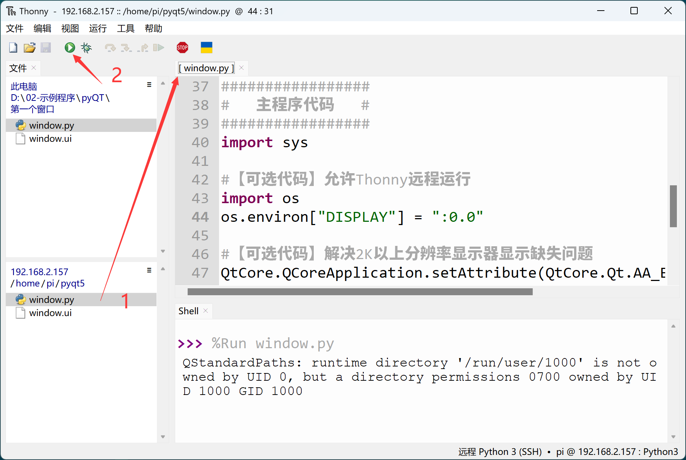
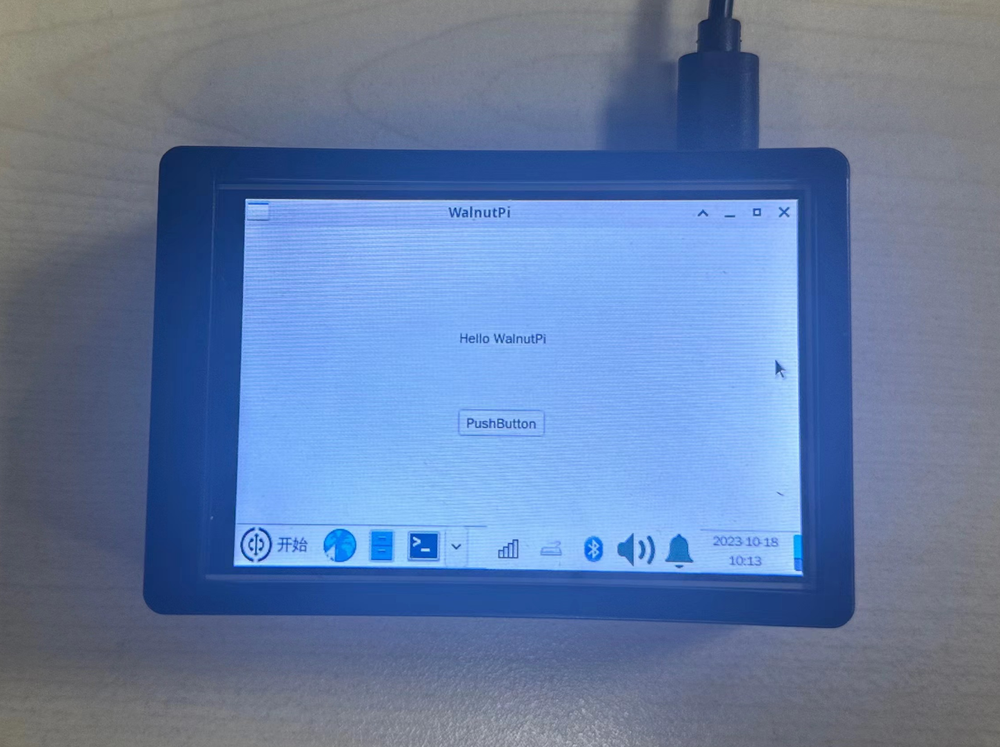
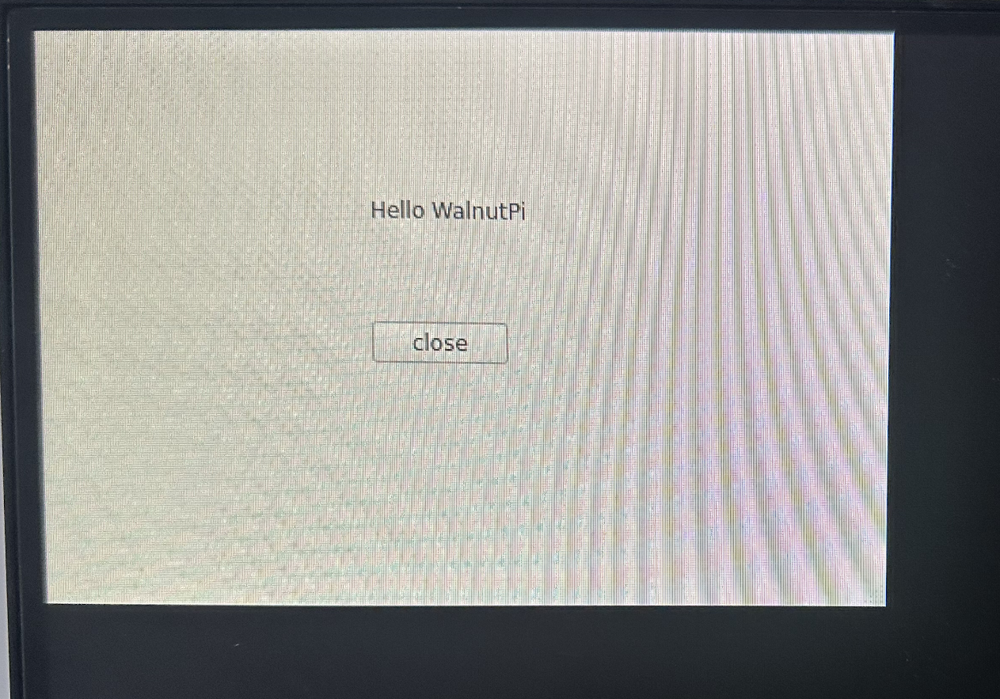

# Writing and Running Code

## Local on WalnutPi

In the previous section, we designed a UI window using Qt Designer and converted it into Python code. Since it's Python programming, we can open the Python code on the WalnutPi board and program directly.

On the WalnutPi, we recommend using Thonny to open and edit Python files. For instructions, see: [**Thonny IDE**](../python/python_run#thonny-ide).

Open the window.py file generated in the previous section and add the following program entry code at the end. The complete code after adding is as follows:

```python
# -*- coding: utf-8 -*-

# pyQT5 For WalnutPi

from PyQt5 import QtCore, QtGui, QtWidgets

class Ui_MainWindow(object):
    def setupUi(self, MainWindow):
        MainWindow.setObjectName("MainWindow")
        MainWindow.resize(480, 320)
        self.centralwidget = QtWidgets.QWidget(MainWindow)
        self.centralwidget.setObjectName("centralwidget")
        self.pushButton = QtWidgets.QPushButton(self.centralwidget)
        self.pushButton.setGeometry(QtCore.QRect(190, 160, 75, 23))
        self.pushButton.setObjectName("pushButton")
        self.label = QtWidgets.QLabel(self.centralwidget)
        self.label.setGeometry(QtCore.QRect(190, 90, 91, 16))
        self.label.setObjectName("label")
        MainWindow.setCentralWidget(self.centralwidget)
        self.menubar = QtWidgets.QMenuBar(MainWindow)
        self.menubar.setGeometry(QtCore.QRect(0, 0, 480, 22))
        self.menubar.setObjectName("menubar")
        MainWindow.setMenuBar(self.menubar)
        self.statusbar = QtWidgets.QStatusBar(MainWindow)
        self.statusbar.setObjectName("statusbar")
        MainWindow.setStatusBar(self.statusbar)

        self.retranslateUi(MainWindow)
        QtCore.QMetaObject.connectSlotsByName(MainWindow)

    def retranslateUi(self, MainWindow):
        _translate = QtCore.QCoreApplication.translate
        MainWindow.setWindowTitle(_translate("MainWindow", "WalnutPi"))
        self.pushButton.setText(_translate("MainWindow", "PushButton"))
        self.label.setText(_translate("MainWindow", "Hello WalnutPi"))

#################
#   Main Code    #
#################
import sys

# [Optional] Allow Thonny remote execution
import os
os.environ["DISPLAY"] = ":0.0"

# [Optional] Fix display issues on 2K+ resolution monitors
QtCore.QCoreApplication.setAttribute(QtCore.Qt.AA_EnableHighDpiScaling)

# Main program entry — build and display the window
app = QtWidgets.QApplication(sys.argv)
MainWindow = QtWidgets.QMainWindow() # Create window object
ui = Ui_MainWindow() # Create PyQt5-designed window object
ui.setupUi(MainWindow) # Initialize window
MainWindow.show() # Show window

# [Recommended] Allow Ctrl+C to interrupt the window from terminal for easier debugging
import signal
signal.signal(signal.SIGINT, signal.SIG_DFL)
timer = QtCore.QTimer()
timer.start(100)  # You may change this if you wish.
timer.timeout.connect(lambda: None)  # Let the interpreter run each 100 ms

sys.exit(app.exec_()) # Exit the process when the window is closed

```

Click "Run" in Thonny on the WalnutPi desktop — you'll see the first window we designed in the previous section pop up. (Terminal warnings can be ignored.)


You can also run the modified window.py file from the terminal using the `python` command — the effect is the same.


Click the close button on the window to terminate the process. For windows without a close button, you can press Ctrl+C in the terminal to interrupt the window process.

:::tip Tip

Since PyQt5 is cross-platform, the operations on Windows are exactly the same as described above.

:::

## Thonny Remote Development (Based on Windows)

Above we used the Thonny IDE within the WalnutPi system. Similarly, we can use the Thonny IDE on Windows to remotely connect to the WalnutPi for Python programming. The WalnutPi factory system already has SSH pre-installed, allowing SSH-based remote control. This method is suitable for developing remotely from your own computer. For the remote method, refer to Python Embedded Programming: [Thonny Remote](../python/python_run#thonny-remote-connection-windows-based). No need to repeat here.

Note that when using Thonny remotely, you must add the following code for it to work properly:

```python
# Allow Thonny remote execution
import os
os.environ["DISPLAY"] = ":0.0"
```

Remotely open the WalnutPi's window.py file (the complete code above) and click Run:



The window will pop up on the WalnutPi board's desktop.


To exit the window program, use **Run > Interrupt** from the Thonny main menu or press Ctrl+C in the lower terminal.


## Displaying on a 3.5-inch LCD

The methods above can display on either the WalnutPi HDMI monitor or the 3.5-inch LCD. For instructions on using the 3.5-inch display, see: [3.5-inch Touch Display](../os_software/3.5_LCD.md)



## Running PyQt5 Without a Desktop Environment

For a non-desktop system, you need to enable the **mouse-enabled xterm terminal** to enter QT debugging mode.

```bash
sudo systemctl enable lightdm.service
```

After running, reboot for the changes to take effect:

```bash
sudo reboot
```

After reboot, it will auto-login as pi. The command prompt is in the upper-left corner and you can see the mouse cursor, as shown below:


At this point, you can run PyQt5 Python code locally or remotely:



The following command exits this functionality:

```bash
sudo systemctl disable lightdm.service
```

Also requires a reboot to take effect, returning to normal terminal mode:

```bash
sudo reboot
```
