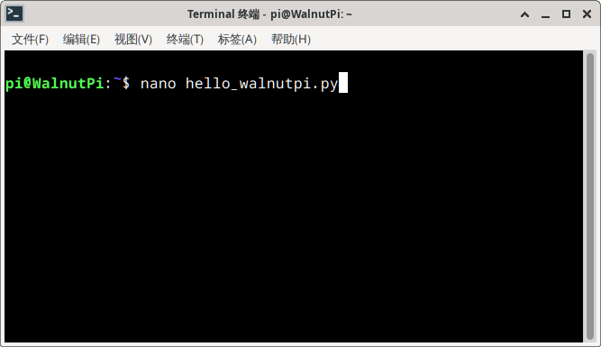
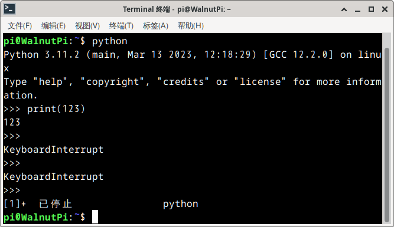
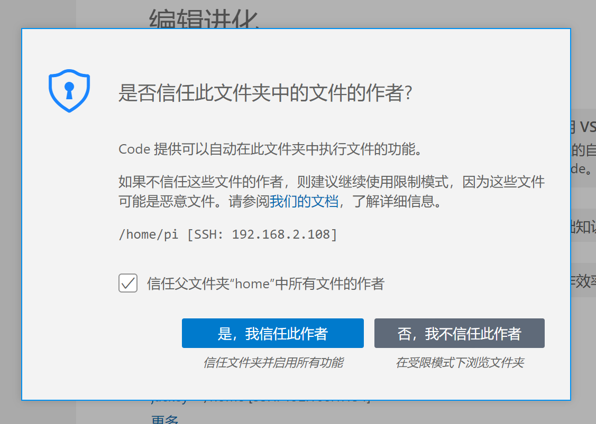
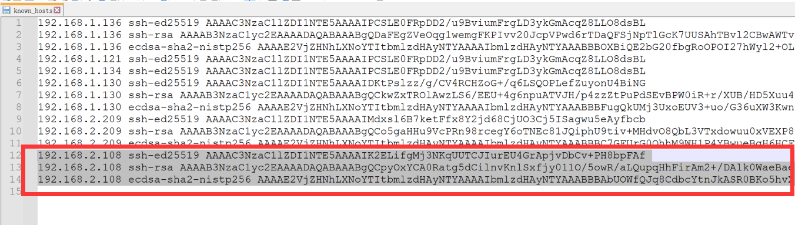

# 运行Python代码

本节主要讲解如何在核桃派进行Python编程和运行Python代码。如果你完全没学习过Python，可以先到这个网站学习一下。
- Python基础教程： [https://www.runoob.com/python/python-tutorial.html](https://www.runoob.com/python/python-tutorial.html) 

## 终端运行Python
我们先来看看如何使用最原始的方式来写python代码和运行python程序，也就是用到核桃派的终端来操作。这个方法同样适合无桌面操作系统。

打开核桃派终端,使用nano编辑器新建一个python文件：
```bash
nano hello_walnutpi.py
```


进入编辑界面，输入最简单的python代码
```python
print('hello walnutpi!')
```


按 **Ctrl+X** 退出，提示是否保存。


按 **Y** 弹出要保存的文件名，这里默认即可，按回车确认。


使用 **ls** 命令查看到当前目录已经增加了**hello_walnutpi.py**文件。


通过python指令可以直接运行Python文件。可以看到代码正常运行，打印了“hello walnutpi!”信息！
```bash
python hello_walnutpi
```


你也可以直接在终端输入python命令，能看到当前python版本和进入python交互模式。


按**Ctrl+Z**或**Ctrl+C**可以退出。



## Thonny IDE
如果你使用的是核桃派带桌面版操作系统，那么可以直接使用系统自带的Thonny IDE进行编程，非常方便。需要给核桃派通过HDMI连接到显示器和接入键盘鼠标。

打开**菜单--开发--Thonny** 

首次运行会提示选择语言，点击“Let's go!” 进入：


进入后先把文件目录调出来方便查看，点击**视图-文件**：


可以看到IDE左边多了一个当前系统的文件目录：


接下来新建一个文件：


在编辑区输入：
```python
print('hello walnutpi!')
```
然后保存。


点击绿色按钮 “运行” ，可以看到python代码被直接运行：


当然你也可以直接在Thonny 下方python终端进行python指令交互：


可以在Thonny菜单栏 **工具--选项**勾选**在编辑器中使用Tab键补全**功能，方便开发。


下方在输入**led.**后按键盘tab键补全：


## Thonny 远程连接（基于Windows）
上面使用核桃派系统里面的Thonny IDE编程，同样我们可以使用Windows上的Thonny IDE远程到核桃派进行Python编程。核桃派系统出厂已经预装ssh服务，可以通过ssh远程控制。这个方法适合使用自己电脑远程开发。

:::tip 提示

只做Python编程而又习惯使用PC的用户推荐这种方式。也是本章教程主要使用的。

:::

Thonny ide Windows版本下载地址：https://thonny.org/ 

下载安装完成后打开Thonny。首先还是点击 **视图 -- 文件** 将文件目录调出来。


接下来通过ssh方式连接核桃派，点击 **运行 -- 配置解析器** ：


在弹出的配置界面按下图配置：
1. 选择远程Python 3（SSH）
2. 核桃派IP地址
3. 核桃派用户名，这里写**pi**
4. 默认password方式即可
5. 这里写**Python3** ，注意首字母大写，因为核桃派python3（首字母小写）有些文件权限无法使用，而Python3(首字母大小)是已经设置好权限的。


配置完后点**运行 -- 停止/重启后端进程** 即可开始连接：


输入密码 **pi** :


等待Thonny左下方会出现核桃派的文件系统目录说明连接成功：


在Python终端可以直接使用Python指令（相当于在核桃派开发板上操作）：


然后我们可以打开windows本地py文件或者核桃派py文件，编写完代码后直接点**运行**按钮即可运行python代码。


可通过代码栏上方文件标题来区分本地或远程文件：

- [ hello.py ] 带“**[ ]**”表示核桃派开发板文件（远程文件）；

- hello2.py 不带“**[ ]**”表示Windows文件（本地文件）。


可以在左侧文件目录通过**右键**上传/下载文件实现核桃派和Windows本地文件互传。


可以在Thonny菜单栏 **工具--选项**勾选**在编辑器中使用Tab键补全**功能，方便开发。**补全内容为解释器连接的设备，这里远程那么补全的就是核桃派上的Python库**


下方在输入**led.**后按键盘tab键补全：


## VSCode 远程连接（基于Windows）

上面用到的Thonny主要是用于Python编程，有些小伙伴或许习惯使用VS Code，这里介绍一下VS Code如何远程。VS Code的好处是方便多种语言编程。
:::danger 注意

VS Code远程方式会占用核桃派较多的内存，使用这个方式不建议核桃派再跑其它占内存的应用软件。

:::

先安装VS Code,下载地址： https://code.visualstudio.com/download

安装完成后在VS Code插件栏搜索 **ssh** 插件并安装：


插件安装完成后在左侧打开，按右边 **+** 按钮新建一个远程连接：


在弹出的栏输入：**pi@192.168.2.180**。pi为核桃派默认用户群，后面是IP地址，可以使用"sudo ifconfig"查看核桃派的IP地址。


接下来选择信息保存到哪个文件，默认选第一个即可：


然后点右下角 “Connect” 按钮：


接下来在上方选择“Linux”：


选“Continue”:


输入核桃派pi用户密码：**pi**


等待连接，直到左下角出现核桃派IP地址即可：


点击下图1位置查看文件按钮，然后点击图2打开文件夹按钮，图3可以输出自己想要的路径，这里直接默认 /home/pi 即可，点确定。


勾选信用:



打开后可以看到左边已经出现核桃派的目录，你可以下载核桃派开发板文件或上传文件。右边为文档编辑区。


我们可以新建一个核桃派终端，方便指令进行一些操作：


可以看到下方出现熟悉的终端。


在VSCode的远程终端跟核桃派本地终端一样，直接使用。编辑好python代码，然后直接使用 **python xx.py** 命令即可运行python程序。


登录过的IP和账号会被记录，再次登录直接在远程管理器打开即可：


## 无法ssh远程解决办法

有一个使用场景是当使用thonny 或 vscode 远程过一个核桃派，然后核桃派更新了镜像或更换SD卡，那么需要删除电脑ssh的密钥信息才能重新连接。

windows 用户该文件位于 **C:\Users\【username】\ .ssh\known_hosts** 

打开后找到当前核桃派的IP，把IP和密钥信息删除即可。


