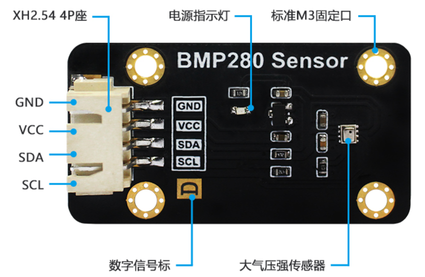
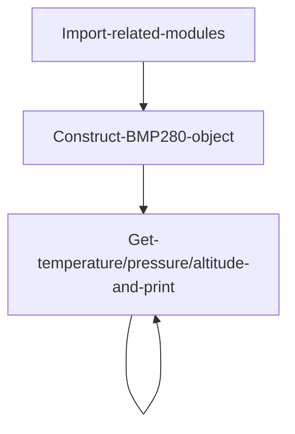

# BMP280 Barometric Pressure Sensor

## Introduction
The atmospheric pressure sensor module used in this experiment is the BMP280, a high-precision barometric pressure sensor designed specifically for mobile applications. The sensor module uses an extremely compact package; its small size and low power consumption make it suitable for battery-powered devices such as phones, GPS modules, and watches. In addition to measuring atmospheric pressure, the BMP280 sensor can also measure temperature (with moderate accuracy) and calculate altitude using a conversion formula.

## Objective
Use Python programming to measure the current environment's atmospheric pressure and temperature. Calculate the current altitude from the atmospheric pressure using a formula — build your own barometer!

## Explanation

Most BMP280 modules on the market are universal and communicate via the I2C bus. The image below shows a BMP280 sensor module:



|  Module Parameters | |
|  :---:  | ---  |
| Supply Voltage  | 3.3V |
| Operating Current  | \<20mA |
| Communication  | I2C bus |
| I2C Address  | 0x76 (BMP280's SDO is pulled low by default);<br></br> When BMP280's SDO pin is pulled high, I2C address is: 0x77 |
| Pin Description  | `VCC`: Connect to 3.3V <br></br> `GND`: Ground <br></br>  `SDA`: I2C data pin  <br></br> `SCL`: I2C clock pin |

<br></br>

From the description above, we can see that the BMP280 is a sensor driven via the I2C interface. We can communicate with this module by programming the WalnutPi's I2C interface.

**Altitude Calculation:**

Standard atmospheric pressure refers to the pressure at sea level (altitude 0 meters) at a temperature of 0°C and latitude 45°, with a value of 101325 Pascals (Pa).

The relationship between atmospheric pressure and altitude is: P = P0 × (1 − H/44300)^5.256

Therefore, the altitude calculation formula is: H = 44300*(1 − (P/P0)^(1/5.256))

Where: H is altitude, P0 = standard atmospheric pressure (0°C, 101325 Pa)

From the formula above, we can see that altitude is derived from atmospheric pressure. From a physics perspective, the higher the altitude, the thinner the air and the lower the atmospheric pressure. By measuring the pressure change, we can calculate the altitude. However, this holds true under a specific condition — a temperature of 0°C. The hotter the temperature, the thinner the air and the lower the atmospheric pressure. Therefore, altitude data theoretically requires temperature compensation, which means the altitude values in this experiment may have some error. Interested users can research further on their own.

This routine uses the WalnutPi's I2C1 to connect the BMP280 sensor:


Python's strength lies in its rich ecosystem of modules and function libraries. Once a module is built, later users can use it very easily without needing to develop underlying drivers. This enables object-oriented programming, while also allowing modification of low-level code when needed — it's flexible in both directions. Here, we directly call the already-written Python driver file, which implements measurement and calculation of atmospheric pressure, temperature, and altitude. Users can use it directly, as detailed below:

## The BMP280 Object

In CircuitPython, you can directly use a pre-written Python library to obtain BMP280 barometric pressure sensor data. Details are as follows:

### Constructor
```python
bmp280 = adafruit_bmp280.Adafruit_BMP280_I2C(i2c,address=0x76)
```
Constructs a BMP280 object.

Parameter description:
- `i2c` Requires constructing an i2c object, refer to: [I2C Object Description](../gpio/i2c_oled#the-i2c-object); not repeated here.
- `address` Module I2C address. Default: 0x76;

### Methods

```python
bmp280.sea_level_pressure = 1013.25
```
Set the local sea level standard atmospheric pressure value, in hPa.

<br></br>

```python
bmp280.temperature
```
Returns the temperature value, in °C, data type `float`.

<br></br>

```python
bmp280.pressure
```
Returns the atmospheric pressure value, in hPa (1 hPa = 100 Pa), data type `float`.

<br></br>

```python
bmp280.altitude
```
Returns the altitude value, in meters, data type `float`.

<br></br>

After understanding the BMP280 sensor principles and object usage, we can organize the programming approach. The flowchart is as follows:



## Reference Code

```python
'''
Experiment Name: BMP280 Barometric Pressure
Experiment Platform: WalnutPi 1B
'''

import time, board, busio, adafruit_bmp280

# Construct I2C object, controlled by WalnutPi I2C1
i2c = busio.I2C(board.SCL1, board.SDA1)

# Construct BMP280 object; this module's I2C address is the default 0x76.
bmp280 = adafruit_bmp280.Adafruit_BMP280_I2C(i2c,address=0x76)

# Local sea level standard atmospheric pressure
bmp280.sea_level_pressure = 1013.25

while True:

    print("\nTemperature: %0.1f C" % bmp280.temperature)
    print("Pressure: %0.1f hPa" % bmp280.pressure)
    print("Altitude = %0.2f meters" % bmp280.altitude)

    time.sleep(1)
```

## Result

Connect the BMP280 sensor to the WalnutPi as shown — SDA1 to module SDA pin, SCL1 to module SCL pin:


Since this code depends on other `.py` library files, you need to upload the entire example folder to the WalnutPi:


After successful transfer, you need to open and run the `.py` file from the remote directory (WalnutPi), because running it will import other library files in the folder. Therefore, running this type of code locally on a PC is ineffective.


Use Thonny to remotely run the above Python code on the WalnutPi. For instructions on running Python code on the WalnutPi, please refer to: [Running Python Code](../python_run.md). After successful execution, the terminal will print temperature, pressure, and altitude information:


