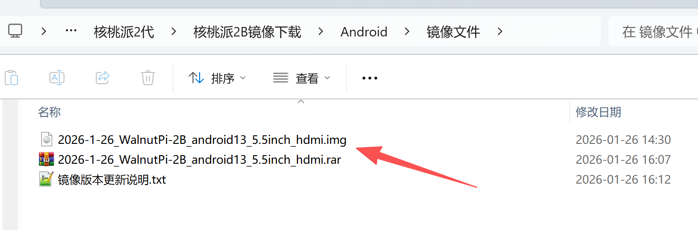
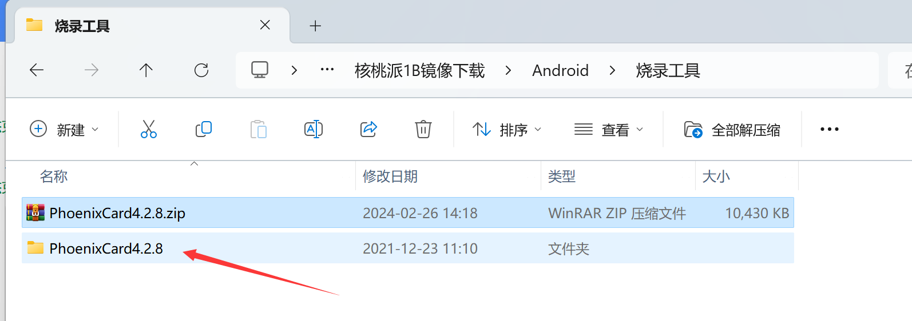
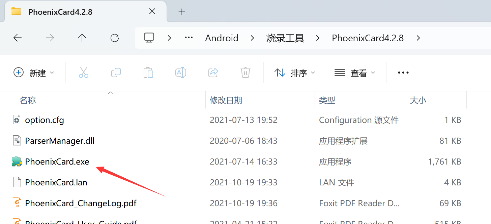
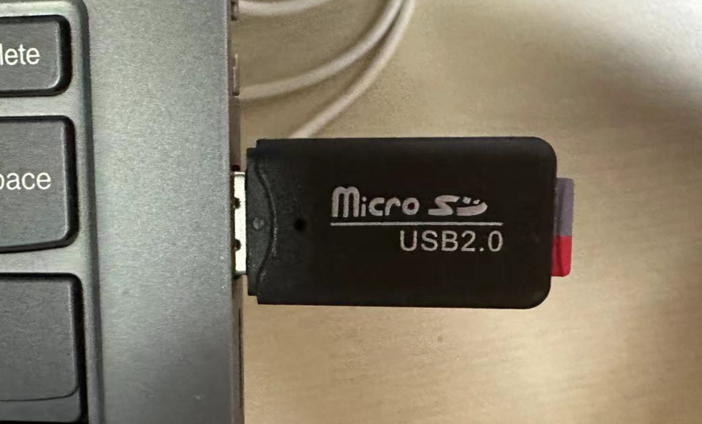
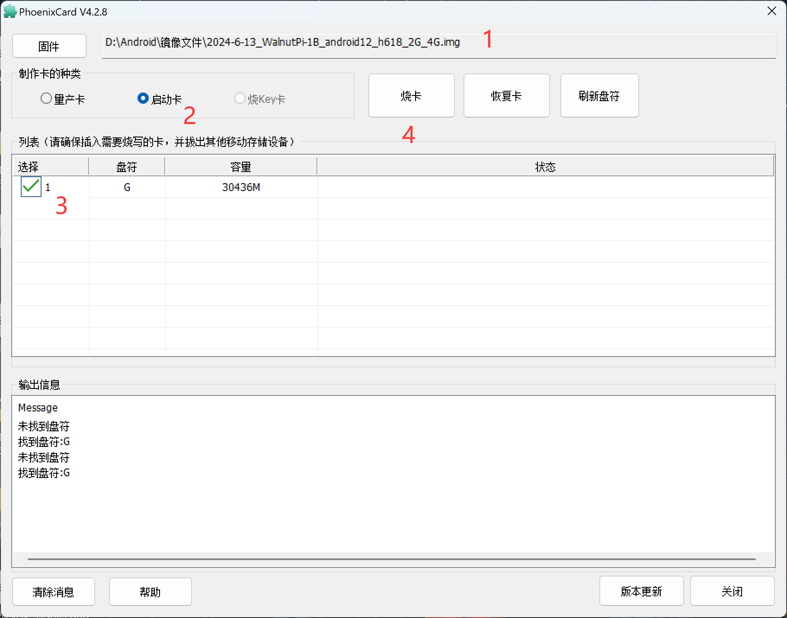
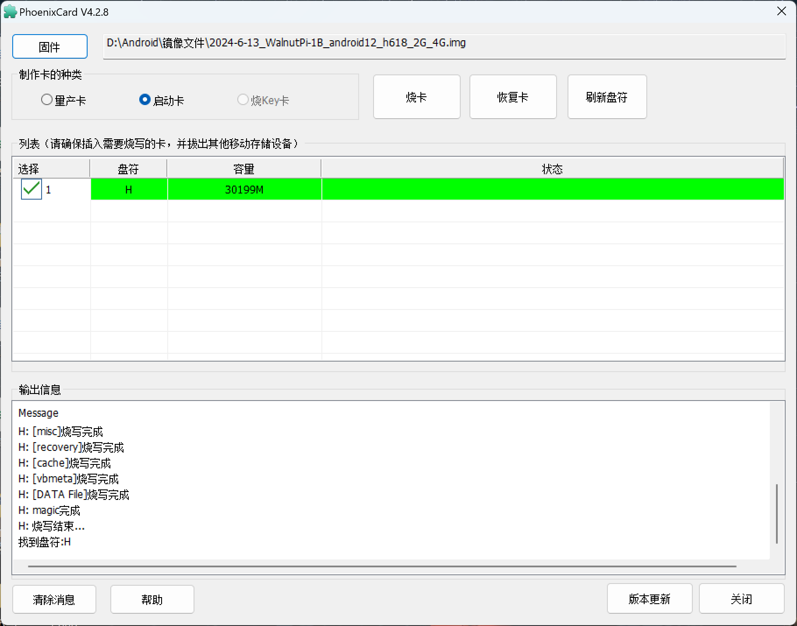
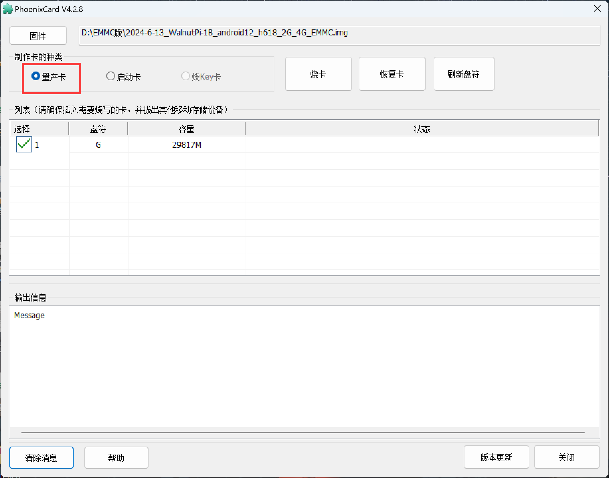
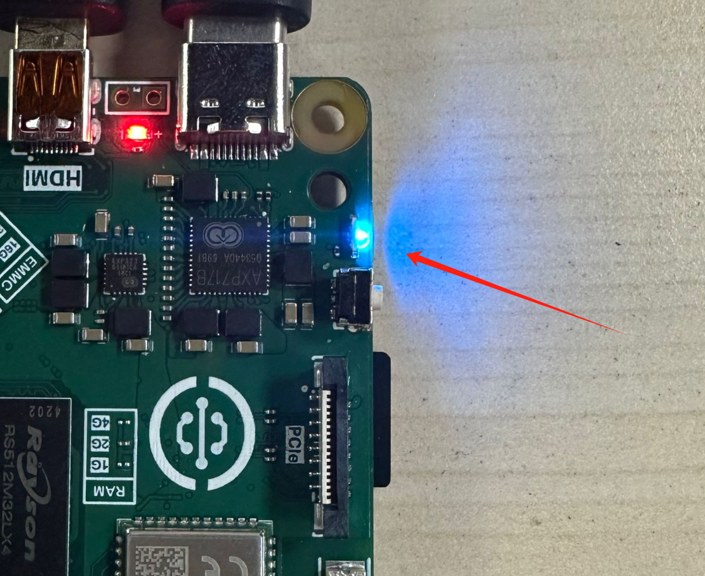
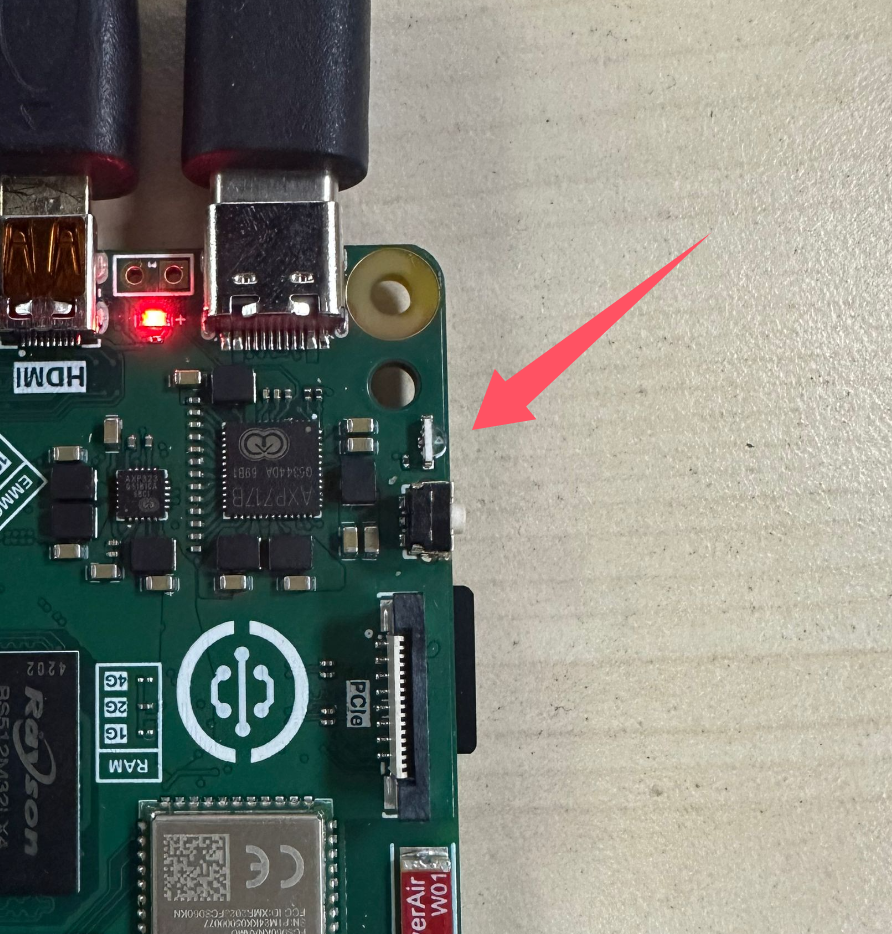

# Image Burning

WalnutPi 2B Android uses the standard Android system. We have adapted the WalnutPi 2B hardware so that users can install various Android apps after burning this system image.

## Image Download Links

- Baidu Netdisk: https://pan.baidu.com/s/14Vi3VoKkUBPWZf2TvYiPaw?pwd=WPKJ
- Extraction Code: **WPKJ**

Open the Android folder; for image update notes, refer to the **说明文档.txt** (Release Notes) inside. If Baidu Netdisk is too slow, you can also download from the QQ group files: 677173708

**(After downloading, extract the compressed package to get the .img image file for later use)**

:::tip Note
- Image name: **2026-1-26_WalnutPi-2B_android13_5.5inch_hdmi.img** — Defaults to the official WalnutPi 5.5-inch display (1920x1080) as the primary screen.

- Image name: **2026-1-30_WalnutPi-2B_android13_10.1inch_hdmi.img** — Defaults to the official WalnutPi 10.1-inch display (1280x800) as the primary screen.
:::

## Burning to SD Boot Card

### Using PhoenixCard

After downloading the image, you will also need a burning tool — PhoenixCard. The software is located in the **烧录工具** (Burning Tool) folder within the WalnutPi Android image package:

**(Extract the downloaded archive to get the folder)**

Enter the folder and open the software shown below:

Insert the SD card into your computer:

Follow these steps to start burning:

1. Select the image to burn;
2. Choose **启动卡** (Boot Card);
3. Select the drive letter of the inserted SD card;
4. Click **烧卡** (Burn) to start burning.

The progress bar may appear frozen during burning — wait for a few minutes. Please be patient. After burning completes, it will look like this:

A drive of about 100+ MB will appear in My Computer. This contains some configuration files for the WalnutPi Android system.

After burning, insert the SD card into WalnutPi 2B and power it on.

## Burning to EMMC

Use the [burning tutorial above](#burning-to-sd-boot-card) to burn to an SD card. The only difference is that you need to select **量产卡** (Mass Production Card); the rest of the process is the same.

After burning, insert the SD card into the WalnutPi 2B EMMC version hardware and power on. A fast-blinking blue LED indicates that data is being written to EMMC.

When the blue LED turns off, burning is complete.

:::tip Note
You can use a USB-to-TTL tool connected to the debug serial port to monitor the burning progress. [Debug Serial Port Terminal](../os_software/terminal.md#opening-terminal-via-debug-serial-port)
:::

Power off, remove the SD card, and power on again to boot the Android system from EMMC.
