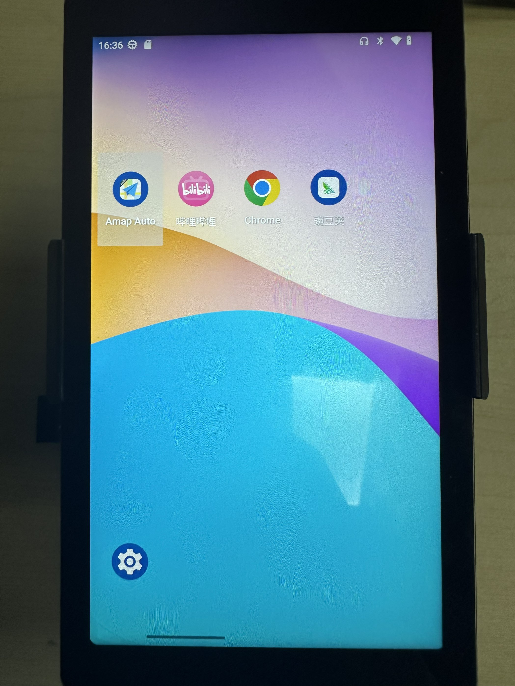
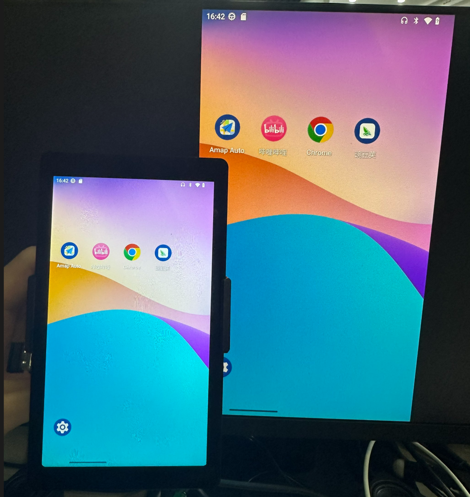

# Startup

After completing the system image burning in the previous section, the microSD card will contain the WalnutPi Android system. Insert it into the SD card slot on the back of WalnutPi. After powering on, a solid blue LED indicates normal startup.

## Using the 5.5-inch Display (Capacitive Touch)

The image named **2026-1-26_WalnutPi-2B_android13_5.5inch_hdmi.img** defaults to using the official WalnutPi 5.5-inch display (1080P) as the primary screen, [Purchase link >>](https://item.taobao.com/item.htm?id=1013424344059). An external HDMI monitor can be connected for mirrored display.

After normal system boot, the blue LED will remain solid.

Once booted successfully, the Android system interface will appear.

The WalnutPi 2B Android system comes pre-installed with Wandoujia (app store), Google Chrome, and Bilibili. Most apps and games can be downloaded and installed via Wandoujia.

## HDMI Monitor Mirroring

Simply connect an HDMI monitor to enable screen mirroring.

If you do not have a monitor or cannot boot normally, you can use a USB-to-TTL tool connected to the WalnutPi debug serial port to log in via a serial terminal. This method is suitable for developers. For details, refer to: [Debug Serial Port Terminal](../os_software/terminal#opening-terminal-via-debug-serial-port).

## Setting Simplified Chinese

Click the **Settings** button at the bottom-left corner of the home screen:

Then navigate to `System` → `Language & input` → `Languages`, as shown below. Then click **Add a language**.

Select **简体中文** (Simplified Chinese):

Once it appears, press and hold the drag handle on the right, then drag Simplified Chinese to the very top.

After setup, the default language will be Simplified Chinese, as shown below.

## Power Off

Long-press the development board button to bring up the shutdown options.

