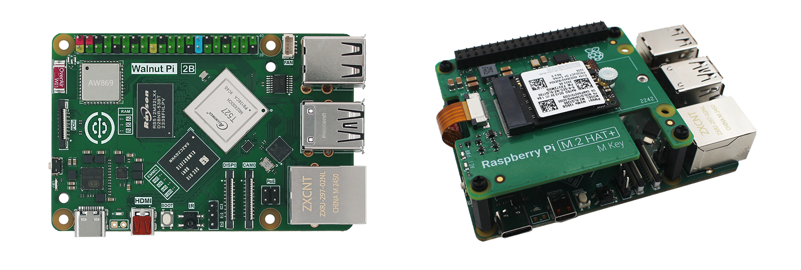

# Directory

- **核桃派2代介绍**

    - [产品参数](./intro/hw-parameter.md)
    - [资料下载](./intro/download.md)

- **开箱指南**

    - [硬件详解](./getting_start/hw-detail.md)
    - [核桃派2B配件组装](./getting_start/1b-peripherals.md)
    - [系统镜像烧录](./getting_start/os-install.md)
    - [开机](./getting_start/start_up.md)

- **核桃派系统使用**

    - [系统简介](./os_software/os_intro.md)
    - [预装软件](./os_software/software.md)
    - [终端和常用命令](./os_software/terminal.md)
    - [WiFi连接](./os_software/wifi.md)
    - [时间设置](./os_software/date.md)
    - [系统语言](./os_software/language.md)
    - [IP地址获取](./os_software/ip_get.md)
    - [SSH远程终端](./os_software/ssh.md)
    - [VNC远程桌面](./os_software/vnc.md)
    - [设备地图](./os_software/map_device.md)
    - [EMMC闪存](./os_software/emmc.md)
    - [NVMe固态硬盘](./os_software/nvme.md)
    - [关机和重启](./os_software/log_out.md)
    - [主控温度信息](./os_software/core_temp.md)
    - [主控ID号](./os_software/cpu_id.md)
    - [音频](./os_software/audio.md)
    - [红外接收头](./os_software/ir.md)
    - [U盘挂载](./os_software/usb_disk.md)
    - [USB摄像头](./os_software/usb_cam.md)
    - [3.5寸显示屏（电阻触摸）](./os_software/3.5_LCD.md)
    - [1.54寸显示屏](./os_software/1.54_LCD.md)
    - [开机自动运行脚本](./os_software/auto_run.md)
    - [config.txt](./os_software/config.txt.md)

- **GPIO应用**

    - [GPIO介绍](./gpio/gpio_intro.md)
    - [GPIO指令操作](./gpio/gpio_command.md)
    - [GPIO设备配置](./gpio/gpio_config.md)
    - [PWM](./gpio/pwm.md)

- **Python嵌入式编程**

    - [运行Python代码](./python/python_run.md) 
    - [Blinka（Python库）简介](./python/blinka_intro.md) 
    - **GPIO基础实验**
        - [GPIO介绍](./python/gpio/gpio_intro.md) 
        - [点亮第1个LED](./python/gpio/led.md) 
        - [按键](./python/gpio/key.md) 
        - [有源蜂鸣器](./python/gpio/active_buzzer.md) 
        - [UART（串口通讯）](./python/gpio/uart.md) 
        - [I2C（OLED显示屏）](./python/gpio/i2c_oled.md) 
        - [PWM](./python/gpio/pwm.md) 
    - **传感器**
        - [人体感应传感器](./python/sensor/human_induction.md) 
        - [HC-SR04超声波测距](./python/sensor/hcsr04.md) 
        - [BMP280大气压强](./python/sensor/bmp280.md) 
        - [MPU6050六轴加速度计](./python/sensor/mpu6050.md) 
        - [VL53L1X激光测距](./python/sensor/vl53l1x.md) 
        - [MLX90614红外测温](./python/sensor/mlx90614.md) 
    - **拓展模块**
        - [继电器](./python/module/relay.md) 
    - **网络应用**
        - [Socket通讯](./python/network/socket.md) 
        - [MQTT通讯](./python/network/mqtt.md) 
    - **其它使用技巧**
        - [开机自动运行Python代码](./python/skills/auto_run.md) 
        - [Python调用终端命令](./python/skills/command.md) 

- **C嵌入式编程**

    - [在开发板上编译C语言代码](./c/c_run.md) 
    - [IO控制](./c/io_gpioc.md) 
    - [I2C](./c/i2c.md) 
    - [SPI](./c/spi.md) 
    - [UART（串口）](./c/uart.md) 
    - [PWM](./c/pwm.md) 

- **PyQt5**

    - [PyQt5简介](./pyQT5/pyqt5_intro.md) 
    - [开发环境搭建](./pyQT5/development_setup.md) 
    - [第一个窗口](./pyQT5/first_window.md) 
    - [代码编写和运行](./pyQT5/code_run.md) 
    - [信号和槽](./pyQT5/signal_slot.md) 
    - **控件**
        - [控件简介](./pyQT5/widgets/widgets_intro.md) 
        - **按钮类**
            - [PushButton（按钮）](./pyQT5/widgets/buttons/push_button.md) 
            - [ToolButton（工具按钮）](./pyQT5/widgets/buttons/tool_button.md) 
        - **显示控件**
            - [Label](./pyQT5/widgets/display/label.md) 
        - **输入控件**
            - [LineEdit（单行文本框）](./pyQT5/widgets/input/line_edit.md) 
            - [TextEdit（多行文本框）](./pyQT5/widgets/input/text_edit.md) 
    - **绘图**
        - [绘图简介](./pyQT5/paint/paint_intro.md) 
        - **绘制形状**
            - [画形状](./pyQT5/paint/shape/shape.md) 
            - [画笔和画刷设置](./pyQT5/paint/shape/qpen_qbursh.md) 
        - **绘制文本**
            - [写文本](./pyQT5/paint/text/text.md) 
            - [字体设置](./pyQT5/paint/text/qfont.md) 
        - [绘制图像](./pyQT5/paint/image.md) 

- **OpenCV**

    - [OpenCV简介](./opencv/intro.md) 
    - [OpenCV安装](./opencv/install.md) 
    - [图像基本操作](./opencv/operate.md) 
    - [图像基础知识](./opencv/image.md) 
    - **绘图**
        - [画图形](./opencv/draw/shape.md) 
        - [写字符](./opencv/draw/string.md) 
    - **图像处理**
        - [缩放](./opencv/process/resize.md) 
        - [翻转](./opencv/process/flip.md) 
        - [二值化](./opencv/process/binary.md) 
    - **图像检测**
        - [轮廓检测](./opencv/detection/contour_detection.md) 
        - [边缘检测](./opencv/detection/edge_detection.md) 
        - [线段检测](./opencv/detection/line_detection.md) 
        - [圆形检测](./opencv/detection/circle_detection.md) 
        - [模板匹配](./opencv/detection/template_match.md) 
    - [USB摄像头使用](./opencv/usb_cam.md) 
    - [LCD使用](./opencv/lcd.md) 
    - **视觉识别**
        - [级联分类器介绍](./opencv/vision/haar_cascade.md) 
        - [人脸检测](./opencv/vision/front_face_detection.md)
        - [眼睛检测](./opencv/vision/eye_detection%20copy.md) 
        - [猫脸检测](./opencv/vision/cat_face_detection.md) 
        - [车牌检测](./opencv/vision/plate_detection.md) 

- **Home Assistant**

    - [简介](./home_assistant/intro.md) 
    - [Home Assistant安装](./home_assistant/install.md) 
    - [初始化配置](./home_assistant/config.md) 
    - [概念和术语](./home_assistant/concept.md) 
    - [仪表盘](./home_assistant/dashboard.md) 
    - **MQTT集成**
        - [MQTT服务器安装](./home_assistant/mqtt/install.md) 
        - [添加MQTT集成](./home_assistant/mqtt/add.md) 
        - **添加MQTT设备和实体**
            - [发现设备和实体](./home_assistant/mqtt/device_entity/discovery.md) 
            - [LED](./home_assistant/mqtt/device_entity/led.md) 
            - [按键](./home_assistant/mqtt/device_entity/key.md) 
            - [温度传感器DS18B20](./home_assistant/mqtt/device_entity/ds18b20.md) 
    - [摄像头监控](./home_assistant/ip_camera.md) 
    - [自动化](./home_assistant/automation.md) 
    - [加入市面上产品](./home_assistant/other_device.md) 
    - [接入苹果HomeKit](./home_assistant/homekit.md) 

- [**社区用户开源项目分享**](./diy.md) 

- [**更新说明**](./update.md)

